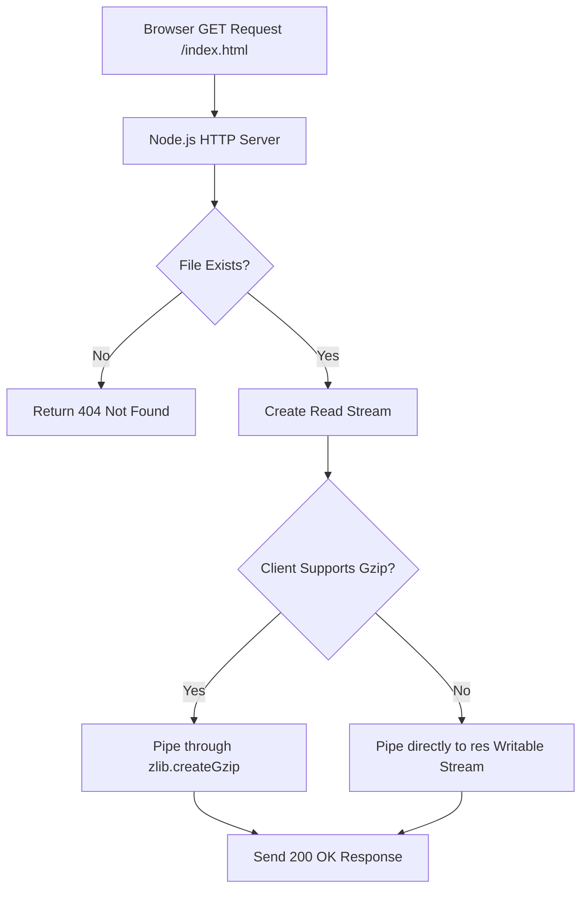

# File 30: Capstone Project — High-Performance Static Web Server

## Overview
This project implements a **High-Performance Static File Server** using raw Node.js `http`, `fs`, `path`, and `zlib` modules, supporting dynamic MIME-type detection, stream piping, and Gzip compression.

---

## 1. Static File Server Request Processing Flow



---

## 2. Static Web Server Implementation

```javascript
const http = require("http");
const fs = require("fs");
const path = require("path");
const zlib = require("zlib");

const PORT = 8080;
const PUBLIC_DIR = path.join(__dirname, "public");

const MIME_TYPES = {
    ".html": "text/html",
    ".css": "text/css",
    ".js": "application/javascript",
    ".json": "application/json",
    ".png": "image/png"
};

const server = http.createServer((req, res) => {
    let safePath = path.normalize(req.url).replace(/^(\.\.[\/\\])+/, "");
    if (safePath === "/") safePath = "/index.html";

    const filePath = path.join(PUBLIC_DIR, safePath);
    const ext = path.extname(filePath).toLowerCase();
    const contentType = MIME_TYPES[ext] || "application/octet-stream";

    fs.stat(filePath, (err, stats) => {
        if (err || !stats.isFile()) {
            res.writeHead(404, { "Content-Type": "text/plain" });
            return res.end("404 Not Found");
        }

        const acceptEncoding = req.headers["accept-encoding"] || "";
        const fileStream = fs.createReadStream(filePath);

        if (acceptEncoding.includes("gzip")) {
            res.writeHead(200, {
                "Content-Type": contentType,
                "Content-Encoding": "gzip"
            });
            fileStream.pipe(zlib.createGzip()).pipe(res);
        } else {
            res.writeHead(200, { "Content-Type": contentType });
            fileStream.pipe(res);
        }
    });
});

server.listen(PORT, () => {
    console.log(`Static Web Server running at http://localhost:${PORT}`);
});
```

---

## Key Takeaways
1. Demonstrates streaming static files directly off disk using **`fs.createReadStream()`** and **`stream.pipe()`**.
2. Dynamically compresses text responses with **`zlib.createGzip()`** based on client `Accept-Encoding` headers.
3. Sanitizes user input paths with **`path.normalize()`** to prevent directory traversal security attacks.
