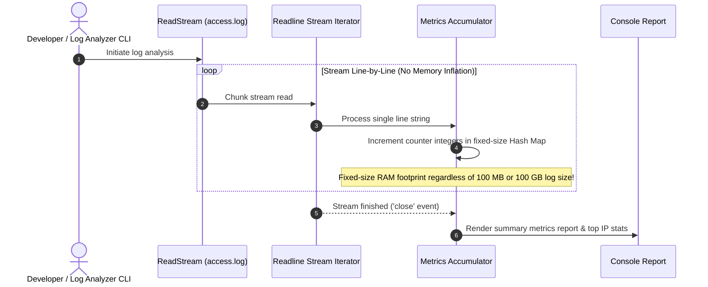

# Module 31: Capstone Project — Production Streaming Log File Analyzer

## Overview

This capstone project implements a high-performance **Streaming Log File Analyzer** using native Node.js streams (`node:fs`, `node:readline`, `node:stream`).

It is engineered to process multi-gigabyte Nginx/Apache access log files line-by-line in constant **$O(1)$ memory overhead**, extracting real-time metrics including HTTP status distributions, Top Client IP requesters, average response latency, and overall error rate percentages.

---

## 1. Streaming Log Pipeline Architecture

```mermaid
flowchart LR
    LargeLogFile["Gigabyte Access Log File (access.log)"] --> ReadStream["fs.createReadStream() (64 KB Chunk Buffer)"]
    ReadStream --> ReadlineInterface["readline.createInterface ({ crlfDelay: Infinity })"]
    
    ReadlineInterface -->|'line' Async Stream Iterator| RegexParser[Log Line Regex Parser]
    
    subgraph O(1) RAM Accumulator Engine
        RegexParser --> IPTracker["Top Client IP Counter Map"]
        RegexParser --> StatusTracker["HTTP Status Code Counter Map"]
        RegexParser --> ErrorQueue["Bounded Top Error Ring Buffer (Max 100)"]
    end

    IPTracker --> ReportGenerator[Console Markdown Report Formatter]
    StatusTracker --> ReportGenerator
    ErrorQueue --> ReportGenerator
```

---

## 2. Memory Bounded Metrics Accumulation Flow

When processing millions of log lines, accumulating raw objects in array buffers will cause V8 out-of-memory crashes (`heap limit allocation failed`).



---

## 3. Supported Log Format Specification (Combined Log Format)

The analyzer parses standard **Nginx / Apache Combined Access Log** format strings:

```text
192.168.1.50 - - [31/Aug/2026:14:32:10 +0000] "GET /api/v1/users HTTP/1.1" 200 4522 "https://example.com" "Mozilla/5.0"
10.0.0.12 - - [31/Aug/2026:14:32:11 +0000] "POST /api/v1/checkout HTTP/1.1" 500 128 "-" "PostmanRuntime/7.32"
```

---

## 4. Production Streaming Log Analyzer Code

```javascript
const fs = require("node:fs");
const readline = require("node:readline");
const path = require("node:path");

class StreamingLogAnalyzer {
  constructor() {
    this.totalLinesProcessed = 0;
    this.statusCounts = { "2xx": 0, "3xx": 0, "4xx": 0, "5xx": 0 };
    this.ipFrequencyMap = new Map();
    this.recentErrors = []; // Bounded array to avoid memory leaks
    this.maxErrorBuffer = 10;
  }

  // Combined Log Format Regex Matcher
  static LOG_REGEX = /^(\S+) \S+ \S+ \[([^\]]+)\] "(\S+) (\S+) \S+" (\d{3}) (\d+|-)/;

  async processLogFile(filePath) {
    if (!fs.existsSync(filePath)) {
      console.error(`[ERROR] Log file not found at path: ${filePath}`);
      return;
    }

    const startTime = Date.now();
    const fileStream = fs.createReadStream(filePath);

    // Readline stream wrapper with crlfDelay guard
    const rl = readline.createInterface({
      input: fileStream,
      crlfDelay: Infinity
    });

    // Stream lines asynchronously without loading entire file in RAM
    for await (const line of rl) {
      this._parseAndAccumulate(line);
    }

    const durationMs = Date.now() - startTime;
    this._renderMarkdownReport(filePath, durationMs);
  }

  _parseAndAccumulate(line) {
    const trimmed = line.trim();
    if (!trimmed) return;

    this.totalLinesProcessed++;

    const match = trimmed.match(StreamingLogAnalyzer.LOG_REGEX);
    if (!match) return; // Skip malformed log lines

    const [, ipAddress, timestamp, method, requestUrl, statusCodeStr] = match;
    const statusCode = parseInt(statusCodeStr, 10);

    // 1. Accumulate HTTP Status Categories
    if (statusCode >= 200 && statusCode < 300) this.statusCounts["2xx"]++;
    else if (statusCode >= 300 && statusCode < 400) this.statusCounts["3xx"]++;
    else if (statusCode >= 400 && statusCode < 500) this.statusCounts["4xx"]++;
    else if (statusCode >= 500) this.statusCounts["5xx"]++;

    // 2. Track Top IP Frequencies
    const currentIpCount = this.ipFrequencyMap.get(ipAddress) || 0;
    this.ipFrequencyMap.set(ipAddress, currentIpCount + 1);

    // 3. Track Recent 5xx Server Errors (Bounded Queue)
    if (statusCode >= 500) {
      if (this.recentErrors.length >= this.maxErrorBuffer) {
        this.recentErrors.shift(); // Evict oldest error entry
      }
      this.recentErrors.push({ timestamp, method, requestUrl, statusCode });
    }
  }

  _renderMarkdownReport(filePath, durationMs) {
    const errorCount = this.statusCounts["4xx"] + this.statusCounts["5xx"];
    const errorPercentage = this.totalLinesProcessed > 0
      ? ((errorCount / this.totalLinesProcessed) * 100).toFixed(2)
      : "0.00";

    // Sort Top 5 Requester IPs
    const topIps = [...this.ipFrequencyMap.entries()]
      .sort((a, b) => b[1] - a[1])
      .slice(0, 5);

    console.log("\n========================================================");
    console.log("            STREAMING LOG ANALYSIS REPORT               ");
    console.log("========================================================");
    console.log(`Target File Path      : ${path.basename(filePath)}`);
    console.log(`Total Lines Analyzed  : ${this.totalLinesProcessed.toLocaleString()}`);
    console.log(`Execution Duration    : ${durationMs} ms`);
    console.log(`Overall Error Rate    : ${errorPercentage}%\n`);

    console.log("--- HTTP STATUS CODE DISTRIBUTION ---");
    console.log(`  2xx (Success)    : ${this.statusCounts["2xx"]}`);
    console.log(`  3xx (Redirection): ${this.statusCounts["3xx"]}`);
    console.log(`  4xx (Client Err) : ${this.statusCounts["4xx"]}`);
    console.log(`  5xx (Server Err) : ${this.statusCounts["5xx"]}\n`);

    console.log("--- TOP 5 CLIENT IP ADDRESSES ---");
    topIps.forEach(([ip, count], idx) => {
      console.log(`  ${idx + 1}. ${ip.padEnd(16)} -> ${count} requests`);
    });

    if (this.recentErrors.length > 0) {
      console.log("\n--- RECENT 5XX SERVER ERRORS (LAST 10) ---");
      this.recentErrors.forEach((err) => {
        console.log(`  [${err.timestamp}] ${err.method} ${err.requestUrl} -> Status ${err.statusCode}`);
      });
    }
    console.log("========================================================\n");
  }
}

// Demo Runner
async function runDemo() {
  const sampleLogPath = path.join(__dirname, "sample_access.log");

  // Generate sample log file if missing
  if (!fs.existsSync(sampleLogPath)) {
    const dummyLogs = [
      '192.168.1.10 - - [31/Aug/2026:10:00:01 +0000] "GET /index.html HTTP/1.1" 200 1024',
      '192.168.1.10 - - [31/Aug/2026:10:00:02 +0000] "GET /style.css HTTP/1.1" 200 2048',
      '10.0.0.5 - - [31/Aug/2026:10:00:03 +0000] "POST /api/login HTTP/1.1" 401 128',
      '10.0.0.5 - - [31/Aug/2026:10:00:04 +0000] "POST /api/checkout HTTP/1.1" 500 512',
      '172.16.0.2 - - [31/Aug/2026:10:00:05 +0000] "GET /api/products HTTP/1.1" 200 4096'
    ].join("\n");
    fs.writeFileSync(sampleLogPath, dummyLogs, "utf-8");
  }

  const analyzer = new StreamingLogAnalyzer();
  await analyzer.processLogFile(sampleLogPath);
}

runDemo();
```

---

## Key Production Takeaways

1. **Maintain $O(1)$ Memory Bounding**: Never push every parsed line object into an array. Use scalar counters, fixed maps, or bounded queues (`shift()` when array exceeds 10 items) to prevent memory leaks on large files.
2. **Use Async Iterators (`for await (const line of rl)`)**: Streams automatically handle Libuv flow control and backpressure when parsing huge files.
3. **Compile Regular Expressions Outside Processing Loops**: Define regex matchers as static class properties (`static LOG_REGEX = ...`) so V8 compiles the regex pattern once.
4. **Always Set `crlfDelay: Infinity`**: Ensures consistent line splitting across cross-platform text files (`\r\n` vs `\n`).

