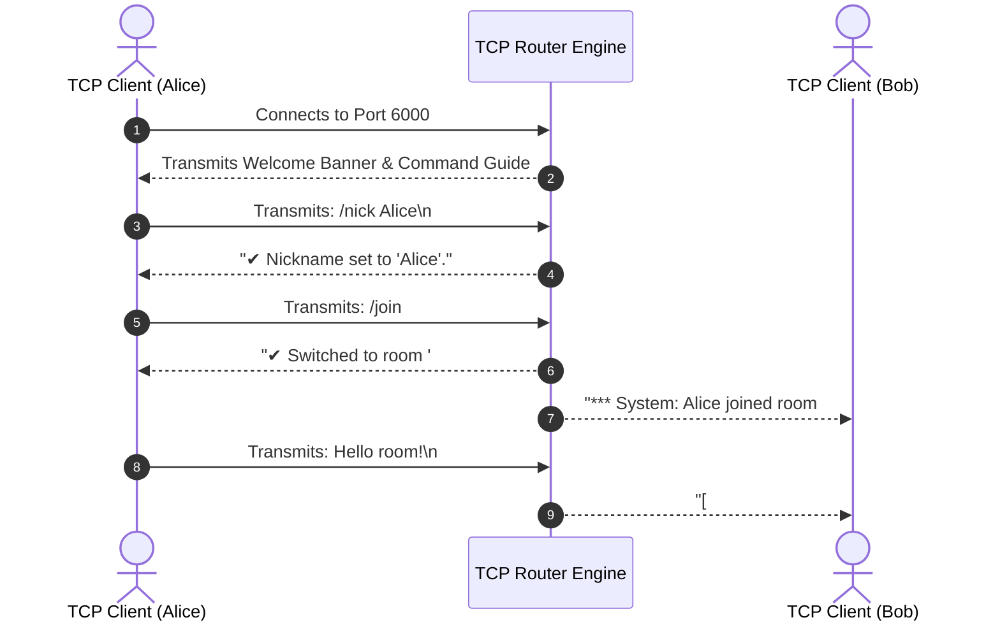
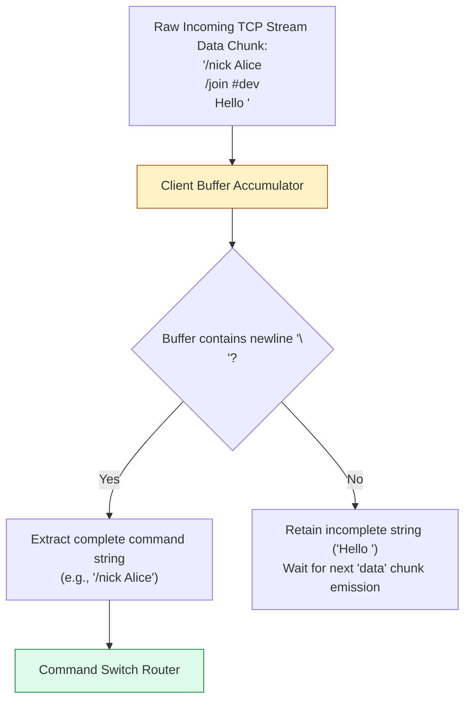

# Module 32: Capstone Project — Multi-Room Real-Time TCP Chat Server Architecture

## Overview

This capstone project implements a zero-dependency, real-time **Multi-Room TCP Chat Server** using the core Node.js **`node:net`** module.

It showcases low-level TCP socket management, line-delimited protocol parsing (`\n`), socket pool state tracking (`Set`), dynamic room channel isolation (`/join <#room>`), nickname assignment (`/nick <name>`), direct peer-to-peer private messaging (`/msg <user> <text>`), and low-latency TCP socket settings (`socket.setNoDelay(true)`).

Understanding **Multi-Room Socket Broadcasting Architecture**, **Command Line Protocol Parsing Lifecycle**, **Custom TCP Protocol Commands**, and **Clean Socket Teardown** is essential.

---

## 1. Multi-Room Socket Broadcasting Architecture

```mermaid
flowchart TD
    subgraph Multi-Room TCP Server (net.createServer)
        RoomGeneral["Room: #general"]
        RoomDev["Room: #dev"]

        Socket1["Client: Alice (Socket 1)"] --> RoomGeneral
        Socket2["Client: Bob (Socket 2)"] --> RoomGeneral
        Socket3["Client: Charlie (Socket 3)"] --> RoomDev
    end

    Socket1 -->|socket.write: Hello General!\n| ServerRouter[TCP Message Router & Protocol Parser]
    ServerRouter -->|Broadcast to #general subscribers| Socket2
    ServerRouter -.->|ISOLATED: No delivery to #dev| Socket3

    style RoomGeneral fill:#dbeafe,stroke:#1d4ed8
    style RoomDev fill:#dcfce7,stroke:#15803d
    style ServerRouter fill:#fef3c7,stroke:#b45309
```

---

## 2. Command Parsing Lifecycle Sequence

Clients interact with the server by writing line-delimited text commands over raw TCP sockets:



---

## 3. TCP Protocol Message Framing & Parsing



---

## 4. TCP Custom Protocol Command Matrix

| Command Syntax | Arguments / Parameters | Functionality & Technical Behavior | Example Call |
| :--- | :--- | :--- | :--- |
| **`/nick`** | `<new_name>` | Assigns or updates client's display nickname in socket pool. | `/nick Alice` |
| **`/join`** | `<#room_name>` | Switches client to target chat channel room (`#general`, `#dev`). | `/join #dev` |
| **`/msg`** | `<target_nick> <text>` | Transmits private message directly to target user socket. | `/msg Bob Secrets` |
| **`/who`** | N/A | Lists all active users in client's current room. | `/who` |
| **`/quit`** | N/A | Gracefully closes client TCP socket connection. | `/quit` |

---

## 5. Production Code Showcase: Multi-Room TCP Chat Server

```javascript
const net = require("node:net");

class ChatClient {
  constructor(socket) {
    this.socket = socket;
    this.id = `user_${Math.random().toString(36).substring(2, 7)}`;
    this.nickname = this.id;
    this.room = "#general";
    this.bufferAccumulator = "";
  }
}

class MultiRoomTcpChatServer {
  constructor(port = 6000) {
    this.port = port;
    this.clients = new Set(); // Active client collection
  }

  start() {
    const server = net.createServer((socket) => {
      const client = new ChatClient(socket);
      this.clients.add(client);

      // Low-Latency TCP Socket Performance Settings
      socket.setEncoding("utf-8");
      socket.setNoDelay(true);          // Disable Nagle's algorithm for instant message delivery
      socket.setKeepAlive(true, 30000); // Send Keep-Alive probes every 30s

      console.log(`[TCP CONNECT] Client ${client.id} connected from ${socket.remoteAddress}:${socket.remotePort}`);

      // Send Welcome Banner
      socket.write("=====================================================\n");
      socket.write("        WELCOME TO MULTI-ROOM REAL-TIME TCP CHAT     \n");
      socket.write(" Commands:\n");
      socket.write("   /nick <name>            Set display nickname\n");
      socket.write("   /join <#room>           Switch chat room\n");
      socket.write("   /msg <user> <message>   Send private message\n");
      socket.write("   /who                    List users in room\n");
      socket.write("   /quit                   Exit chat\n");
      socket.write("=====================================================\n\n");

      this._broadcastRoom(client.room, `*** System: ${client.nickname} joined ${client.room} ***\n`, client);

      // Handle Incoming TCP Data Stream
      socket.on("data", (chunk) => {
        client.bufferAccumulator += chunk;

        // Line-delimited protocol parsing (\n)
        let newlineIndex;
        while ((newlineIndex = client.bufferAccumulator.indexOf("\n")) !== -1) {
          const rawLine = client.bufferAccumulator.slice(0, newlineIndex).trim();
          client.bufferAccumulator = client.bufferAccumulator.slice(newlineIndex + 1);

          if (rawLine) {
            this._handleCommand(client, rawLine);
          }
        }
      });

      // Handle Disconnect & Cleanup
      socket.on("end", () => this._handleDisconnect(client));
      socket.on("error", (err) => {
        console.error(`[SOCKET ERROR] (${client.nickname}):`, err.message);
        this._handleDisconnect(client);
      });
    });

    const PORT = process.env.PORT || this.port;
    server.listen(PORT, () => {
      console.log(`=== MULTI-ROOM TCP CHAT SERVER ACTIVE: Listening on port ${PORT} ===`);
    });
  }

  _handleCommand(client, message) {
    if (message.startsWith("/")) {
      const parts = message.split(" ");
      const cmd = parts[0].toLowerCase();
      const args = parts.slice(1);

      switch (cmd) {
        case "/nick": {
          const newName = args[0];
          if (!newName) return client.socket.write("Usage: /nick <new_name>\n");
          const oldName = client.nickname;
          client.nickname = newName;
          client.socket.write(`✔ Nickname updated to: ${newName}\n`);
          this._broadcastRoom(client.room, `*** System: ${oldName} is now known as ${newName} ***\n`, client);
          break;
        }

        case "/join": {
          const newRoom = args[0];
          if (!newRoom || !newRoom.startsWith("#")) {
            return client.socket.write("Usage: /join <#room_name> (Room name must start with #)\n");
          }
          this._broadcastRoom(client.room, `*** System: ${client.nickname} left room ${client.room} ***\n`, client);
          client.room = newRoom;
          client.socket.write(`✔ Switched to room ${newRoom}\n`);
          this._broadcastRoom(client.room, `*** System: ${client.nickname} joined room ${newRoom} ***\n`, client);
          break;
        }

        case "/msg": {
          const targetName = args[0];
          const privateMsg = args.slice(1).join(" ");
          if (!targetName || !privateMsg) return client.socket.write("Usage: /msg <username> <message>\n");

          const recipient = [...this.clients].find((c) => c.nickname === targetName);
          if (!recipient) return client.socket.write(`✖ User '${targetName}' not found.\n`);

          recipient.socket.write(`[PRIVATE from ${client.nickname}]: ${privateMsg}\n`);
          client.socket.write(`[PRIVATE to ${targetName}]: ${privateMsg}\n`);
          break;
        }

        case "/who": {
          const roomUsers = [...this.clients]
            .filter((c) => c.room === client.room)
            .map((c) => c.nickname);
          client.socket.write(`Users in ${client.room}: ${roomUsers.join(", ")}\n`);
          break;
        }

        case "/quit": {
          client.socket.write("Goodbye!\n");
          client.socket.end();
          break;
        }

        default:
          client.socket.write(`✖ Unknown command '${cmd}'. Type /who or /join.\n`);
      }
    } else {
      // Normal Chat Message: Broadcast to clients in SAME room
      const formattedMessage = `[${client.room}] ${client.nickname}: ${message}\n`;
      this._broadcastRoom(client.room, formattedMessage, client);
    }
  }

  _broadcastRoom(roomName, message, senderClient = null) {
    for (const client of this.clients) {
      if (client.room === roomName && client !== senderClient && !client.socket.destroyed) {
        client.socket.write(message);
      }
    }
  }

  _handleDisconnect(client) {
    if (this.clients.has(client)) {
      this.clients.delete(client);
      console.log(`[TCP DISCONNECT] ${client.nickname} disconnected.`);
      this._broadcastRoom(client.room, `*** System: ${client.nickname} left the chat ***\n`);
    }
  }
}

// Start TCP Chat Server
const chatServer = new MultiRoomTcpChatServer(6000);
chatServer.start();
```

---

## Key Production Takeaways

1. **Always Enforce Line Framing (`\n`)**: TCP streams do not preserve message boundaries. Always buffer incoming data chunks and parse complete messages using newline delimiters.
2. **Disable Nagle's Algorithm (`socket.setNoDelay(true)`)**: Essential for real-time chat servers to prevent the operating system from buffering small single-line text messages.
3. **Clean Up Disconnected Sockets Immediately**: Delete disconnected client objects from your tracking `Set` on `'end'` or `'error'` events to prevent memory leaks and write errors to closed sockets.
4. **Isolate Room Broadcasts**: Check matching room properties (`client.room === targetRoom`) before executing socket writes to guarantee channel privacy.


