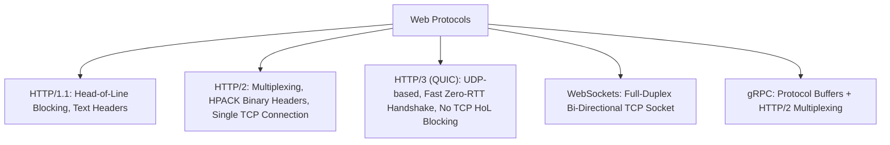

# File 01: Client-Server Architecture and Protocols (HTTP/1.1 vs HTTP/2 vs HTTP/3 vs WebSockets vs gRPC)

## Overview
The **Client-Server Architecture** separates user presentation interfaces (**Clients**) from data storage and business logic processing (**Servers**). Understanding communication protocols (HTTP/1.1, HTTP/2, HTTP/3, WebSockets, gRPC) determines latency, throughput, and system scalability.

---

## 1. Network Protocols Comparison Matrix



### Protocol Feature Matrix

| Protocol | Transport Protocol | Multiplexing? | Header Format | Typical Use Case |
| :--- | :--- | :--- | :--- | :--- |
| **HTTP/1.1** | TCP | No (Head-of-Line Blocking) | Plaintext | Legacy Web APIs |
| **HTTP/2** | TCP | **Yes** (Frames over 1 TCP stream) | Compressed Binary (HPACK) | Modern Web APIs & Webapps |
| **HTTP/3** | **QUIC (UDP)** | **Yes** (Zero TCP HoL blocking) | Compressed Binary (QPACK) | Mobile apps, High-latency networks |
| **WebSockets**| TCP | Full-Duplex Bi-Directional | Binary / Frame Text | Real-time Chat, Financial Tickers |
| **gRPC** | HTTP/2 (TCP) | **Yes** | Protocol Buffers | Inter-Microservice RPC Calls |

---

## 2. Minimal Protocol Server Implementation

```javascript
// HTTP/1.1 & HTTP/2 Server Simulation Concept
const http = require("http");

const server = http.createServer((req, res) => {
    if (req.url === "/api/health") {
        res.writeHead(200, { "Content-Type": "application/json" });
        res.end(JSON.stringify({ status: "UP", protocol: req.httpVersion }));
    }
});

server.listen(3000, () => {
    console.log("Server listening on port 3000");
});
```

---

## Key Takeaways
1. **HTTP/2** introduces **Multiplexing** over a single TCP connection to fix HTTP/1.1 Head-of-Line blocking.
2. **HTTP/3** runs on **QUIC (UDP)** to eliminate TCP packet loss blocking across streams.
3. Use **gRPC (Protobuf over HTTP/2)** for ultra-low latency microservice-to-microservice IPC calls.
4. Use **WebSockets** for persistent real-time bi-directional messaging.
