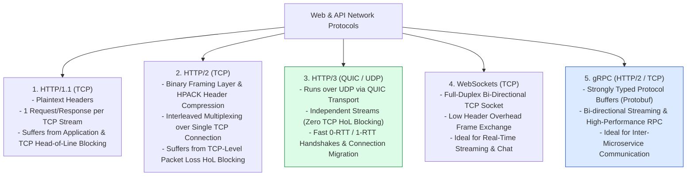
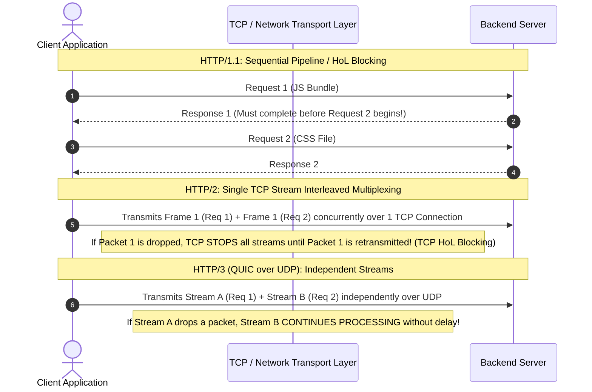
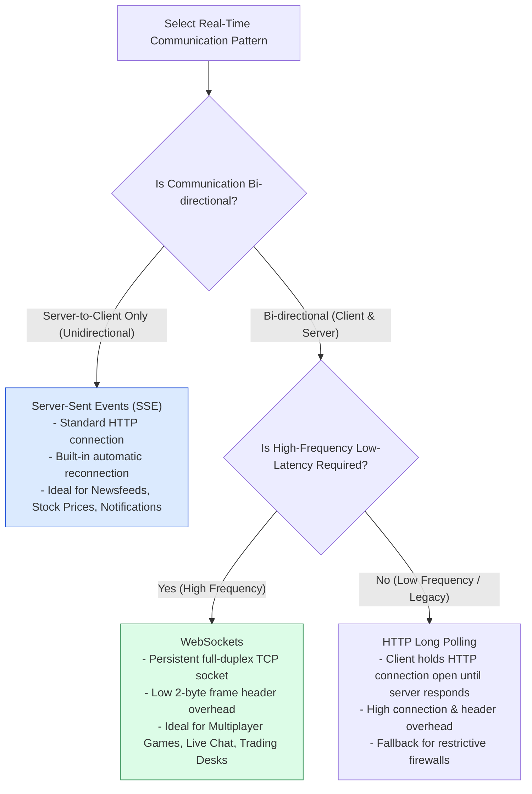

# Module 01: Client-Server Architecture and Web Communication Protocols (HTTP/1.1, HTTP/2, HTTP/3, WebSockets, gRPC)

## Overview

The **Client-Server Architecture** forms the foundational topology of distributed systems, cleanly decoupling user presentation layers (**Clients**) from data storage and business domain processing (**Servers**).

Selecting the appropriate network communication protocol—**HTTP/1.1**, **HTTP/2**, **HTTP/3 (QUIC)**, **WebSockets**, or **gRPC**—determines network latency, transport throughput, connection overhead, and vertical/horizontal system scalability.

Understanding **Transport Layer Bindings (TCP vs. UDP)**, **Head-of-Line (HoL) Blocking**, **Binary Framing & HPACK/QPACK Compression**, and **Bi-directional Multiplexing** is essential.

---

## 1. Network Protocol Architectural Evolution



---

## 2. Head-of-Line (HoL) Blocking: HTTP/1.1 vs. HTTP/2 vs. HTTP/3 (QUIC)



---

## 3. Comprehensive Protocol Selection Matrix

| Protocol Feature | HTTP/1.1 | HTTP/2 | HTTP/3 (QUIC) | WebSockets | gRPC |
| :--- | :--- | :--- | :--- | :--- | :--- |
| **Transport Layer** | TCP | TCP | **UDP (QUIC)** | TCP | TCP (over HTTP/2) |
| **Data Payload Format**| Plaintext Text | Binary Frames | Binary Frames | Binary / UTF-8 Text | **Protocol Buffers (Protobuf)** |
| **Multiplexing** | No (Pipelining fragile) | **Yes** (Single TCP Connection) | **Yes** (Independent UDP Streams) | Full-Duplex Socket | **Yes** (HTTP/2 Streams) |
| **Header Compression** | None | HPACK (Huffman Coding) | QPACK | Low Frame Header Overhead | HPACK |
| **Handshake Latency** | 2-3 RTTs (TCP + TLS) | 2-3 RTTs (TCP + TLS) | **0-1 RTT (Combined TLS 1.3)** | 2-3 RTTs (HTTP Upgrade) | 2-3 RTTs |
| **Connection Migration**| Breaks on IP change | Breaks on IP change | **Sustained via Connection ID** | Breaks on IP change | Breaks on IP change |
| **Primary Use Case** | Legacy APIs / Static web | Modern Web Applications | Mobile Apps / High Latency Mesh | Real-Time Feeds / Chat / Tickers | Inter-Microservice RPC |

---

## 4. WebSockets vs. HTTP Long Polling vs. Server-Sent Events (SSE)



---

## 5. Practical Implementation Showcase: Protocol Server Engine

```javascript
const http = require("node:http");
const { URL } = require("node:url");

// HTTP Server handling REST, Long Polling, and Protocol Inspection
const server = http.createServer((req, res) => {
  const reqUrl = new URL(req.url, `http://${req.headers.host}`);

  // Set Common CORS & Protocol Headers
  res.setHeader("X-Protocol-Version", req.httpVersion);
  res.setHeader("Access-Control-Allow-Origin", "*");

  // 1. Health Check Endpoint
  if (reqUrl.pathname === "/api/health") {
    res.writeHead(200, { "Content-Type": "application/json" });
    return res.end(JSON.stringify({
      status: "UP",
      httpVersion: req.httpVersion,
      transport: "TCP",
      timestamp: new Date().toISOString()
    }));
  }

  // 2. Server-Sent Events (SSE) Unidirectional Push Endpoint
  if (reqUrl.pathname === "/api/events") {
    res.writeHead(200, {
      "Content-Type": "text/event-stream",
      "Cache-Control": "no-cache",
      "Connection": "keep-alive"
    });

    // Send initial SSE connection event
    res.write(`data: ${JSON.stringify({ message: "SSE Connection Established" })}\n\n`);

    // Stream periodic events every 2 seconds
    const intervalId = setInterval(() => {
      res.write(`data: ${JSON.stringify({ ticker: "BTC-USD", price: (60000 + Math.random() * 500).toFixed(2) })}\n\n`);
    }, 2000);

    req.on("close", () => {
      clearInterval(intervalId);
      res.end();
    });
    return;
  }

  // Default 404 Handler
  res.writeHead(404, { "Content-Type": "application/json" });
  res.end(JSON.stringify({ error: "NOT_FOUND", message: "Endpoint does not exist." }));
});

const PORT = process.env.PORT || 3000;
server.listen(PORT, () => {
  console.log(`=== PROTOCOL DEMO SERVER ACTIVE: Listening on http://localhost:${PORT} ===`);
});
```

---

## Key Production Takeaways

1. **Adopt HTTP/2 or HTTP/3 for Web Frontends**: HTTP/2 multiplexing eliminates asset downloading bottlenecks by multiplexing CSS, JS, and image streams over a single TCP connection.
2. **Use gRPC for Microservice-to-Microservice IPC**: Internal microservice APIs should leverage gRPC (Protobuf over HTTP/2) instead of JSON REST to reduce serialization CPU cost and network payload size by up to 60-80%.
3. **Use HTTP/3 (QUIC) for Mobile & High-Packet-Loss Networks**: QUIC prevents TCP packet loss from stalling unrelated streams and supports seamless IP network migration when mobile devices switch between Wi-Fi and Cellular networks.
4. **Choose WebSockets for Bi-Directional, SSE for Unidirectional**: Use WebSockets for interactive chat and live gaming; use Server-Sent Events (SSE) for news feeds, dashboard notifications, and stock tickers to leverage native browser reconnection logic and standard HTTP infrastructure.

