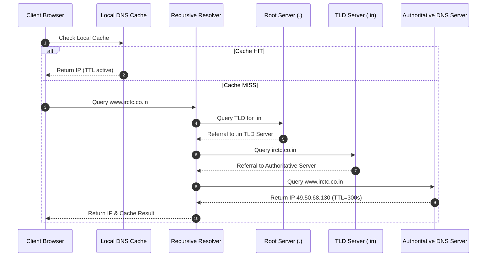
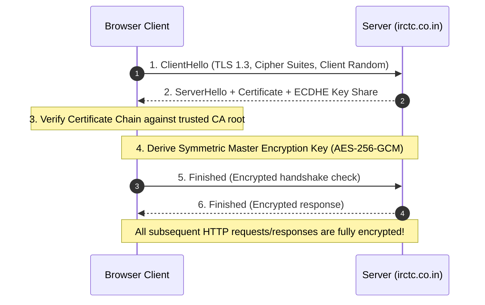

# Module 01: Client-Server Model, Networking Protocols, and HTTP/TLS Lifecycle

## Executive Summary & Theoretical Intuition

The **Client-Server Model** is the foundational architecture of distributed systems. A **Client** (browser, mobile app, CLI) initiates communication by requesting resources or operations from a **Server** (backend application, microservice, API gateway), which processes the request and returns a response.

```mermaid
flowchart LR
    Client["Client (Browser / App)"] -->|1. DNS Lookup| DNS["DNS Server Hierarchy"]
    DNS -- 2. IP Address --> Client
    Client -->|3. TCP Handshake + TLS| Server["Backend Application Server"]
    Client -->|4. HTTP Request (GET/POST)| Server
    Server -->|5. HTTP Response (200 OK)| Client
```

### Real-World Case Study: The IRCTC Tatkal Booking Rush
At 10:00 AM sharp, millions of users initiate requests simultaneously to book train tickets on IRCTC:
1. **DNS Resolution**: The browser resolves `www.irctc.co.in` to IP `49.50.68.130`.
2. **TCP & TLS Handshake**: Establishes an encrypted, reliable channel.
3. **HTTP Request**: Sends HTTP `POST /api/booking` with passenger and payment details.
4. **Server Processing & Response**: IRCTC processes the booking and returns HTTP `201 Created` with a PNR number or `429 Too Many Requests` when rate limits trigger under surge load.

---

## 1. DNS Resolution Mechanics

**DNS (Domain Name System)** translates human-readable domain names (e.g., `www.irctc.co.in`) into 32-bit IPv4 or 128-bit IPv6 addresses.



### Code Simulation Walkthrough (`DNSResolver`)
The DNS resolver maintains a local cache and delegates recursive lookups down root and TLD hierarchies:

```javascript
class DNSResolver {
  constructor() {
    this.cache = new Map();
    this.rootServers = { ".in": "198.41.0.4", ".com": "199.7.91.13" };
    this.authoritativeRecords = {
      "www.irctc.co.in": "49.50.68.130",
      "www.swiggy.com": "104.18.10.20",
    };
  }

  resolve(domain) {
    if (this.cache.has(domain)) {
      const cached = this.cache.get(domain);
      return cached.ip; // Cache HIT
    }

    const tld = "." + domain.split(".").pop();
    if (this.authoritativeRecords[domain]) {
      const ip = this.authoritativeRecords[domain];
      this.cache.set(domain, { ip, ttl: 300 });
      return ip; // Cache MISS -> Authoritative Answer
    }
    return null; // NXDOMAIN
  }
}
```

---

## 2. HTTP Request/Response Lifecycle

An **HTTP Transaction** represents a single request-response cycle over a TCP/IP network connection.

```javascript
class HTTPMock {
  constructor(name) {
    this.name = name;
    this.routes = new Map();
    this.connectionId = 0;
  }

  addRoute(method, path, handler) {
    this.routes.set(`${method}:${path}`, handler);
  }

  request(method, url, headers = {}, body = null) {
    this.connectionId++;
    // Execution steps:
    // 1. Resolve DNS
    // 2. TCP 3-way handshake (SYN -> SYN-ACK -> ACK)
    // 3. Send HTTP Request
    // 4. Server Process & Response
    const key = `${method}:${url}`;
    const handler = this.routes.get(key);
    if (handler) return handler(body);
    return { status: 404, body: { error: "Route not found" } };
  }
}
```

---

## 3. HTTP Methods: Safety and Idempotency

HTTP defines specific method semantics controlling safety and idempotency:
- **Safe Method**: Does not alter server state (Read-Only).
- **Idempotent Method**: Executing identical requests multiple times produces the exact same server state as a single execution ($f(f(x)) = f(x)$).

| Method | Safe | Idempotent | Description | Real-World System Analogy |
| :--- | :--- | :--- | :--- | :--- |
| **GET** | **Yes** | **Yes** | Retrieves resource state without side effects. | Checking train seat availability. |
| **POST** | **No** | **No** | Creates a new resource or triggers side effects. | Booking a new Tatkal ticket. |
| **PUT** | **No** | **Yes** | Replaces target resource state entirely. | Updating complete passenger details list. |
| **PATCH**| **No** | **No** | Applies partial modifications to a resource. | Updating meal preference on a booking. |
| **DELETE**| **No** | **Yes** | Removes target resource. | Canceling a booked ticket. |

---

## 4. HTTP Status Code Taxonomy Matrix

Status codes communicate the result of an HTTP request:

| Code Range | Category | Common Status Codes | Meaning & Analogy |
| :--- | :--- | :--- | :--- |
| **1xx** | Informational | `100 Continue` | Server received headers; client should continue sending request body. |
| **2xx** | Success | `200 OK`<br/>`201 Created`<br/>`204 No Content` | Successful request (`200` GET response, `201` resource created via POST, `204` successful update without payload). |
| **3xx** | Redirection | `301 Moved Permanently`<br/>`304 Not Modified` | `301` permanent redirect (cached by browser), `304` validation match (use local cache). |
| **4xx** | Client Error | `400 Bad Request`<br/>`401 Unauthorized`<br/>`404 Not Found`<br/>`429 Too Many Requests` | Client issues (`401` missing auth token, `404` invalid URL, `429` rate-limit quota exceeded). |
| **5xx** | Server Error | `500 Internal Server Error`<br/>`502 Bad Gateway`<br/>`503 Service Unavailable` | Backend server failures (`502` upstream timeout, `503` server overload during rush). |

---

## 5. HTTP Headers & Caching Directives

Headers carry key metadata controlling security, authorization, content negotiation, and caching.

### Cache-Control Directives Comparison
```http
Cache-Control: public, max-age=86400
Cache-Control: no-cache, must-revalidate
Cache-Control: no-store
```

| Strategy Header | Caching Behavior | Use Case |
| :--- | :--- | :--- |
| `public, max-age=86400` | Cached by browser & CDNs for 24 hours. | Static assets (CSS, JS, logos, train schedules). |
| `no-cache, must-revalidate` | Caches copy but **must revalidate** with server before serving. | Live seat availability status. |
| `no-store` | **Never cache** any part of the request/response in RAM/disk. | Payment gateways, credit card forms, PII data. |

---

## 6. HTTPS & TLS 1.3 Handshake Architecture

HTTPS wraps HTTP inside **TLS (Transport Layer Security)** encryption to guarantee confidentiality, integrity, and authenticity.



---

## 7. Transport Layer: TCP vs UDP

| Metric | TCP (Transmission Control Protocol) | UDP (User Datagram Protocol) |
| :--- | :--- | :--- |
| **Connection Setup** | 3-Way Handshake (`SYN` $\to$ `SYN-ACK` $\to$ `ACK`). | Connectionless (No handshake). |
| **Reliability** | **Guaranteed delivery** via ACKs and retransmissions. | Unreliable (Packets may drop or arrive out of order). |
| **Ordering** | Guaranteed sequence number ordering (`SEQ`). | No sequence guarantees. |
| **Flow & Congestion Control**| Yes (Sliding Window, Slow Start, Congestion Avoidance).| None (Sends data at maximum requested speed). |
| **Primary Use Cases** | Bank transactions, IRCTC ticketing, APIs, SSH, email. | Live streaming, voice calls (VoIP), online gaming, DNS queries. |

---

## 8. Connection Keep-Alive and Connection Pooling

Creating a new TCP connection requires a 3-way handshake ($\approx 100\text{ ms}$). Reusing existing connections via `ConnectionPool` dramatically reduces latency.

```javascript
class ConnectionPool {
  constructor(max) {
    this.max = max;
    this.active = [];
    this.idle = [];
    this.created = 0;
  }

  acquire(host) {
    const idleIdx = this.idle.findIndex((c) => c.host === host);
    if (idleIdx >= 0) {
      const conn = this.idle.splice(idleIdx, 1)[0];
      this.active.push(conn);
      return conn; // Reused connection (0ms handshake!)
    }
    if (this.active.length < this.max) {
      this.created++;
      const conn = { id: this.created, host };
      this.active.push(conn);
      return conn; // New TCP connection
    }
    return null; // Queued
  }

  release(conn) {
    const idx = this.active.indexOf(conn);
    if (idx >= 0) {
      this.active.splice(idx, 1);
      this.idle.push(conn);
    }
  }
}
```

- **Without Keep-Alive**: 4 requests $= 4 \times 100\text{ ms} = 400\text{ ms}$.
- **With Keep-Alive Pooling**: 3 initial connections $+ 1$ reused connection $= 300\text{ ms}$ (**25% faster**).

---

## Key Takeaways

1. **DNS Resolution**: Resolves domain names to IP addresses via root, TLD, and authoritative nameservers before initiating connections.
2. **HTTP Semantics**: Respect safe (GET) and idempotent (GET, PUT, DELETE) method definitions to prevent unintended side effects.
3. **Status Codes**: 2xx = Success, 3xx = Redirection, 4xx = Client Error, 5xx = Server Error.
4. **HTTPS Encryption**: Protects against MITM attacks using TLS 1.3 certificate validation and ECDHE key exchange.
5. **TCP vs UDP**: Use TCP when reliability is mandatory; use UDP for ultra-low latency real-time data streams.
6. **Connection Pooling**: Eliminates redundant TCP handshakes, improving overall application throughput.
