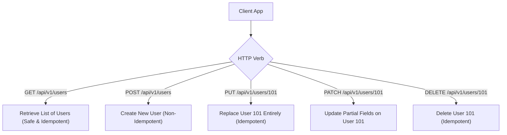

# File 02: REST API Design Best Practices

## Overview
**REST (Representational State Transfer)** is an architectural style for designing stateless web APIs centered around resources identified by URIs, manipulated using standard HTTP verbs (`GET`, `POST`, `PUT`, `PATCH`, `DELETE`).

---

## 1. REST Resource Endpoint Taxonomy



### HTTP Verb Characteristics Matrix

| Verb | Action | Safe? | Idempotent? | Success Status |
| :--- | :--- | :--- | :--- | :--- |
| **`GET`** | Read Resource | **Yes** | **Yes** | `200 OK` |
| **`POST`** | Create Resource | No | No | `201 Created` |
| **`PUT`** | Full Replace | No | **Yes** | `200 OK` / `204 No Content` |
| **`PATCH`**| Partial Update | No | No | `200 OK` |
| **`DELETE`**| Delete Resource | No | **Yes** | `200 OK` / `204 No Content` |

---

## 2. Production REST Controller Implementation

```javascript
// Express-style REST Controller Handler
class OrderController {
    static async getOrders(req, res) {
        const { page = 1, limit = 10, status } = req.query;
        // Pagination & Filtering
        return res.status(200).json({
            page: Number(page),
            limit: Number(limit),
            data: [{ id: "ORD_101", status: status || "PENDING" }]
        });
    }

    static async createOrder(req, res) {
        const { items, total } = req.body;
        if (!items || items.length === 0) {
            return res.status(400).json({
                error: "BAD_REQUEST",
                message: "Order items cannot be empty"
            });
        }
        return res.status(201).json({ id: "ORD_102", status: "CREATED", total });
    }
}
```

---

## Key Takeaways
1. Use **plural nouns for URIs** (`/api/v1/orders`), never verbs (`/api/v1/getOrders`).
2. An operation is **Idempotent** if making multiple identical requests leaves the system in the exact same state as a single request.
3. Always return standard **HTTP Status Codes** (`200`, `201`, `400`, `401`, `403`, `404`, `500`).
