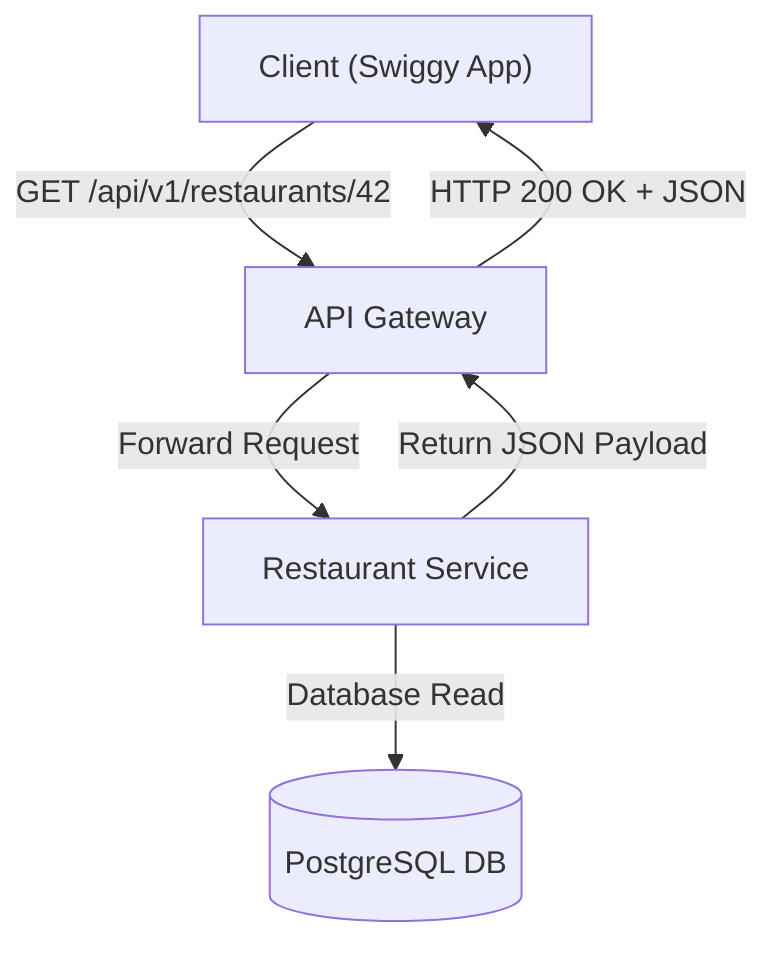
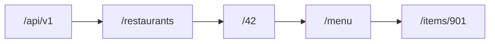
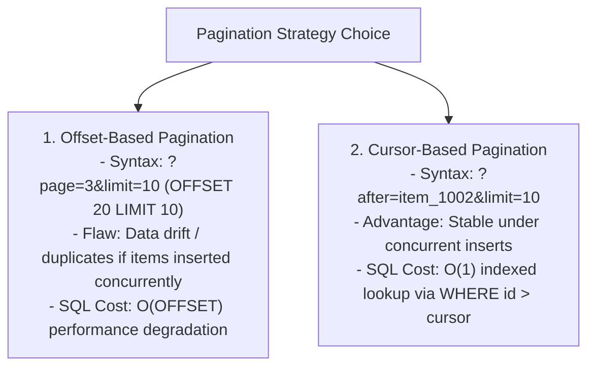
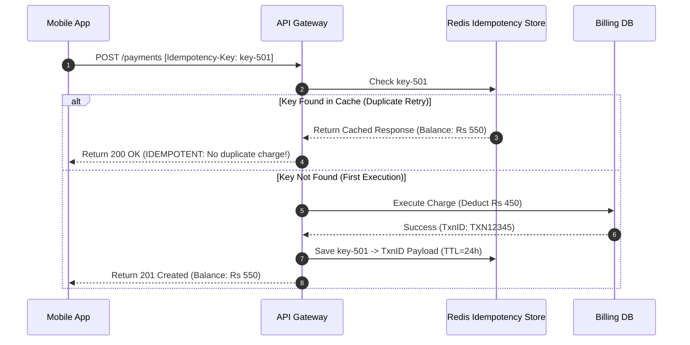

# Module 02: REST API Architecture, Resource Naming, & Idempotency Design

## Theoretical Overview & Architecture Constraints

**REST (Representational State Transfer)** is an architectural style defined by Roy Fielding that governs communication between web clients and distributed servers. REST treats data entities as **Resources** identified by unique **URIs**, manipulated via standardized HTTP methods.



### The 6 Core REST Constraints
1. **Client-Server Separation**: Decouples UI concerns from data storage, allowing frontend and backend code to evolve independently.
2. **Statelessness**: Every HTTP request must contain all contextual data required for authorization and execution (e.g., Bearer JWT tokens). The server stores **no client session state**.
3. **Cacheability**: Responses must explicitly declare themselves cacheable or non-cacheable (`Cache-Control`) to prevent stale reads.
4. **Uniform Interface**: Resources use consistent naming schemes and standard HTTP methods (`GET`, `POST`, `PUT`, `DELETE`).
5. **Layered System**: Clients cannot detect whether they are connected directly to an end application server, a CDN edge, or a load balancer.
6. **Code on Demand (Optional)**: Servers can temporarily extend client functionality by transferring executable code (e.g., JavaScript scripts).

---

## 1. REST Architectural Principles Matrix

| Principle | Meaning | Real-World System Analogy | Constraint Violation Example |
| :--- | :--- | :--- | :--- |
| **Client-Server** | Separation of user interface from backend data storage. | Swiggy iOS app and Node.js API backend deploy independently. | Server rendering HTML UI mixed directly with raw API data. |
| **Statelessness** | Server holds zero client session state between requests. | JWT token passed in `Authorization` header on every call. | Server storing active page numbers in global RAM variables. |
| **Cacheability** | Explicit caching headers on resource payloads. | Menu list cached for 5 minutes; cart total never cached. | Serving dynamic cart data without `Cache-Control` headers. |
| **Uniform Interface** | Predictable URIs and standardized HTTP verb semantics. | `GET /restaurants/42` always retrieves restaurant 42. | Non-standard RPC calls like `POST /getRestaurant` with `{id: 42}`. |
| **Layered System** | Intermediary proxies (CDNs, LBs, Gateways) operate transparently. | Swiggy app connects to Cloudflare CDN without backend awareness. | Client requiring hardcoded internal microservice IP addresses. |

---

## 2. Resource-Oriented URI Design Best Practices

URIs are the **nouns** of your API ecosystem. Well-designed URIs are self-documenting, predictable, and hierarchical.



### Clean URI Design Rules

```http
GOOD: GET /api/v1/restaurants/42/menu
BAD:  GET /api/getRestaurantMenu?id=42
```

1. **Use Nouns, Not Verbs**: Resources represent entities (`/orders`), while HTTP methods represent operations (`POST`, `DELETE`).
2. **Use Plural Nouns**: Standardize on plural collections (`/users`, `/restaurants`, `/orders`).
3. **Represent Hierarchy**: Nest child resources under parent items (`/restaurants/42/menu`).
4. **Filter via Query Parameters**: Reserve path segments for resource identification; use query parameters for filtering, sorting, and pagination (`/restaurants?cuisine=biryani&city=bangalore`).

---

## 3. CRUD Operations to HTTP Mapping

The `SwiggyAPI` class illustrates clean mapping between domain CRUD actions and HTTP semantics:

```javascript
class SwiggyAPI {
  constructor() {
    this.restaurants = new Map([
      [1, { id: 1, name: "Meghana Foods", cuisine: "Biryani", city: "Bangalore" }],
    ]);
    this.orders = new Map();
    this.nextOrderId = 100;
  }

  // GET /restaurants?city=bangalore -> 200 OK
  listRestaurants(filters) {
    let results = Array.from(this.restaurants.values());
    if (filters.city) {
      results = results.filter((r) => r.city.toLowerCase() === filters.city.toLowerCase());
    }
    return results;
  }

  // POST /orders -> 201 Created
  createOrder(data) {
    const id = this.nextOrderId++;
    const order = { id, ...data, status: "placed", createdAt: new Date().toISOString() };
    this.orders.set(id, order);
    return order;
  }

  // PATCH /orders/100 -> 200 OK (Partial update)
  patchOrder(id, updates) {
    const order = this.orders.get(id);
    if (!order) return null; // 404 Not Found
    Object.assign(order, updates);
    return order;
  }

  // DELETE /orders/100 -> 204 No Content
  cancelOrder(id) {
    if (!this.orders.has(id)) return false; // 404 Not Found
    this.orders.delete(id);
    return true; // 204 No Content
  }
}
```

---

## 4. API Versioning Strategies

| Strategy | Syntax Example | Pros | Cons | Best Use Case |
| :--- | :--- | :--- | :--- | :--- |
| **URI Path** | `/api/v1/restaurants`<br/>`/api/v2/restaurants` | Highly explicit, browser readable, simple to route at API Gateway. | Minor URL clutter across major versions. | **Industry Standard** (Stripe, Twilio, Swiggy). |
| **Custom Header**| `Accept-Version: v2`<br/>`Accept: application/vnd.swiggy.v2+json` | Clean URIs, supports granular content negotiation. | Harder to test in browser tools, breaks caching proxies. | Internal enterprise microservices. |
| **Additive-Only**| Add new optional fields; never delete/rename existing fields. | Zero breaking changes, avoids versioning overhead. | Accumulates technical debt over time. | Public consumer APIs. |

---

## 5. Pagination Mechanics: Offset vs Cursor

Returning unpaginated database records can exhaust RAM and cause network timeouts.



```javascript
class PaginationDemo {
  constructor() {
    this.data = Array.from({ length: 20 }, (_, i) => ({ id: i + 1, name: `Restaurant-${i + 1}` }));
  }

  // Offset Pagination: Problematic when items are inserted during scroll
  offsetPaginate(page, limit) {
    const offset = (page - 1) * limit;
    return this.data.slice(offset, offset + limit);
  }

  // Cursor Pagination: High performance & stable under concurrent writes
  cursorPaginate(afterId, limit) {
    let start = afterId ? this.data.findIndex((r) => r.id === afterId) + 1 : 0;
    const items = this.data.slice(start, start + limit);
    const nextCursor = items.length ? items[items.length - 1].id : null;
    return { items, nextCursor };
  }
}
```

---

## 6. HATEOAS (Hypermedia As The Engine Of Application State)

HATEOAS extends REST payloads by embedding dynamic hypermedia links (`_links`) informing clients of allowed next operations based on current resource state.

```javascript
function buildHATEOASResponse(order) {
  const links = [{ rel: "self", href: `/api/v1/orders/${order.id}`, method: "GET" }];
  
  if (order.status === "placed") {
    links.push({ rel: "cancel", href: `/api/v1/orders/${order.id}`, method: "DELETE" });
    links.push({ rel: "track", href: `/api/v1/orders/${order.id}/tracking`, method: "GET" });
  }
  if (order.status === "delivered") {
    links.push({ rel: "rate", href: `/api/v1/orders/${order.id}/rating`, method: "POST" });
    links.push({ rel: "reorder", href: `/api/v1/orders`, method: "POST" });
  }
  return { ...order, _links: links };
}
```

---

## 7. Idempotency Key Architecture for Payment APIs

Because `POST` requests are non-idempotent by default, network timeouts during payment authorization can trigger duplicate billing if retried. **Idempotency Keys** guarantee single execution.



```javascript
class IdempotencyDemo {
  constructor() {
    this.processed = new Map();
    this.balance = 1000;
  }

  processPayment(key, amount) {
    if (this.processed.has(key)) {
      return this.processed.get(key); // Return cached result; skip charge!
    }
    this.balance -= amount;
    const result = { txnId: "TXN" + Date.now(), amount, balance: this.balance };
    this.processed.set(key, result);
    return result;
  }
}
```

---

## Key Takeaways

1. **Noun-Based URIs**: Use plural nouns (`/restaurants`) and standard HTTP verbs (`GET`, `POST`, `PUT`, `PATCH`, `DELETE`).
2. **Stateless Authentication**: Pass tokens (JWT) in headers rather than managing server-side session state.
3. **Prefer Cursor Pagination**: Use cursors for high-volume, dynamic data feeds to prevent item skipping or duplication.
4. **Idempotency Keys**: Use unique headers (`Idempotency-Key`) for payment and creation endpoints to protect against network retry duplicates.
5. **HATEOAS**: Embed dynamic navigation links (`_links`) to drive application state transitions cleanly.
