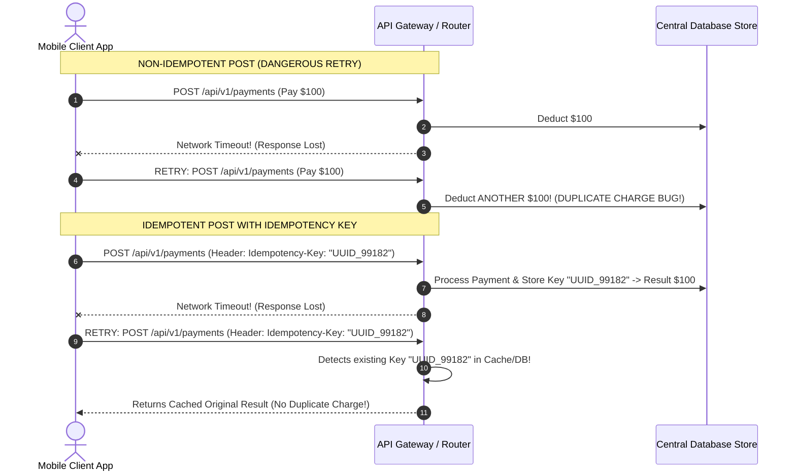
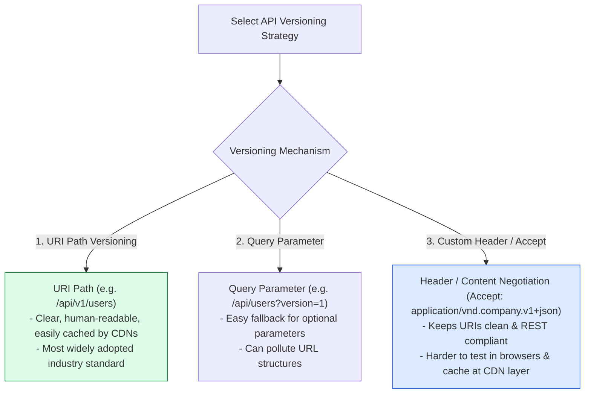

# Module 02: REST API Architecture, Idempotency Mechanics, and Production Design Standards

## Overview

**REST (Representational State Transfer)** is an architectural style for distributed hypermedia systems introduced by Roy Fielding. It models web APIs around **Resources** identified by URIs and manipulated using standard **HTTP Verbs** (`GET`, `POST`, `PUT`, `PATCH`, `DELETE`).

Building production-ready RESTful APIs requires strict adherence to **Fielding's Architectural Constraints** (Statelessness, Uniform Interface, Cacheability, Layered System), **Idempotency Guarantees**, **RFC 7807 Problem Details Error Formatting**, and **API Versioning Strategies**.

---

## 1. Architectural Constraints & Resource Endpoint Taxonomy

```mermaid
flowchart TD
    subgraph REST Architectural Constraints
        C1["1. Statelessness<br/>Every request contains full authentication & context"]
        C2["2. Uniform Interface<br/>Standard URIs, HTTP Verbs, Representation Formats"]
        C3["3. Cacheable Responses<br/>Explicit ETag & Cache-Control headers"]
        C4["4. Layered System<br/>Intermediary proxies, load balancers, & gateways"]
    end

    subgraph HTTP Verb Mapping
        GET["GET /api/v1/orders<br/>(Safe & Idempotent Read)"]
        POST["POST /api/v1/orders<br/>(Non-Idempotent Resource Creation)"]
        PUT["PUT /api/v1/orders/101<br/>(Idempotent Full Replacement)"]
        PATCH["PATCH /api/v1/orders/101<br/>(Non-Idempotent Partial Mutation)"]
        DELETE["DELETE /api/v1/orders/101<br/>(Idempotent Removal)"]
    end

    C2 --> HTTP Verb Mapping
```

### Comprehensive HTTP Verb Semantics Matrix

| HTTP Verb | Operation Purpose | Safe? | Idempotent? | Success Status Code | Failure Status Codes |
| :--- | :--- | :--- | :--- | :--- | :--- |
| **`GET`** | Retrieve resource representation | **Yes** | **Yes** | `200 OK` | `404 Not Found`, `400 Bad Request` |
| **`POST`** | Create new resource / Execute action | No | No | `201 Created` | `400 Bad Request`, `409 Conflict`, `422 Unprocessable` |
| **`PUT`** | Full replacement of existing resource | No | **Yes** | `200 OK` / `204 No Content` | `404 Not Found`, `400 Bad Request` |
| **`PATCH`**| Partial modification of fields | No | No (Unless atomic) | `200 OK` | `404 Not Found`, `400 Bad Request`, `422 Unprocessable` |
| **`DELETE`**| Remove resource | No | **Yes** | `200 OK` / `204 No Content` | `404 Not Found` (or `204` idempotent) |

---

## 2. Idempotency Mechanics in Distributed APIs

An HTTP method is **Idempotent** if executing $N > 1$ identical requests leaves the system in the **exact same state** as executing $N = 1$ request.



---

## 3. API Versioning Strategies Comparison



---

## 4. RFC 7807 Problem Details Error Specification

Production REST APIs should standardize error payloads using the **RFC 7807 Problem Details for HTTP APIs** specification (`Content-Type: application/problem+json`):

```json
{
  "type": "https://api.techplaybook.org/errors/validation-failed",
  "title": "Invalid Input Payload",
  "status": 400,
  "detail": "The request body failed 2 validation rules.",
  "instance": "/api/v1/orders/ORD-9912/items",
  "invalidParams": [
    { "name": "quantity", "reason": "Quantity must be a positive integer greater than 0" },
    { "name": "sku", "reason": "SKU 'PROD_INVALID' does not exist in catalog" }
  ]
}
```

---

## 5. Practical Implementation Showcase: Production REST Controller

```javascript
const http = require("node:http");
const { URL } = require("node:url");

// Mock Database Store
const ordersDb = new Map();
const idempotencyStore = new Map(); // Idempotency Key Cache

class RestOrderController {
  // GET /api/v1/orders (Paginated List)
  static async getOrders(req, res, queryParams) {
    const page = parseInt(queryParams.get("page") || "1", 10);
    const limit = parseInt(queryParams.get("limit") || "10", 10);
    const allOrders = Array.from(ordersDb.values());

    const startIndex = (page - 1) * limit;
    const paginatedOrders = allOrders.slice(startIndex, startIndex + limit);

    res.writeHead(200, {
      "Content-Type": "application/json",
      "Cache-Control": "public, max-age=60"
    });
    res.end(JSON.stringify({
      object: "list",
      page,
      limit,
      totalCount: allOrders.length,
      data: paginatedOrders
    }));
  }

  // POST /api/v1/orders (Idempotent Resource Creation)
  static async createOrder(req, res, body) {
    const idempotencyKey = req.headers["idempotency-key"];

    // Check for duplicate request via Idempotency Key
    if (idempotencyKey && idempotencyStore.has(idempotencyKey)) {
      const cachedResponse = idempotencyStore.get(idempotencyKey);
      res.writeHead(cachedResponse.status, { "Content-Type": "application/json", "X-Cache-Hit": "true" });
      return res.end(cachedResponse.payload);
    }

    if (!body.items || !Array.isArray(body.items) || body.items.length === 0) {
      // RFC 7807 Error Response Format
      const errorPayload = JSON.stringify({
        type: "https://api.techplaybook.org/errors/bad-request",
        title: "Validation Error",
        status: 400,
        detail: "Order must contain at least one valid item.",
        instance: req.url
      });
      res.writeHead(400, { "Content-Type": "application/problem+json" });
      return res.end(errorPayload);
    }

    const orderId = `ORD_${Date.now()}`;
    const newOrder = {
      id: orderId,
      items: body.items,
      total: body.total || 0,
      status: "CREATED",
      createdAt: new Date().toISOString()
    };

    ordersDb.set(orderId, newOrder);

    const responsePayload = JSON.stringify(newOrder);

    // Cache Idempotency Key response
    if (idempotencyKey) {
      idempotencyStore.set(idempotencyKey, { status: 201, payload: responsePayload });
    }

    res.writeHead(201, {
      "Content-Type": "application/json",
      "Location": `/api/v1/orders/${orderId}`
    });
    res.end(responsePayload);
  }
}

// HTTP Route Dispatcher
const server = http.createServer((req, res) => {
  const parsedUrl = new URL(req.url, `http://${req.headers.host}`);
  let bodyChunks = [];

  req.on("data", (chunk) => bodyChunks.push(chunk));
  req.on("end", async () => {
    let body = {};
    if (bodyChunks.length > 0) {
      try { body = JSON.parse(Buffer.concat(bodyChunks).toString()); } catch (e) {}
    }

    if (req.method === "GET" && parsedUrl.pathname === "/api/v1/orders") {
      return RestOrderController.getOrders(req, res, parsedUrl.searchParams);
    }
    if (req.method === "POST" && parsedUrl.pathname === "/api/v1/orders") {
      return RestOrderController.createOrder(req, res, body);
    }

    res.writeHead(404, { "Content-Type": "application/problem+json" });
    res.end(JSON.stringify({
      type: "https://api.techplaybook.org/errors/not-found",
      title: "Resource Not Found",
      status: 404,
      detail: `Endpoint '${parsedUrl.pathname}' does not exist.`
    }));
  });
});

const PORT = process.env.PORT || 3000;
server.listen(PORT, () => {
  console.log(`=== REST API SERVER ACTIVE: http://localhost:${PORT} ===`);
});
```

---

## Key Production Takeaways

1. **Use Plural Nouns for URIs**: Design endpoints around resource entities (`/api/v1/users`), never verbs (`/api/v1/getUsers`).
2. **Implement Idempotency Keys for `POST` Operations**: Accept an `Idempotency-Key` header on financial/mutation endpoints to safely allow network retries without causing duplicate records or billing bugs.
3. **Use RFC 7807 for Standardized Error Responses**: Return `Content-Type: application/problem+json` with `type`, `title`, `status`, and `detail` keys to ensure client software can parse errors uniformly.
4. **Use URI Path Versioning**: Prefer `/api/v1/...` path versioning to ensure CDN caches, edge routers, and API gateways can route requests deterministically without needing header inspection.

