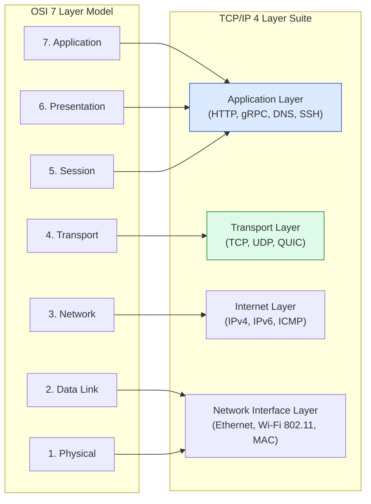
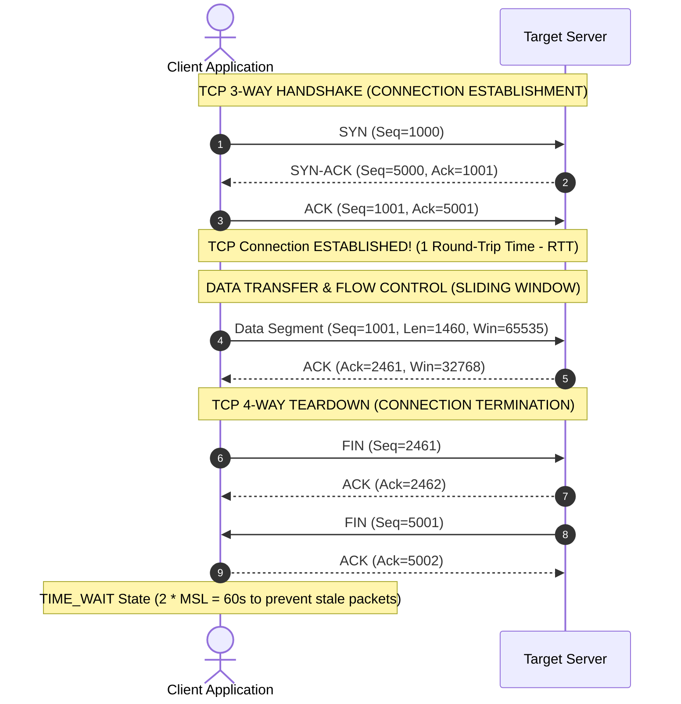
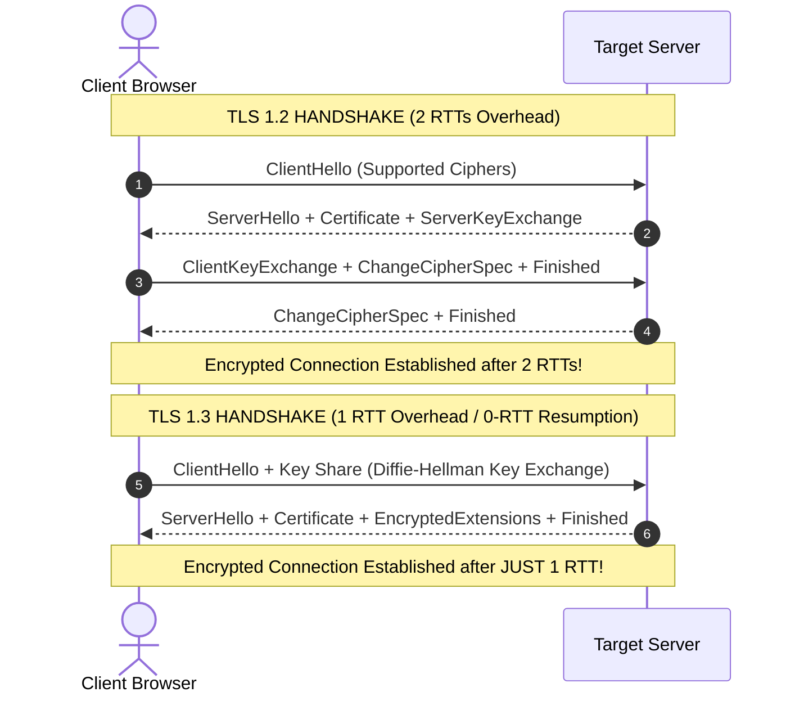

# Module 03: Computer Networking Deep Dive (OSI 7 Layers, TCP Handshake/Teardown, TLS 1.3, MTU/MSS)

## Overview

Modern web applications and distributed systems depend on low-level computer networking fundamentals. Understanding the **OSI 7-Layer Model**, **TCP 3-Way Connection Handshake**, **TCP 4-Way Connection Teardown**, **Sliding Window Flow Control**, **TLS 1.3 Cryptographic Handshakes**, and **MTU/MSS Packet Demarcation** is essential for optimizing system latency and debugging connection timeouts.

---

## 1. OSI 7-Layer vs. TCP/IP 4-Layer Architecture Model



### Protocol Data Unit (PDU) Encapsulation Matrix

| OSI Layer | Layer Name | Protocol Data Unit (PDU) | Core Protocols & Primitives | Technical Function |
| :--- | :--- | :--- | :--- | :--- |
| **7** | Application | Data | HTTP/1.1, HTTP/2, HTTP/3, DNS, WebSockets | User-facing application data exchange |
| **6** | Presentation | Data | TLS 1.3, SSL, JSON, Protocol Buffers | Encryption, decryption, data formatting |
| **5** | Session | Data | POSIX Sockets, RPC Handles | Connection session maintenance |
| **4** | Transport | **Segment (TCP) / Datagram (UDP)** | **TCP**, **UDP**, QUIC | End-to-end process port communication (`:80`, `:443`) |
| **3** | Network | **Packet** | IPv4, IPv6, ICMP, IPsec | Host-to-host IP routing across networks |
| **2** | Data Link | **Frame** | Ethernet (802.3), Wi-Fi (802.11), MAC | Node-to-node physical MAC address framing |
| **1** | Physical | **Bits** | Copper Cables, Fiber Optics, Waves | Electrical/optical raw bit transmission |

---

## 2. TCP Lifecycle: 3-Way Handshake & 4-Way Teardown



---

## 3. TLS 1.2 vs. TLS 1.3 Handshake Latency



---

## 4. Packet Demarcation: MTU vs. MSS

- **MTU (Maximum Transmission Unit)**: The maximum frame payload size (typically **1500 Bytes** on standard Ethernet) that a network interface can transmit without IP fragmentation.
- **MSS (Maximum Segment Size)**: The maximum TCP data payload size excluding IP (20 Bytes) and TCP (20 Bytes) headers:
  $$\text{MSS} = \text{MTU} - (\text{IP Header} + \text{TCP Header}) = 1500 - (20 + 20) = 1460 \text{ Bytes}$$

---

## 5. Practical Implementation Showcase: Low-Level TCP Socket Metrics

```javascript
const net = require("node:net");

// Low-level TCP Server inspecting socket transport metrics
const server = net.createServer((socket) => {
  console.log(`[TCP CLIENT CONNECTED] IP: ${socket.remoteAddress}, Port: ${socket.remotePort}`);

  // Inspect TCP Socket Options
  socket.setKeepAlive(true, 10000); // 10s Keep-Alive idle timer
  socket.setNoDelay(true);          // Disable Nagle's algorithm (TCP_NODELAY)

  socket.on("data", (data) => {
    console.log(`[RECEIVED TCP SEGMENT] Received ${data.length} bytes.`);
    
    // Echo response back over TCP stream
    const responsePayload = `HTTP/1.1 200 OK\r\nContent-Length: 13\r\n\r\nHello World!\n`;
    socket.write(responsePayload);
  });

  socket.on("end", () => {
    console.log(`[TCP FIN RECEIVED] Client initiated teardown.`);
  });

  socket.on("error", (err) => {
    console.error(`[TCP SOCKET ERROR]`, err.message);
  });
});

const PORT = process.env.PORT || 4000;
server.listen(PORT, () => {
  console.log(`=== LOW-LEVEL TCP SERVER LISTENING ON PORT ${PORT} ===`);
});
```

---

## Key Production Takeaways

1. **Enable TLS 1.3 for Faster Handshakes**: TLS 1.3 reduces cryptographic handshake latency from 2 RTTs down to 1 RTT (and supports 0-RTT session resumption), significantly speeding up mobile and cold API requests.
2. **Tune Linux TCP Socket States (`TIME_WAIT` & `FIN_WAIT_2`)**: High-throughput proxies (e.g. Nginx, HAProxy) handling thousands of requests/sec can run out of local ephemeral ports due to sockets lingering in `TIME_WAIT`. Enable `net.ipv4.tcp_tw_reuse` in Linux kernel sysctl params.
3. **Disable Nagle's Algorithm for Low-Latency APIs**: By default, TCP buffers small data chunks to fill an entire MSS segment. Set `socket.setNoDelay(true)` (`TCP_NODELAY`) on real-time sockets (WebSocket, gRPC, DB drivers) to send packets immediately.
4. **Avoid IP Packet Fragmentation by Respecting MSS**: Keep payloads within the 1460-byte MSS limit for single-packet DNS/UDP or latency-sensitive health check responses to prevent packet fragmentation across intermediate network routers.

