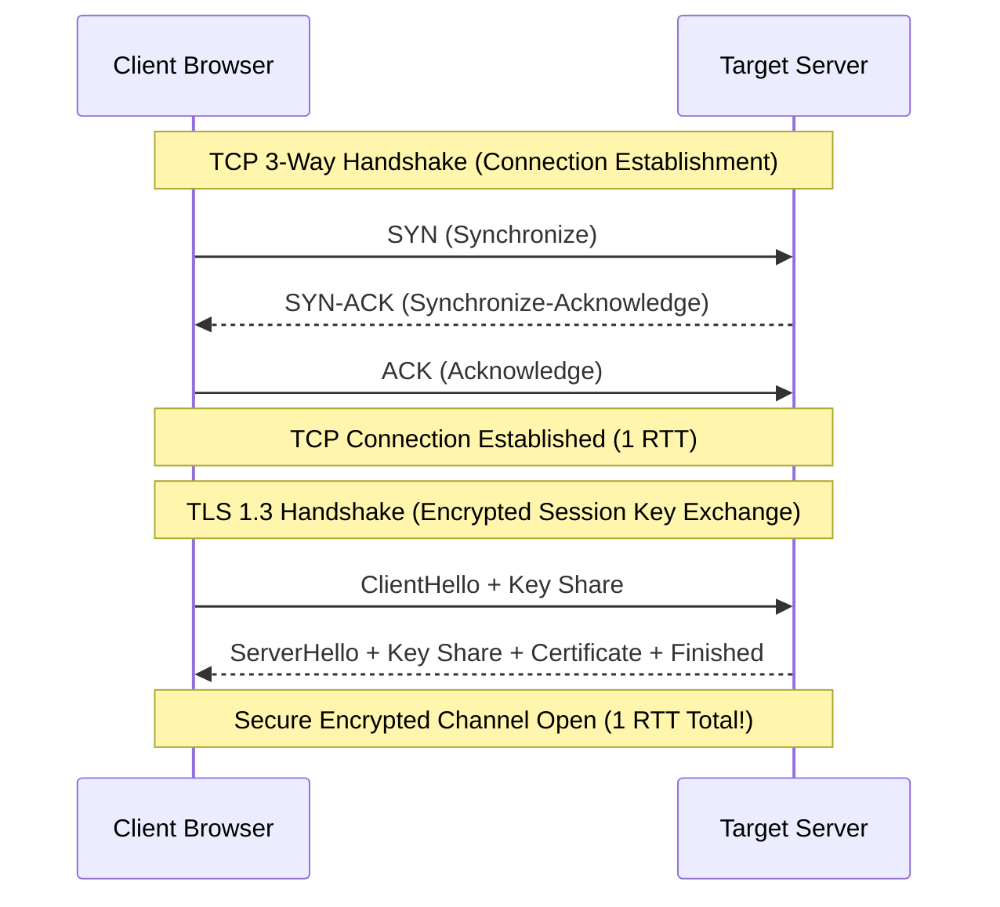

# File 03: Networking Deep Dive (OSI 7 Layers, TCP 3-Way Handshake, TLS Handshake)

## Overview
Computer networking relies on layered communication models. Understanding the **OSI 7 Layer Model**, **TCP 3-Way Handshake**, and **TLS 1.3 Encryption Handshake** explains connection latency and network packet flow.

---

## 1. OSI 7 Layer Model & TCP 3-Way Handshake

### OSI 7 Layer Architecture

| Layer Number | Layer Name | Protocol Examples | Data Unit |
| :--- | :--- | :--- | :--- |
| **7** | Application | HTTP, HTTPS, WebSockets, DNS, SSH | Data |
| **6** | Presentation | TLS, SSL, Data Compression, JSON/Protobuf | Data |
| **5** | Session | NetBIOS, RPC Session Handles | Data |
| **4** | Transport | **TCP**, **UDP** | **Segment** (TCP) / Datagram (UDP) |
| **3** | Network | **IP** (IPv4, IPv6), ICMP | **Packet** |
| **2** | Data Link | Ethernet, Wi-Fi (802.11), MAC Addresses | **Frame** |
| **1** | Physical | Fiber Optics, Copper Wire, Radio Waves | **Bits** |

---

## Key Takeaways
1. **TCP 3-Way Handshake** requires 1 Round Trip Time (RTT): `SYN` $\rightarrow$ `SYN-ACK` $\rightarrow$ `ACK`.
2. **TLS 1.3** reduces encryption handshake setup to **1 RTT** (down from 2 RTTs in TLS 1.2).
3. **TCP** guarantees ordered, reliable packet delivery via ACKs and retransmissions; **UDP** trades reliability for ultra-fast connectionless transmission.
