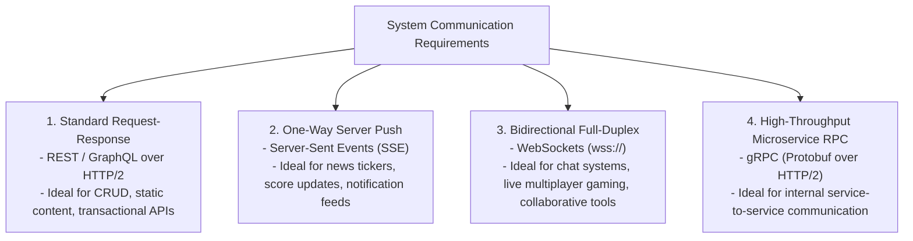
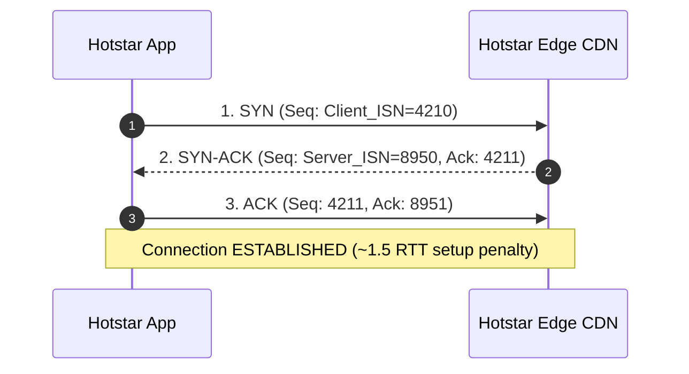
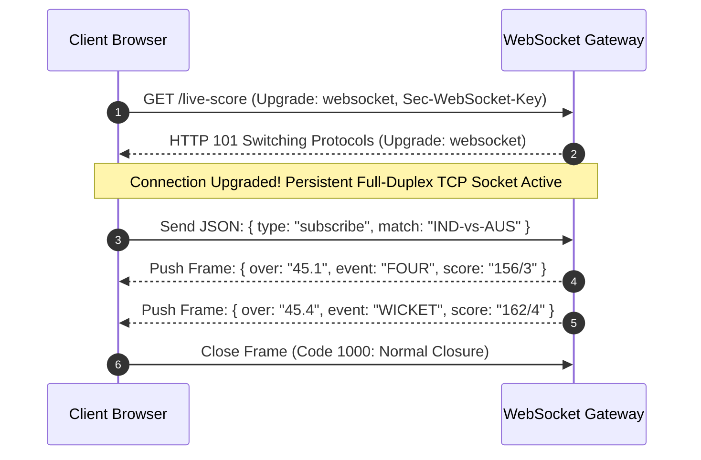

# Module 03: Networking Deep Dive, Real-Time Protocols, and HTTP/2 Multiplexing

## Theoretical Overview & Architecture Intuition

Modern web architectures require diverse communication patterns ranging from stateless HTTP request-response cycles to low-latency, full-duplex real-time streaming sockets.



### Real-World Case Study: Hotstar Live Cricket Streaming
During an India vs. Australia ICC match, Hotstar serves over **25 million concurrent users**:
- **Video Segments**: Streamed over HTTP/2 via CDN edge servers.
- **Live Scoreboard**: Delivered instantly via persistent **WebSockets**.
- **Breaking Push Alerts**: Dispatched using **Server-Sent Events (SSE)**.
- **Internal Backend Microservices**: Communicate using high-performance **gRPC**.

---

## 1. TCP 3-Way Handshake Mechanics

Every reliable HTTP connection or WebSocket session begins with a **TCP 3-Way Handshake** to establish sequence numbers ($ISN$) and buffer sizes.



```javascript
function simulateTCPHandshake(client, server) {
  const clientISN = Math.floor(Math.random() * 10000);
  const serverISN = Math.floor(Math.random() * 10000);
  // Step 1: SYN    Client -> Server (Seq: clientISN)
  // Step 2: SYN-ACK Server -> Client (Seq: serverISN, Ack: clientISN + 1)
  // Step 3: ACK    Client -> Server (Seq: clientISN + 1, Ack: serverISN + 1)
  return { rttCount: 1.5, latencyMs: 75 };
}
```

---

## 2. Connection Pooling Architecture

Opening a new TCP connection for every API call incurs a handshake and TLS setup latency penalty ($\approx 150\text{ ms}$). A **Connection Pool** maintains reusable idle connections.

```javascript
class ConnectionPool {
  constructor(name, maxSize) {
    this.name = name;
    this.maxSize = maxSize;
    this.connections = [];
    this.stats = { created: 0, reused: 0, rejected: 0 };
  }

  acquire(reqId) {
    const idle = this.connections.find((c) => c.state === "idle");
    if (idle) {
      idle.state = "active";
      this.stats.reused++;
      return idle; // 0ms handshake overhead!
    }
    if (this.connections.length < this.maxSize) {
      const conn = { id: this.connections.length + 1, state: "active" };
      this.connections.push(conn);
      this.stats.created++;
      return conn;
    }
    this.stats.rejected++;
    return null; // Pool full
  }

  release(conn) {
    conn.state = "idle";
  }
}
```

---

## 3. Real-Time Communication Protocols Matrix

| Protocol | Direction | Transport | Reconnection | Payload Type | Primary Use Case |
| :--- | :--- | :--- | :--- | :--- | :--- |
| **Short Polling** | Client $\to$ Server | HTTP/1.1 | N/A (Repeated requests) | Text / JSON | Legacy dashboards. |
| **Long Polling** | Client $\leftrightarrow$ Server | HTTP/1.1 | Client initiates new poll | Text / JSON | Payment status confirmation. |
| **Server-Sent Events (SSE)**| **Server $\to$ Client**| HTTP/2 | Automatic (`Last-Event-ID`) | Text (`text/event-stream`) | Live score updates, stock tickers. |
| **WebSockets** | **Bidirectional** | TCP (`wss://`)| Manual client handler | Text & Binary | Real-time chat, multiplayer gaming. |
| **gRPC** | **Bidirectional** | HTTP/2 | Built-in channel reconnect | Binary (Protobuf) | Microservice inter-service calls. |

---

## 4. WebSocket Full-Duplex Protocol

WebSocket upgrades an HTTP connection to a persistent, bidirectional binary/text socket using the `HTTP 101 Switching Protocols` handshake.



```javascript
class WebSocketSim {
  constructor(url) {
    this.url = url;
    this.state = "CLOSED";
  }

  connect() {
    // 1. Send HTTP Upgrade Request
    // 2. Server responds HTTP 101 Switching Protocols
    this.state = "OPEN";
  }

  send(msg) { /* Client -> Server frame */ }
  receive(msg) { /* Server -> Client frame */ }
  close(code, reason) { this.state = "CLOSED"; }
}
```

---

## 5. Short Polling vs Long Polling vs Server-Sent Events (SSE)

```javascript
// Server-Sent Events Implementation (text/event-stream)
class SSESim {
  constructor() { this.eventId = 0; }
  push(type, data) {
    this.eventId++;
    // Formats stream chunk:
    // id: 1
    // event: score-update
    // data: {"runs": 169}
  }
}
```

- **Short Polling**: Client polls every 2 seconds. Up to **70–90% of requests are wasted** (`304 Not Modified`), creating unnecessary server CPU load.
- **Long Polling**: Server holds the request open until new data arrives. Reduces wasted polling HTTP requests, but holds server sockets open.
- **SSE**: Native HTTP server push (`text/event-stream`). Automatically reconnects using `Last-Event-ID` if network drops.

---

## 6. HTTP/2 Multiplexing & HPACK Compression

HTTP/1.1 suffers from **Head-of-Line (HOL) Blocking**, allowing only one active request/response per TCP connection at a time (browsers cap connections at 6 per domain).

HTTP/2 introduces **Binary Framing** and **Multiplexing**, allowing thousands of concurrent requests and responses to transmit concurrently over a **single TCP connection**.

```mermaid
flowchart LR
    subgraph HTTP/1.1 (Connection Per Request - HOL Blocking)
        Conn1["TCP Conn 1"] --> Req1["Request 1: index.html"]
        Conn2["TCP Conn 2"] --> Req2["Request 2: styles.css (Blocked behind Conn 1 limits)"]
    end

    subgraph HTTP/2 (Single TCP Connection - Binary Frame Multiplexing)
        SingleTCP["Single TCP Connection"] --> Stream1["Stream 1: index.html (Frame A)"]
        SingleTCP --> Stream2["Stream 2: styles.css (Frame B)"]
        SingleTCP --> Stream3["Stream 3: hero.jpg (Frame C)"]
    end
```

### Performance Comparison Benchmark
- **HTTP/1.1**: 5 assets across 6 connection slots $= \approx 240\text{ ms}$.
- **HTTP/2**: 5 assets multiplexed concurrently over 1 connection $+ \text{HPACK}$ header compression $= \approx 120\text{ ms}$ (**50% speedup**).

---

## 7. gRPC Microservice Communication Patterns

gRPC runs over **HTTP/2** and uses **Protocol Buffers (Protobuf)** for compact binary data serialization.

```protobuf
syntax = "proto3";

service MatchService {
  rpc GetMatchDetails (MatchRequest) returns (MatchResponse); // Unary
  rpc StreamScoreUpdates (ScoreRequest) returns (stream ScoreUpdate); // Server Streaming
}
```

### The 4 gRPC Streaming Paradigms
1. **Unary RPC**: Single client request $\to$ single server response.
2. **Server Streaming RPC**: Single client request $\to$ stream of server responses.
3. **Client Streaming RPC**: Stream of client requests $\to$ single server response.
4. **Bidirectional Streaming RPC**: Simultaneous streams in both directions.

---

## 8. Protocol Decision Framework

```javascript
const decisions = [
  ["Live Cricket Scores", "Real-time push updates", "WebSocket or SSE"],
  ["Swiggy Order Tracking", "Bidirectional location updates", "WebSocket"],
  ["IRCTC Train Search", "One-time request-response", "REST over HTTP/2"],
  ["Microservice Mesh", "High throughput, binary payload", "gRPC"],
  ["Payment Status Confirm", "Wait for bank confirmation", "Long Polling / WS"],
];
```

---

## Key Takeaways

1. **TCP Handshake Cost**: Every new TCP connection costs $\approx 1.5 \text{ RTTs}$. Use Connection Pooling to eliminate setup overhead.
2. **Use WebSockets for Full-Duplex**: Best for bidirectional, low-latency apps (chat, gaming).
3. **Use SSE for Server Push**: Simpler HTTP-native alternative to WebSockets when only server-to-client push is required.
4. **HTTP/2 Eliminates HOL Blocking**: Multiplexes concurrent request/response streams over a single TCP connection with HPACK compression.
5. **gRPC for Internal Services**: Delivers ultra-fast serialization and low latency for microservice-to-microservice traffic.
