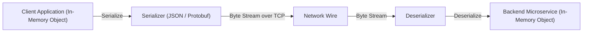
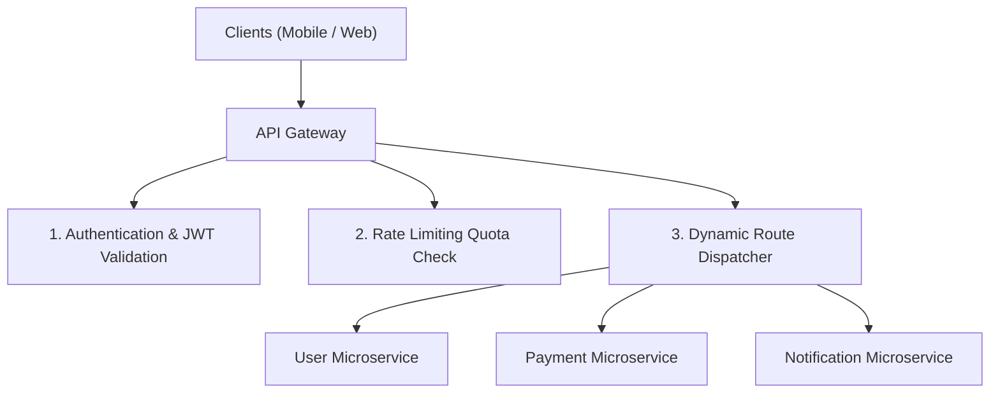
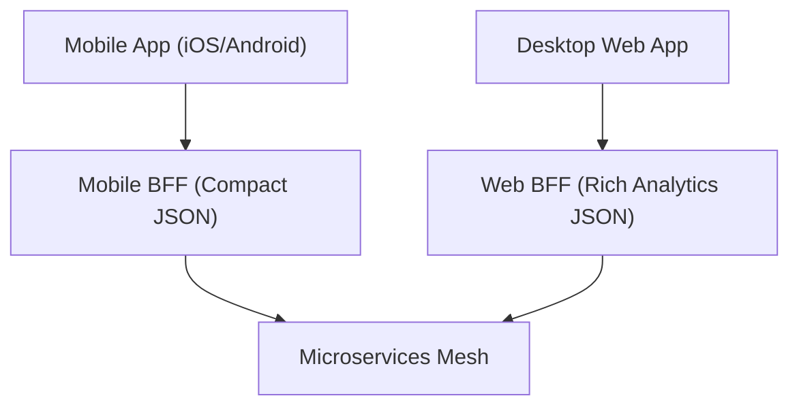

# Module 04: Data Serialization Formats, API Gateway, & BFF Architecture

## Theoretical Overview & Architecture Intuition

Data serialization transforms in-memory data structures (objects, arrays, graphs) into a portable byte stream or text format for transmission over networks or storage in databases.



### Real-World Case Study: PhonePe 10B+ Monthly UPI Payments
- **External Public API**: Mobile app uses **JSON** for readability and native JavaScript parsing.
- **Internal Microservices**: Inter-service communication between PhonePe, NPCI, and core banking networks uses **Protocol Buffers (Protobuf)** binary serialization.
- **Bandwidth Impact**: At 300M daily transactions, switching from JSON to Protobuf saves over **40–60 GB of network traffic every single day**.

---

## 1. JSON Serialization & JavaScript Edge Cases

**JSON (JavaScript Object Notation)** is human-readable and universally supported across web platforms. However, JavaScript native JSON serialization contains critical edge cases:

```javascript
const upiTransaction = {
  transactionId: "TXN202401150001",
  from: { vpa: "arjun@phonepe", bank: "ICICI" },
  to: { vpa: "storekeeper@paytm", bank: "SBI" },
  amount: 30, currency: "INR", status: "SUCCESS",
};

const jsonString = JSON.stringify(upiTransaction); // ~140 bytes
```

### Common JS `JSON.stringify` Pitfalls
1. **`undefined` Removal**: Object keys with `undefined` values are completely dropped from output, whereas `null` keys are preserved (`JSON.stringify({a: 1, b: undefined, c: null})` $\implies$ `{"a":1,"c":null}`).
2. **`Date` Stringification**: `Date` objects are converted to ISO 8601 strings, losing original prototype methods upon `JSON.parse()`.
3. **`BigInt` Throws TypeError**: `JSON.stringify({ amount: BigInt(9999) })` throws a `TypeError`. BigInt values must be converted to strings explicitly.

---

## 2. Protobuf Binary Serialization & Varint Encoding

Protocol Buffers omit field names from the binary payload, replacing them with small **integer field tags** and **Varint (Variable-Length Quantity)** integer encoding.

```mermaid
flowchart TD
    subgraph JSON Payload (142 Bytes)
        JSONData["{ 'transactionId': 'TXN202401150001', 'amount': 30, 'status': 'SUCCESS' }"]
    }

    subgraph Protobuf Binary Payload (52 Bytes - 63% Smaller!)
        Tag1["Tag 1 (String)"] --> Val1["'TXN202401150001'"]
        Tag2["Tag 4 (Varint)"] --> Val2["30"]
        Tag3["Tag 5 (String)"] --> Val3["'SUCCESS'"]
    end
```

### Simple Binary Encoder (`SimpleBinaryEncoder`)
Demonstrates tag bit-shifting `(fieldNumber << 3) | wireType` and 7-bit varint byte encoding:

```javascript
class SimpleBinaryEncoder {
  constructor() { this.buffer = []; }

  encodeVarint(value) {
    const bytes = [];
    while (value > 127) {
      bytes.push((value & 0x7f) | 0x80);
      value = value >>> 7;
    }
    bytes.push(value & 0x7f);
    return bytes;
  }

  encodeString(fieldNumber, value) {
    const tag = (fieldNumber << 3) | 2; // wireType 2 = Length-delimited
    const encoded = Buffer.from(value, "utf-8");
    this.buffer.push(...this.encodeVarint(tag), ...this.encodeVarint(encoded.length), ...encoded);
  }

  encodeInt(fieldNumber, value) {
    this.buffer.push(...this.encodeVarint((fieldNumber << 3) | 0), ...this.encodeVarint(value));
  }
}
```

---

## 3. API Paradigm Comparison: REST vs GraphQL

```mermaid
flowchart LR
    subgraph REST (Under-Fetching / N+1 Calls)
        Client1["Mobile Client"] -->|Call 1| R1["GET /users/1"]
        Client1 -->|Call 2| R2["GET /users/1/orders"]
        Client1 -->|Call 3| R3["GET /users/1/payments"]
    end

    subgraph GraphQL (Single Declarative Query)
        Client2["Mobile Client"] -->|1 Single POST| G1["POST /graphql { user(id:1) { name, orders, payments } }"]
    end
```

| Metric | REST APIs | GraphQL APIs |
| :--- | :--- | :--- |
| **Data Fetching** | Fixed endpoint schema (causes Over/Under-fetching). | Declarative query payload (Client specifies exact fields needed). |
| **Network Round Trips**| Requires multiple calls for nested relations ($N+1$). | Solves $N+1$ problems by returning nested data in 1 round trip. |
| **Caching Mechanism** | Standard HTTP caching headers (`200 OK`, `ETag`). | Complex client-side caching (Requires Normalized Entity Caches). |
| **Schema Definition** | OpenAPI / Swagger specification. | Strongly typed GraphQL Schema Definition Language (SDL). |

---

## 4. Request Batching & Mobile Optimization

Mobile apps on high-latency 3G/4G networks incur heavy TCP handshake overhead when issuing multiple API calls. **Request Batching** wraps multiple sub-requests into a single `POST /api/batch` payload.

- **Without Batching**: 4 requests $\times 100\text{ ms} = 400\text{ ms}$ cumulative round-trip latency.
- **With Batching**: 1 batched HTTP request $= 120\text{ ms}$ total execution time (**70% reduction in round trips**).

---

## 5. API Gateway Pattern

An **API Gateway** acts as a reverse proxy entry point for all incoming client traffic, centralizing cross-cutting concerns:



```javascript
class APIGateway {
  constructor() {
    this.services = new Map();
    this.rateLimits = new Map();
  }

  register(path, service) { this.services.set(path, service); }

  handle(clientId, method, path, headers, body) {
    // 1. Authenticate Token
    if (!headers?.Authorization) return { status: 401, error: "Unauthorized" };

    // 2. Check Rate Limit
    const limit = this.rateLimits.get(clientId);
    if (limit && limit.current > limit.max) return { status: 429, error: "Rate Limit Exceeded" };

    // 3. Dispatch to Target Microservice
    const prefix = "/" + path.split("/").filter(Boolean).slice(0, 2).join("/");
    const service = this.services.get(prefix);
    return service ? service.handle(method, path, body) : { status: 404 };
  }
}
```

---

## 6. BFF (Backend for Frontend) Pattern

The **BFF Pattern** creates dedicated backend aggregation services for each distinct client type (Mobile App, Desktop Web, Smart Watch).



- **Mobile BFF**: Strips unnecessary metadata, sending only compact payloads to preserve battery and mobile data bandwidth (**60% payload reduction**).
- **Web BFF**: Enriches response objects with comprehensive analytics, full user details, and secondary metrics for desktop monitors.

---

## 7. Serialization Format Decision Matrix

| Format | Human Readable | Binary Size | Parsing Speed | Primary Engineering Use Case |
| :--- | :--- | :--- | :--- | :--- |
| **JSON** | **Yes** | Large | Moderate | Client-to-API Gateway public interfaces. |
| **Protobuf** | **No** | **Smallest** | **Ultra-Fast** | High-throughput internal microservice gRPC communication. |
| **MessagePack**| **No** | Medium | Fast | In-memory Redis cache value compression. |
| **Apache Avro**| **No** | Small | Fast | Schema-evolution event streaming in Apache Kafka. |

---

## Key Takeaways

1. **Protobuf Reduces Bandwidth**: Saves 30–80% payload size over JSON, critical for high-volume banking systems like PhonePe.
2. **GraphQL Prevents Over-Fetching**: Allows clients to declare precise data fields, reducing round trips and payload clutter.
3. **API Gateway Centralizes Control**: Consolidates authentication, rate limiting, logging, and routing into a single entry layer.
4. **BFF Tailors API Payloads**: Provides optimized, client-specific APIs for mobile vs. web frontends.
