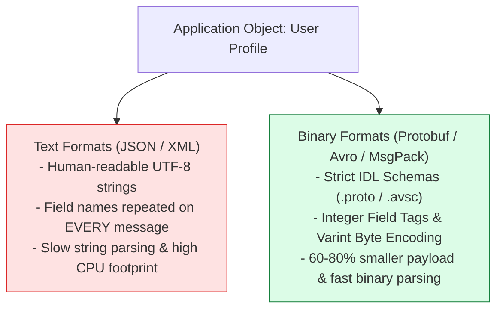
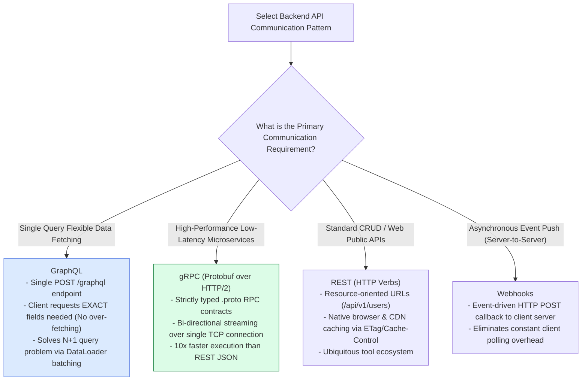
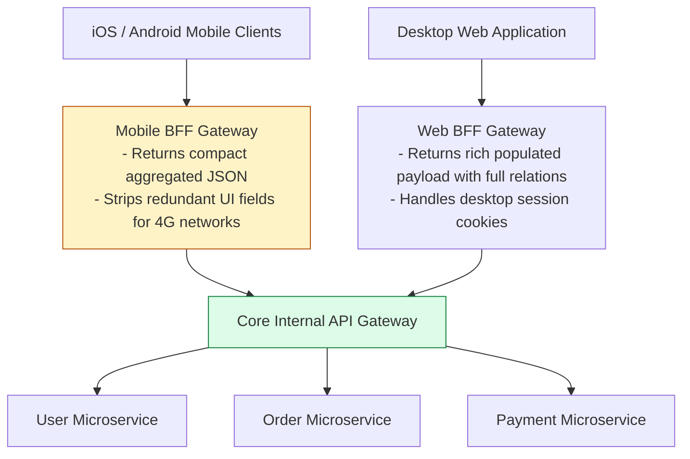

# Module 04: Data Serialization Formats and API Architectural Patterns (JSON, Protobuf, Avro, GraphQL, gRPC, BFF)

## Overview

In distributed system architecture, **Data Serialization** translates in-memory application objects into byte streams suitable for network socket transmission or disk storage. Selecting between text-based (JSON, XML) and binary (Protocol Buffers, Avro, MessagePack) serialization determines serialization CPU overhead and network bandwidth consumption.

Simultaneously, structuring client-to-backend communication requires choosing between **REST**, **GraphQL**, **gRPC**, and **Webhooks**, while employing **API Gateways** and **Backend-For-Frontend (BFF)** patterns to insulate internal microservices.

---

## 1. Serialization Format Comparison (Text vs. Binary Schema-Based)



### Comprehensive Serialization Benchmark Matrix

| Serialization Format | Type Schema Required? | Human Readable? | Payload Size Overhead | Parsing CPU Overhead | Primary Use Case |
| :--- | :--- | :--- | :--- | :--- | :--- |
| **JSON** | No (Dynamic Schema) | **Yes** | High (Includes field name keys) | High (String token parsing) | External Web/Mobile APIs |
| **Protocol Buffers**| **Yes** (`.proto` file) | No (Raw Binary) | **Ultra-Low** (Field tags + Varints) | **Ultra-Low** (Direct byte mapping)| Inter-Microservice RPC (gRPC) |
| **Apache Avro** | **Yes** (`.avsc` JSON schema)| No (Raw Binary) | **Ultra-Low** (Omits tags, schema sent once)| **Ultra-Low** | Kafka Streaming & Big Data Analytics |
| **MessagePack** | No (Dynamic Schema) | No (Binary JSON) | Medium (Compacts integers/arrays) | Medium | Redis Cache & WebSocket frames |

---

## 2. API Communication Archetypes Architecture



---

## 3. Backend-For-Frontend (BFF) & API Gateway Topology



---

## 4. Protobuf Varint Binary Encoding Principle

Protocol Buffers achieve ultra-compact payload sizes by replacing string field keys with **Integer Field Tags** and encoding integers using **Varints** (Variable Length Quantities using 7 bits per byte, reserving the 8th Most Significant Bit as a Continuation Flag):

$$\text{Varint Byte} = (\text{Value} \land \text{0x7F}) \lor (\text{HasMoreBytes} \mathbin{?} \text{0x80} : \text{0x00})$$

---

## 5. Practical Implementation Showcase: Protobuf Varint Encoder & JSON Benchmarker

```javascript
// Compact Varint Binary Encoding Algorithm Demonstration
class VarintEncoder {
  static encodeUnsignedInt32(value) {
    const bytes = [];
    while (value >= 0x80) {
      bytes.push((value & 0x7f) | 0x80); // Set Continuation Bit (MSB = 1)
      value >>>= 7;                      // Right shift 7 bits
    }
    bytes.push(value & 0x7f);            // Final byte (MSB = 0)
    return Buffer.from(bytes);
  }
}

// Serialization Benchmark Simulation
function compareSerializationFootprint() {
  const sampleData = { id: 150, name: "Alice", role: "ADMIN" };

  // 1. JSON Text Serialization
  const jsonBuffer = Buffer.from(JSON.stringify(sampleData), "utf-8");

  // 2. Simulated Protobuf Binary Payload (Tag 1 = 150, Tag 2 = "Alice", Tag 3 = "ADMIN")
  const idVarint = VarintEncoder.encodeUnsignedInt32(150);
  const nameBuf = Buffer.from("Alice", "utf-8");
  const roleBuf = Buffer.from("ADMIN", "utf-8");

  // Tag 1 (1 byte) + Varint (2 bytes) + Tag 2 (1 byte) + Len (1 byte) + String (5 bytes)...
  const protobufSimulatedBuffer = Buffer.concat([
    Buffer.from([0x08]), idVarint,
    Buffer.from([0x12, nameBuf.length]), nameBuf,
    Buffer.from([0x1a, roleBuf.length]), roleBuf
  ]);

  console.log("=== SERIALIZATION FOOTPRINT COMPARISON ===");
  console.log(`JSON Payload Byte Length     : ${jsonBuffer.length} bytes`);
  console.log(`Protobuf Binary Byte Length   : ${protobufSimulatedBuffer.length} bytes`);
  console.log(`Bandwidth Reduction Achieved : ${((1 - protobufSimulatedBuffer.length / jsonBuffer.length) * 100).toFixed(1)}%`);
}

compareSerializationFootprint();
```

---

## Key Production Takeaways

1. **Use Protocol Buffers for High-Throughput gRPC Services**: Replaces verbose JSON keys with compact binary field tags to decrease network bandwidth usage by 60-80% and reduce V8 string parsing garbage collection pauses.
2. **Implement BFFs for Distinct Client Platforms**: Tailor Backend-For-Frontend gateways specifically for Mobile vs Desktop clients to prevent mobile over-fetching and eliminate client-side round-trip orchestration calls.
3. **Use Avro for Apache Kafka Event Pipelines**: Apache Avro embeds schema IDs into binary message headers, enabling schema evolution and compatibility checks (confluent schema registry) across streaming topics.
4. **Solve GraphQL N+1 Query Problems with DataLoader**: When adopting GraphQL, always use Facebook's `DataLoader` batching pattern to coalesce individual database queries into single SQL `WHERE id IN (...)` batch calls.

