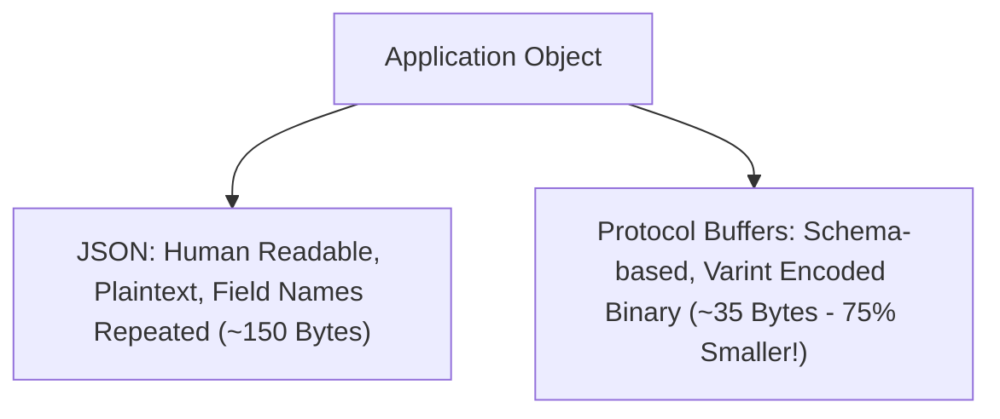
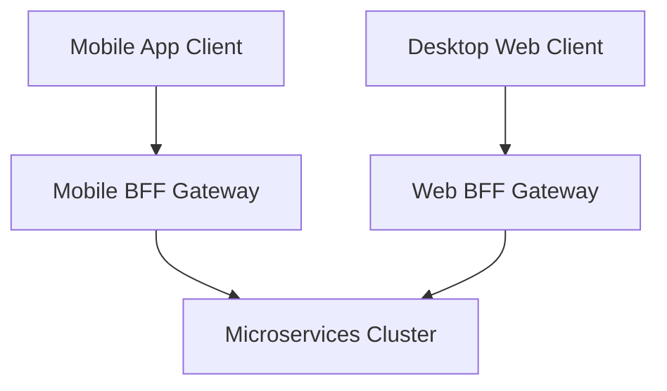

# File 04: Serialization Formats and API Gateway Patterns

## Overview
Data **Serialization** converts in-memory objects into byte streams for transmission over network sockets (JSON vs Protocol Buffers). High-scale architectures use **API Gateways** and **BFF (Backend for Frontend)** patterns to route requests, handle auth, and batch calls.

---

## 1. Serialization Comparison (JSON vs Protocol Buffers)



---

## 2. API Gateway & BFF Architecture



---

## 3. Simple Binary Varint Serialization Concept

```javascript
// Simple Varint Binary Encoder Demonstration
class BinaryEncoder {
    constructor() {
        this.buffer = [];
    }

    encodeInt(fieldTag, value) {
        this.buffer.push(fieldTag); // Field Tag Number
        // Varint encoding byte truncation
        while (value >= 0x80) {
            this.buffer.push((value & 0x7f) | 0x80);
            value >>>= 7;
        }
        this.buffer.push(value & 0x7f);
    }

    getByteLength() {
        return this.buffer.length;
    }
}

const encoder = new BinaryEncoder();
encoder.encodeInt(1, 150);
console.log("Binary Encoded Bytes:", encoder.getByteLength()); // Extremely compact!
```

---

## Key Takeaways
1. **Protobuf** binary serialization is 60-80% smaller and significantly faster to parse than JSON.
2. **API Gateways** centralize authentication, rate-limiting, SSL termination, and request routing.
3. **BFF (Backend for Frontend)** tailors API payloads specifically for mobile vs web client requirements.
