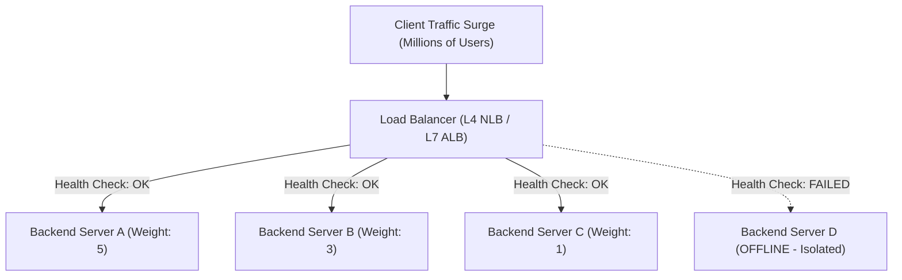

# Module 05: Load Balancing Architecture, Algorithms, & Health Monitoring

## Theoretical Overview & Load Distribution Mechanics

A **Load Balancer** acts as an architectural reverse proxy traffic cop, distributing incoming client network traffic across a pool of backend servers to prevent single-point overload, optimize throughput, and eliminate downtime.



### Real-World Case Study: Flipkart Big Billion Days Sale
At midnight on sale launch, Flipkart experiences a 10x traffic spike (18,000+ RPS).
- **Without Load Balancing**: Traffic piles up on the primary server node, causing connection timeouts, memory exhaustion, and cascading database crashes.
- **With Load Balancing**: Traffic is dynamically routed based on backend capacity, with active auto-scaling groups launching replacement instances seamlessly.

---

## 1. Load Balancing Algorithms Comparison Matrix

| Algorithm | Routing Strategy | Session Affinity | Best Engineering Use Case |
| :--- | :--- | :--- | :--- |
| **Round-Robin** | Circular sequential distribution. | None | Homogeneous server fleets with uniform request weights. |
| **Weighted Round-Robin** | Circular distribution proportional to server weight. | None | Heterogeneous fleets (e.g., 32-core nodes mixed with 8-core nodes). |
| **Least Connections** | Routes to server with fewest active connections. | None | Mixed workloads (e.g., fast GET requests mixed with heavy PDF exports). |
| **IP Hash** | Hashing client IP address to fixed server index. | **Sticky (Session)** | Applications storing user session state in server local RAM. |
| **Consistent Hashing**| Maps keys and servers to a virtual $360^\circ$ hash ring. | **Minimal Remap** | Distributed caching tiers (Redis / Memcached clusters). |

---

## 2. Fundamental Load Balancing Algorithms

### 1. Round-Robin (`RoundRobinBalancer`)
Iterates circularly across the array of backend servers.

```javascript
class RoundRobinBalancer {
  constructor(servers) {
    this.servers = servers.map((s) => ({ ...s, count: 0 }));
    this.idx = 0;
  }

  next() {
    const server = this.servers[this.idx];
    this.idx = (this.idx + 1) % this.servers.length;
    server.count++;
    return server;
  }
}
```

### 2. Weighted Round-Robin (`WeightedRR`)
Expands backend server selections proportional to assigned hardware capacity weights.

```javascript
class WeightedRR {
  constructor(servers) {
    this.servers = servers.map((s) => ({ ...s, count: 0 }));
    this.expanded = [];
    this.servers.forEach((s) => {
      for (let i = 0; i < s.weight; i++) this.expanded.push(s);
    });
    this.idx = 0;
  }

  next() {
    const s = this.expanded[this.idx];
    this.idx = (this.idx + 1) % this.expanded.length;
    s.count++;
    return s;
  }
}
```

### 3. Least Connections (`LeastConnBalancer`)
Prevents request pile-ups by routing new traffic to the server currently processing the fewest active concurrent requests.

```javascript
class LeastConnBalancer {
  constructor(servers) {
    this.servers = servers.map((s) => ({ ...s, active: 0, total: 0 }));
  }

  next() {
    // Find server with minimal active connections
    const s = this.servers.reduce((a, b) => (a.active <= b.active ? a : b));
    s.active++;
    s.total++;
    return s;
  }

  release(s) {
    if (s.active > 0) s.active--;
  }
}
```

---

## 3. Consistent Hashing Ring Architecture

Traditional hash routing (`hash(key) % N`) causes **$N / (N+1)$ keys to relocate** whenever a server is added or removed, invalidating up to 99% of distributed cache entries.

**Consistent Hashing** maps both servers and keys to a $360^\circ$ circular integer ring. When a server node is added or removed, only **$K/N$ keys are remapped** ($K=$ total keys, $N=$ total servers).

```mermaid
flowchart TD
    subgraph Hash Ring (0 to 360 Degrees)
        Node1["Cache Server 1 (Pos: 45°)"]
        Node2["Cache Server 2 (Pos: 160°)"]
        Node3["Cache Server 3 (Pos: 280°)"]
        
        Key1["Key: 'iphone-15' (Hash: 90°)"] -->|Clockwise Next| Node2
        Key2["Key: 'macbook-pro' (Hash: 200°)"] -->|Clockwise Next| Node3
    end
```

```javascript
class ConsistentRing {
  constructor(replicas = 3) {
    this.replicas = replicas;
    this.ring = new Map();
    this.sorted = [];
  }

  hash(key) {
    let h = 0;
    for (let i = 0; i < key.length; i++) h = ((h << 5) - h + key.charCodeAt(i)) & 0x7fffffff;
    return h % 360;
  }

  addServer(name) {
    for (let i = 0; i < this.replicas; i++) {
      const pos = this.hash(`${name}-r${i}`); // Virtual nodes prevent clustering
      this.ring.set(pos, name);
    }
    this.sorted = Array.from(this.ring.keys()).sort((a, b) => a - b);
  }

  getServer(key) {
    const h = this.hash(key);
    for (const pos of this.sorted) {
      if (pos >= h) return this.ring.get(pos);
    }
    return this.ring.get(this.sorted[0]); // Wrap around ring start
  }
}
```

---

## 4. Layer 4 vs Layer 7 Load Balancing

```mermaid
flowchart LR
    subgraph L4 Load Balancer (Transport Layer - AWS NLB)
        L4Client["Client Request"] --> L4LB["L4 LB (Inspects IP:Port only)"]
        L4LB -->|Fast Packet Forwarding| L4Srv["Backend Server"]
    end

    subgraph L7 Load Balancer (Application Layer - AWS ALB / NGINX)
        L7Client["Client Request"] --> L7LB["L7 LB (Decrypts TLS, Inspects URL/Headers/Cookies)"]
        L7LB -->|/api/payments| PaySrv["Payment Microservice"]
        L7LB -->|/static/*| CDNEst["Static Storage Node"]
    end
```

| Dimension | Layer 4 Load Balancing (L4) | Layer 7 Load Balancing (L7) |
| :--- | :--- | :--- |
| **OSI Layer** | Transport Layer (TCP / UDP). | Application Layer (HTTP / HTTPS / gRPC). |
| **Data Visibility** | Inspects IP address and TCP/UDP Port numbers only. | Inspects URL paths, HTTP headers, cookies, and JSON payloads. |
| **Performance** | Ultra-high throughput, low CPU overhead (no TLS termination). | Moderately higher CPU overhead (TLS termination & HTTP parsing). |
| **Routing Flexibility**| Simple IP routing. | Advanced path-based routing (`/api/v1/checkout`), SSL termination, header rewrites. |
| **AWS Equivalent** | AWS Network Load Balancer (NLB). | AWS Application Load Balancer (ALB). |

---

## 5. Health Check Taxonomy & Resiliency

Load balancers periodically monitor backend servers to automatically drop unhealthy instances from traffic rotations.

```javascript
const healthCheckTypes = {
  L4_TCP: "Attempts TCP connection on target port (e.g., port 80/443). Fast but basic.",
  L7_HTTP: "Issues HTTP GET /health request. Verifies 200 OK status code.",
  Deep_Health: "Executes synthetic queries testing database and Redis connectivity.",
};
```

### Kubernetes Probe Mechanics
- **Liveness Probe**: Determines if the container has crashed or deadlocked. **Action on failure**: K8s restarts the container container instance.
- **Readiness Probe**: Determines if the container is ready to accept user network traffic. **Action on failure**: K8s temporarily removes container IP from Load Balancer endpoint list.

---

## Key Takeaways

1. **Algorithm Choice**: Round-Robin for uniform fleets; Weighted for unequal hardware; Least Connections for mixed heavy/light workloads.
2. **Consistent Hashing Minimizes Cache Invalidation**: Moving to consistent hashing prevents complete cache remapping when scaling nodes up or down.
3. **L4 vs L7 Trade-off**: Use L4 for maximum packet throughput; use L7 for smart HTTP path routing, SSL termination, and cookie affinity.
4. **Mandatory Health Checking**: Configure both active Liveness and Readiness probes to prevent routing requests to dead or degraded servers.
