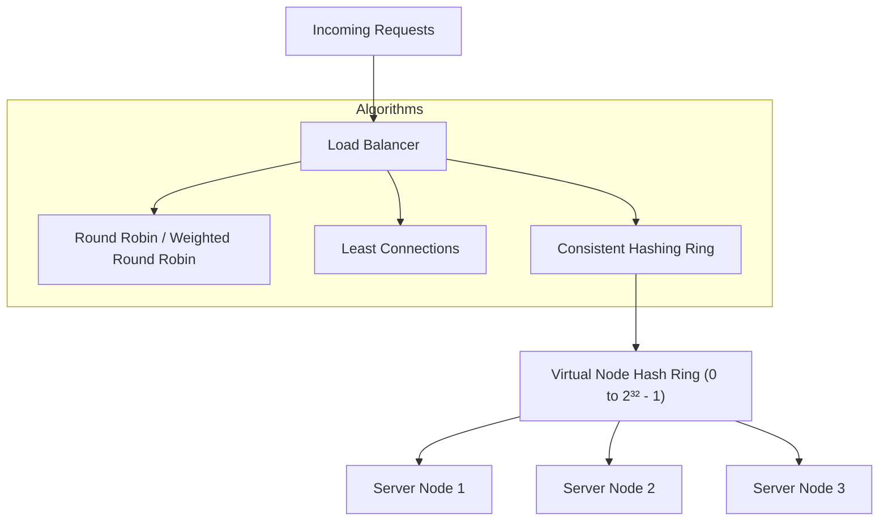

# File 05: Load Balancing and Consistent Hashing

## Overview
A **Load Balancer** distributes incoming network traffic across a farm of backend servers. **Consistent Hashing** ensures that when servers are added or removed, only $K/n$ keys need to be remapped, making it essential for distributed caching clusters.

---

## 1. Load Balancing Algorithms & Consistent Hashing Ring



---

## 2. Consistent Hashing Implementation

```javascript
const crypto = require("crypto");

class ConsistentHashRing {
    constructor(replicas = 3) {
        this.replicas = replicas; // Virtual nodes per physical server
        this.ring = new Map();
        this.keys = [];
    }

    _hash(key) {
        return crypto.createHash("md5").update(key).digest("hex").substring(0, 8);
    }

    addServer(server) {
        for (let i = 0; i < this.replicas; i++) {
            const virtualNodeKey = `${server}-replica-${i}`;
            const hash = this._hash(virtualNodeKey);
            this.ring.set(hash, server);
            this.keys.push(hash);
        }
        this.keys.sort();
    }

    getServer(key) {
        if (this.keys.length === 0) return null;
        const hash = this._hash(key);

        // Binary search for first node >= key hash
        for (const ringKey of this.keys) {
            if (hash <= ringKey) {
                return this.ring.get(ringKey);
            }
        }

        // Wrap around to first server on ring
        return this.ring.get(this.keys[0]);
    }
}

const hashRing = new ConsistentHashRing(3);
hashRing.addServer("Server-A");
hashRing.addServer("Server-B");
hashRing.addServer("Server-C");

console.log("User 101 mapped to:", hashRing.getServer("user_101"));
```

---

## Key Takeaways
1. **Layer 4 Load Balancers** route based on IP & Port (TCP/UDP); **Layer 7 Load Balancers** inspect HTTP headers & cookies.
2. **Consistent Hashing** minimizes cache key reshuffling when scaling backend nodes up or down.
3. Use **Virtual Nodes** to ensure uniform traffic distribution across physical servers.
