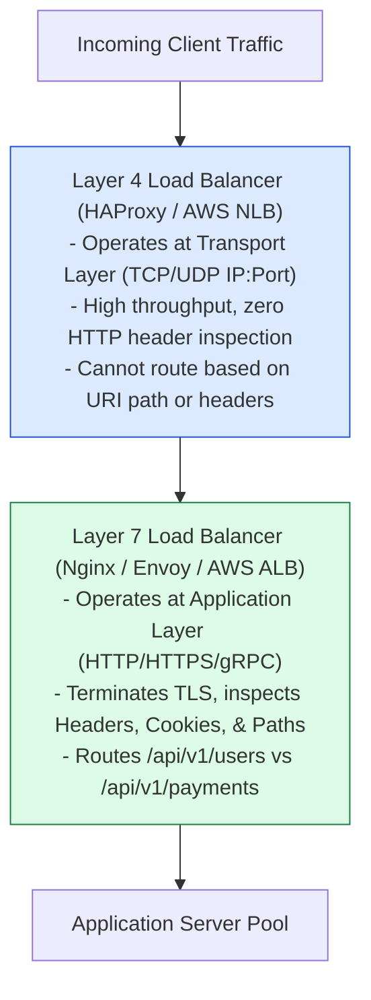
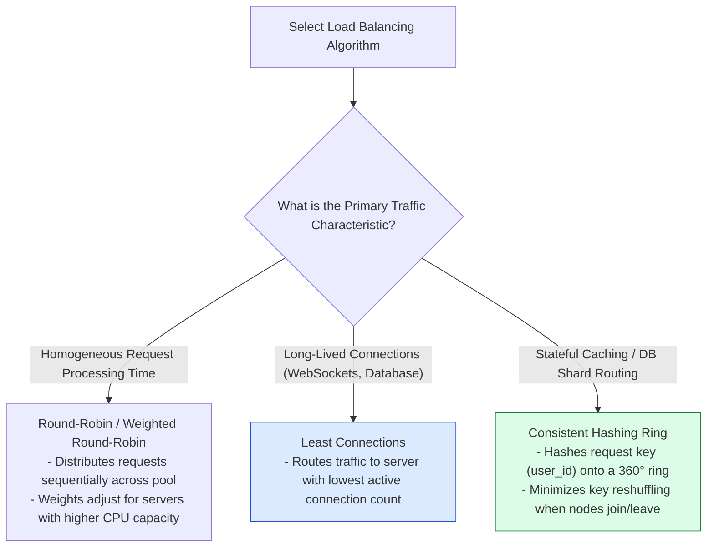

# Module 05: Load Balancing Architecture, Routing Algorithms, and Consistent Hashing Rings

## Overview

A **Load Balancer** serves as the central traffic traffic cop in high-concurrency systems, distributing incoming client requests across multiple backend application instances to optimize resource utilization, prevent server overload, and eliminate single points of failure (SPOF).

Understanding **Layer 4 (Transport) vs. Layer 7 (Application) Load Balancing**, **Routing Algorithms (Round-Robin, Least Connections, IP Hash)**, **Consistent Hashing Rings with Virtual Nodes**, and **High-Availability (HA) Topologies (VRRP / Anycast)** is essential.

---

## 1. Layer 4 vs. Layer 7 Load Balancing Architecture



### Layer 4 vs. Layer 7 Feature Comparison Matrix

| Load Balancer Category | OSI Layer | Inspection Capabilities | Throughput & CPU Cost | Primary Use Case |
| :--- | :--- | :--- | :--- | :--- |
| **Layer 4 (Network LB)** | Transport (TCP/UDP) | IP Address, TCP Port | **Ultra-High Throughput / Low CPU** (Raw packet forwarding) | Ultra-high volume TCP streams, DB proxies |
| **Layer 7 (Application LB)**| Application (HTTP/gRPC) | Headers, Cookies, Paths, Payload | High CPU (TLS termination & HTTP parsing) | Microservice routing, WAF, Sticky Sessions |

---

## 2. Load Balancing Algorithm Taxonomy



---

## 3. Consistent Hashing Ring Mechanics with Virtual Nodes

In traditional modulo hashing ($\text{server} = \text{hash}(\text{key}) \bmod N$), adding or removing a single server invalidates **$100\%$ of cached keys**, causing severe cache stampedes.

**Consistent Hashing** maps both server nodes and client keys onto a circular hash space ($0 \text{ to } 2^{32}-1$). Adding or removing a server node only requires remapping **$K/n$ keys** (where $K$ is total keys and $n$ is total servers). To prevent uneven key distribution (hotspots), physical servers are mapped to multiple **Virtual Nodes**:

```mermaid
flowchart TD
    subgraph Consistent Hashing Ring Space (0 to 2³² - 1)
        NodeA_V1["Server A (Virtual Node 1) [Hash: 0x1000]"]
        NodeB_V1["Server B (Virtual Node 1) [Hash: 0x4000]"]
        NodeA_V2["Server A (Virtual Node 2) [Hash: 0x8000]"]
        NodeB_V2["Server B (Virtual Node 2) [Hash: 0xC000]"]

        Key1["User Key 'user_99' [Hash: 0x2500]"] -->|Clockwise Lookup| NodeB_V1
        Key2["User Key 'user_101' [Hash: 0x6000]"] -->|Clockwise Lookup| NodeA_V2
    end

    style NodeA_V1 fill:#dcfce7,stroke:#15803d
    style NodeA_V2 fill:#dcfce7,stroke:#15803d
    style NodeB_V1 fill:#dbeafe,stroke:#1d4ed8
    style NodeB_V2 fill:#dbeafe,stroke:#1d4ed8
```

---

## 4. Practical Implementation Showcase: Consistent Hashing Ring Engine

```javascript
const crypto = require("node:crypto");

class ConsistentHashRing {
  constructor(replicas = 100) {
    this.replicas = replicas; // Virtual nodes per physical server
    this.ring = new Map();     // Hash -> Physical Server Name
    this.sortedHashes = [];    // Sorted array of virtual node hashes
  }

  // 32-bit Integer MD5 Hash Helper
  _hash(key) {
    const hex = crypto.createHash("md5").update(key).digest("hex");
    return parseInt(hex.substring(0, 8), 16);
  }

  // Add physical server node to ring with virtual replicas
  addServer(server) {
    for (let i = 0; i < this.replicas; i++) {
      const virtualNodeKey = `${server}-replica-${i}`;
      const hash = this._hash(virtualNodeKey);
      this.ring.set(hash, server);
      this.sortedHashes.push(hash);
    }
    this.sortedHashes.sort((a, b) => a - b);
  }

  // Remove physical server node from ring
  removeServer(server) {
    for (let i = 0; i < this.replicas; i++) {
      const virtualNodeKey = `${server}-replica-${i}`;
      const hash = this._hash(virtualNodeKey);
      this.ring.delete(hash);
    }
    this.sortedHashes = this.sortedHashes.filter((h) => this.ring.has(h));
  }

  // Find destination server using Binary Search (Clockwise Lookup)
  getServer(key) {
    if (this.sortedHashes.length === 0) return null;
    const hash = this._hash(key);

    // Binary search for first hash >= request key hash
    let low = 0;
    let high = this.sortedHashes.length - 1;

    while (low <= high) {
      const mid = Math.floor((low + high) / 2);
      if (this.sortedHashes[mid] >= hash) {
        high = mid - 1;
      } else {
        low = mid + 1;
      }
    }

    // If hash exceeds all nodes, wrap around to index 0 (Ring Property)
    const targetIndex = low < this.sortedHashes.length ? low : 0;
    return this.ring.get(this.sortedHashes[targetIndex]);
  }
}

// Consistent Hashing Demonstration
const hashRing = new ConsistentHashRing(100);
hashRing.addServer("cache-node-01.internal");
hashRing.addServer("cache-node-02.internal");
hashRing.addServer("cache-node-03.internal");

console.log("=== CONSISTENT HASHING RING TEST ===");
console.log(`Key 'session_user_101' -> ${hashRing.getServer("session_user_101")}`);
console.log(`Key 'session_user_202' -> ${hashRing.getServer("session_user_202")}`);
console.log(`Key 'session_user_303' -> ${hashRing.getServer("session_user_303")}`);

// Simulate Server Node Failure
console.log("\n--- SIMULATING NODE REMOVAL (cache-node-02.internal drops) ---");
hashRing.removeServer("cache-node-02.internal");
console.log(`Key 'session_user_101' -> ${hashRing.getServer("session_user_101")}`);
console.log(`Key 'session_user_202' -> ${hashRing.getServer("session_user_202")}`);
```

---

## Key Production Takeaways

1. **Use Layer 4 LBs for Entry Ingress, Layer 7 LBs for Microservice Routing**: Combine AWS NLB (L4) for high-volume TCP TLS termination with Nginx/Envoy (L7) for URI-path microservice routing.
2. **Use Virtual Nodes in Consistent Hashing Rings**: Always configure 100-250 virtual node replicas per physical server to ensure balanced, uniform key distributions and prevent hotspots.
3. **Configure Health Checks with Fail-Fast Timestamps**: Ensure load balancers perform active HTTP/TCP health checks every 2-5 seconds with a 2-strike eviction threshold to quickly divert traffic from degraded servers.
4. **Use Active-Passive VRRP or Anycast for Load Balancer High Availability**: Prevent load balancers themselves from becoming single points of failure by pairing primary and secondary load balancers using Virtual Router Redundancy Protocol (VRRP / Keepalived) or BGP Anycast.

