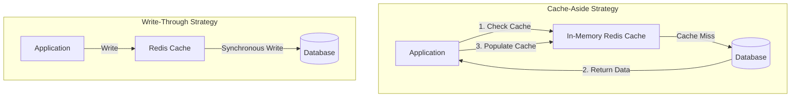

# File 06: Caching Strategies and Eviction Policies

## Overview
**Caching** stores high-frequency data in fast, in-memory stores (Redis, Memcached) to reduce database load and response latency. Caching strategies include **Cache-Aside**, **Write-Through**, **Write-Behind (Write-Back)**, and **Refresh-Ahead**.

---

## 1. Caching Strategies & Eviction Architecture



### Caching Strategy Comparison

| Strategy | Write Mechanism | Read Mechanism | Pros | Cons |
| :--- | :--- | :--- | :--- | :--- |
| **Cache-Aside (Lazy Loading)** | Application writes to DB directly | Check Cache $\rightarrow$ On miss, read DB & write Cache | Resilient to cache failure; only requested data cached | Cache miss penalty on first read |
| **Write-Through** | Write to Cache $\rightarrow$ Cache writes to DB synchronously | Read from Cache directly | No stale cache data | High write latency |
| **Write-Behind (Write-Back)** | Write to Cache $\rightarrow$ Async batch write to DB | Read from Cache directly | Ultra-fast write latency | Potential data loss on cache crash |

---

## 2. Cache-Aside Implementation

```javascript
class CacheAsideService {
    constructor(cacheStore, dbStore) {
        this.cache = cacheStore;
        this.db = dbStore;
    }

    async getUser(userId) {
        const cacheKey = `user:${userId}`;
        
        // 1. Read from Cache
        const cached = await this.cache.get(cacheKey);
        if (cached) {
            console.log("[CACHE HIT] Returned from Redis");
            return JSON.parse(cached);
        }

        // 2. Read from Database on Cache Miss
        console.log("[CACHE MISS] Reading from Database...");
        const user = await this.db.findById(userId);

        if (user) {
            // 3. Populate Cache with TTL (Time To Live = 60s)
            await this.cache.set(cacheKey, JSON.stringify(user), 60);
        }

        return user;
    }
}
```

---

## Key Takeaways
1. **Cache-Aside** is the most common read-heavy caching pattern.
2. Prevent **Cache Stampede (Thundering Herd)** using locks or probabilistic early expiration.
3. Prevent **Cache Penetration** (querying non-existent keys) using **Bloom Filters**.
4. Set explicit **TTL (Time To Live)** on cached keys to prevent stale data retention.
