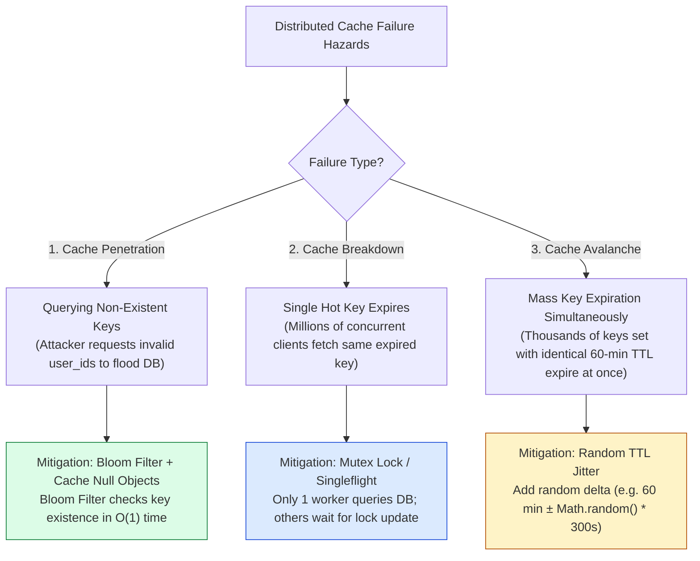

# Module 06: Distributed Caching Architecture, Eviction Policies, and Cache Failure Mitigation

## Overview

**Caching** stores high-frequency, expensive data calculations in low-latency, in-memory datastores (Redis, Memcached) to reduce database workload and achieve microsecond response times.

Understanding **Caching Read/Write Patterns (Cache-Aside, Read-Through, Write-Through, Write-Back)**, **Eviction Policies (LRU, LFU, ARC)**, and **Cache Failure Mitigations (Cache Stampede, Cache Penetration, Cache Breakdown, Cache Avalanche)** is essential for high-throughput distributed systems.

---

## 1. Caching Read & Write Pattern Architecture

```mermaid
flowchart TD
    subgraph 1. Cache-Aside Pattern (Lazy Loading)
        App1[Application] -->|1. Check Cache| Redis1[(Redis Cache)]
        Redis1 -- "Cache Miss" --> DB1[(Database)]
        DB1 -- "2. Return Record" --> App1
        App1 -- "3. Populate Cache + TTL" --> Redis1
    end

    subgraph 2. Write-Through Pattern
        App2[Application] -->|1. Write Data| Cache2[(Redis / Cache Layer)]
        Cache2 -->|2. Synchronous Write| DB2[(Database)]
    end

    subgraph 3. Write-Back / Write-Behind Pattern
        App3[Application] -->|1. Instant Write| Cache3[(Redis Queue)]
        Cache3 -.->|2. Async Batch Persist| DB3[(Database Engine)]
    end

    style Redis1 fill:#dcfce7,stroke:#15803d
    style Cache3 fill:#fef3c7,stroke:#b45309
```

### Caching Strategy Comparison Matrix

| Caching Strategy | Read Pathway | Write Pathway | Pros | Cons & Risks |
| :--- | :--- | :--- | :--- | :--- |
| **Cache-Aside** | App reads Cache $\rightarrow$ On miss, reads DB & writes Cache | App writes directly to DB & invalidates Cache | Resilient; cache failure does not break DB writes | Cache miss penalty on first read |
| **Read-Through** | App reads Cache $\rightarrow$ Cache transparently fetches DB | App writes directly to DB | Simplifies application code logic | Cache provider must support DB integration |
| **Write-Through** | App reads directly from Cache | App writes Cache $\rightarrow$ Cache writes DB synchronously | Data consistency guaranteed; zero stale reads | High write latency (2 sequential network writes) |
| **Write-Back (Write-Behind)**| App reads directly from Cache | App writes Cache $\rightarrow$ Async batch worker updates DB | **Ultra-fast write throughput** (High DB write smoothing) | **Risk of data loss** if cache node crashes before batch DB flush |

---

## 2. Cache Eviction Policies Matrix

When in-memory cache allocation reaches maximum capacity (`maxmemory`), the cache engine executes eviction algorithms to reclaim RAM:

| Eviction Policy | Full Name & Mechanics | Best System Scenario |
| :--- | :--- | :--- |
| **LRU** | **Least Recently Used**: Evicts keys with the oldest last-accessed timestamp. | Standard web applications with temporal locality. |
| **LFU** | **Least Frequently Used**: Evicts keys accessed least often overall (uses counter bits). | Long-running caches with hot vs. cold access frequency distributions. |
| **TTL / Volatile LRU** | Evicts keys with explicit expiration TTL timers using LRU ordering. | Session caches and short-lived API token stores. |
| **ARC** | **Adaptive Replacement Cache**: Dynamically balances LRU and LFU based on recent access. | High-performance storage engines (ZFS file caches). |

---

## 3. Cache Failure Modes & Defense Topologies



---

## 4. Practical Implementation Showcase: Cache-Aside with Mutex & Bloom Filter

```javascript
class CacheAsideService {
  constructor(cacheClient, dbClient) {
    this.cache = cacheClient; // In-memory map/Redis mock
    this.db = dbClient;       // DB mock
    this.locks = new Map();   // In-flight request mutex map (Cache Breakdown defense)
  }

  async getUserProfile(userId) {
    const cacheKey = `user:${userId}`;

    // 1. Read from Cache (O(1) memory lookup)
    const cachedData = await this.cache.get(cacheKey);
    if (cachedData !== undefined) {
      if (cachedData === null) return null; // Cache Penetration Guard (Cached Null)
      console.log(`✓ [CACHE HIT] Returning cached user #${userId}`);
      return JSON.parse(cachedData);
    }

    // 2. Cache Breakdown Guard (Mutex / Singleflight Pattern)
    if (this.locks.has(cacheKey)) {
      console.log(`⌛ [MUTEX WAIT] Awaiting in-flight DB fetch for user #${userId}...`);
      return await this.locks.get(cacheKey);
    }

    // Create singleflight promise lock
    const fetchPromise = (async () => {
      try {
        console.log(`⚡ [CACHE MISS] Reading user #${userId} from Database...`);
        const user = await this.db.findUserById(userId);

        if (user) {
          // Add Random Jitter to TTL (Cache Avalanche defense: 60s + random 0-10s)
          const ttlJitter = 60 + Math.floor(Math.random() * 10);
          await this.cache.set(cacheKey, JSON.stringify(user), ttlJitter);
          return user;
        } else {
          // Cache Null Object for 30s (Cache Penetration defense)
          await this.cache.set(cacheKey, null, 30);
          return null;
        }
      } finally {
        this.locks.delete(cacheKey); // Release mutex lock
      }
    })();

    this.locks.set(cacheKey, fetchPromise);
    return await fetchPromise;
  }
}

// Execution Simulation
const mockDb = { findUserById: async (id) => (id === "101" ? { id: "101", name: "Alice" } : null) };
const mockCache = new Map();
const cacheService = new CacheAsideService(
  { get: async (k) => mockCache.get(k), set: async (k, v) => mockCache.set(k, v) },
  mockDb
);

async function run() {
  await cacheService.getUserProfile("101"); // Cache Miss -> DB Fetch
  await cacheService.getUserProfile("101"); // Cache Hit
  await cacheService.getUserProfile("999"); // Cache Miss -> Null Cached
  await cacheService.getUserProfile("999"); // Cache Hit (Null Object)
}
run();
```

---

## Key Production Takeaways

1. **Always Add Random Jitter to TTL Expire Timers**: When caching bulk data or database query results, append random time offsets (`TTL = Base_TTL + Random_Jitter`) to prevent **Cache Avalanches** caused by simultaneous key expirations.
2. **Use Singleflight Mutexes for Hot Keys**: Prevent **Cache Breakdown** on hot newsfeed or product keys by using mutex locks (`singleflight` pattern) so only 1 worker queries the database while concurrent requests await the cached result.
3. **Use Bloom Filters & Cache Null Objects for Cache Penetration**: Protect backend databases from malicious traffic requesting invalid IDs by filtering requests through a Bloom Filter and caching `null` values for missing keys with a short TTL.
4. **Never Rely on Cache as Persistent Data Storage**: Always treat distributed in-memory caches (Redis/Memcached) as ephemeral performance boosters, ensuring application logic can fallback seamlessly to the database if the cache layer fails.

