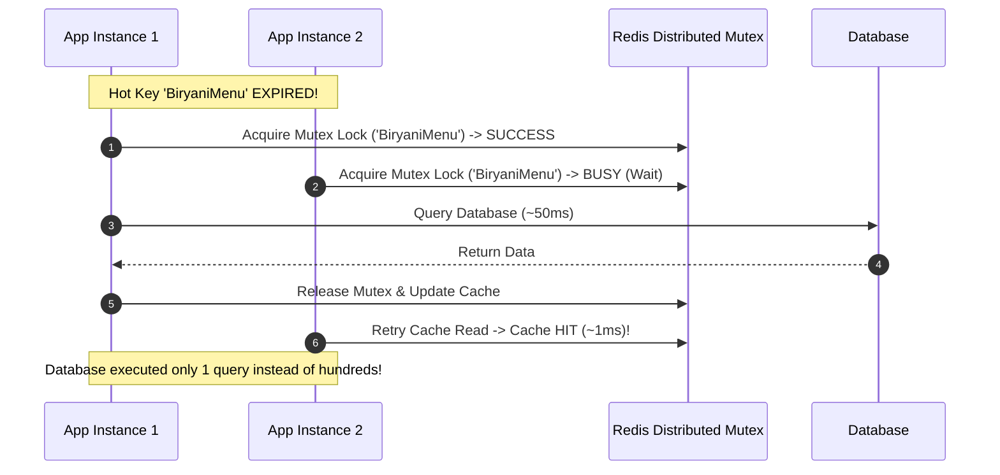
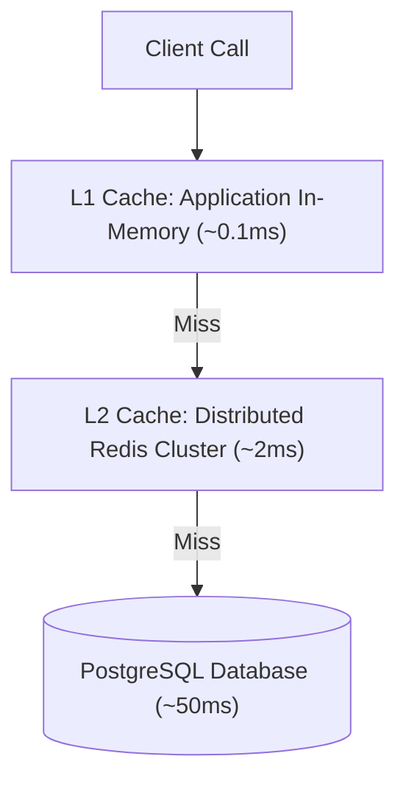

# Module 06: Caching Strategies, Patterns, & Eviction Policies

## Theoretical Overview & Caching Mechanics

**Caching** stores copies of frequently accessed data in a fast, low-latency memory store (e.g., RAM in-memory cache or Redis) to bypass expensive disk IO or network operations.

```mermaid
flowchart LR
    Client["Client Request"] --> App["Application Server"]
    App -->|1. Check Cache (~1ms)| Cache["In-Memory Cache (Redis)"]
    
    Cache -- 2a. Cache HIT --> App
    Cache -. 2b. Cache MISS .-> DB[("Relational Database (~50ms)")]
    DB -. 3. Fill Cache & Return .-> App
    App --> Client
```

### Real-World Case Study: Zomato Menu Caching
Zomato receives millions of menu requests per second.
- **Without Caching**: Every menu view executes a complex SQL query (`JOIN restaurants`, `JOIN items`, `JOIN taxes`), saturating database CPU.
- **With Caching**: The menu payload is cached in Redis. Queries drop from **50 ms to 1 ms**, allowing database servers to operate at under 20% capacity.

---

## 1. Cache Read/Write Patterns Matrix

| Strategy | Read Behavior | Write Behavior | Data Consistency | Performance Profile |
| :--- | :--- | :--- | :--- | :--- |
| **Cache-Aside (Lazy)**| Read Cache; on MISS, query DB & populate Cache. | Write directly to DB; invalidate or wait for TTL. | Stale until TTL or explicit invalidation. | Fast reads; initial MISS incurs DB latency. |
| **Write-Through** | Read Cache; on MISS, query DB & populate Cache. | Write to **Cache AND DB simultaneously** in 1 call. | **Strictly Consistent** (No stale reads). | Slower writes (doubles write latency). |
| **Write-Behind (Write-Back)**| Read Cache. | Write to Cache immediately; **queue async batch DB writes**. | Eventual consistency; **crash data loss risk**. | **Ultra-Fast Writes**; decouples DB write pressure. |
| **Read-Through** | Cache middleware transparently fetches missing data from DB. | Write directly to DB. | High consistency via middleware. | Simplifies application application logic. |

---

## 2. Fundamental Cache Pattern Implementations

### 1. LRU Cache Engine (`LRUCache`)
Manages memory bounds using a Least Recently Used eviction policy:

```javascript
class LRUCache {
  constructor(capacity, name = "Cache") {
    this.capacity = capacity;
    this.name = name;
    this.cache = new Map();
    this.hits = 0;
    this.misses = 0;
  }

  get(key) {
    if (!this.cache.has(key)) { this.misses++; return null; }
    const val = this.cache.get(key);
    this.cache.delete(key);
    this.cache.set(key, val); // Move to end (MRU)
    this.hits++;
    return val;
  }

  put(key, value) {
    if (this.cache.has(key)) this.cache.delete(key);
    else if (this.cache.size >= this.capacity) {
      const lru = this.cache.keys().next().value;
      this.cache.delete(lru); // Evict LRU
    }
    this.cache.set(key, value);
  }
}
```

### 2. Cache-Aside Pattern (`cacheAsideRead`)
```javascript
function cacheAsideRead(cache, db, key) {
  let data = cache.get(key);
  if (data !== null) return data; // Cache HIT (~1ms)

  data = db.query(key); // Cache MISS (~50ms)
  if (data) cache.put(key, data); // Populates cache for next read
  return data;
}
```

### 3. Write-Through Pattern (`WriteThroughCache`)
```javascript
class WriteThroughCache {
  constructor(cap, db) { this.cache = new LRUCache(cap); this.db = db; }

  write(key, val) {
    this.cache.put(key, val);
    this.db.data.set(key, val); // Write to cache and DB simultaneously
  }
}
```

### 4. Write-Behind Pattern (`WriteBehindCache`)
```javascript
class WriteBehindCache {
  constructor(cap, db, batch = 3) {
    this.cache = new LRUCache(cap);
    this.db = db;
    this.queue = [];
    this.batch = batch;
  }

  write(key, val) {
    this.cache.put(key, val);
    this.queue.push({ key, val });
    if (this.queue.length >= this.batch) this.flush(); // Async batch flush
  }

  flush() {
    for (const e of this.queue) this.db.data.set(e.key, e.val);
    this.queue = [];
  }
}
```

---

## 3. Cache Stampede (Thundering Herd) Prevention

A **Cache Stampede** occurs when a popular cached key expires, causing hundreds of concurrent requests to hit the database simultaneously.



```javascript
class StampedeCache {
  constructor() { this.cache = new Map(); this.locks = new Map(); this.dbCalls = 0; }

  // Coalesces concurrent DB requests into a single execution
  readWithLock(key, fetchFn) {
    if (this.cache.has(key)) return "cache";
    if (this.locks.has(key)) return "coalesced"; // Wait for lock holder

    this.locks.set(key, true);
    this.dbCalls++;
    this.cache.set(key, fetchFn());
    this.locks.delete(key);
    return "db";
  }
}
```

---

## 4. Multi-Tier Caching Architecture (L1 / L2)

Combining **L1 In-Memory Cache** (local application RAM) with **L2 Shared Cache** (Redis Cluster) provides ultra-fast latency while maintaining centralized data sharing.



```javascript
class MultiTierCache {
  constructor(l1Size, l2Size, db) {
    this.l1 = new LRUCache(l1Size, "L1-Process");
    this.l2 = new LRUCache(l2Size, "L2-Redis");
    this.db = db;
  }

  read(key) {
    let data = this.l1.get(key);
    if (data !== null) return data; // L1 Hit (~0.1ms)

    data = this.l2.get(key);
    if (data !== null) {
      this.l1.put(key, data); // L2 Hit (~2ms) -> Backfill L1
      return data;
    }

    data = this.db.query(key); // DB Query (~50ms)
    if (data) {
      this.l2.put(key, data);
      this.l1.put(key, data);
    }
    return data;
  }
}
```

---

## 5. Cache Invalidation Strategies

> *"There are only two hard things in Computer Science: cache invalidation and naming things."* — Phil Karlton

1. **Explicit Key Purge**: Direct deletion of a target key upon update (`cache.delete("menu:biryani")`).
2. **Prefix / Pattern Ban**: Deleting all keys matching a namespace wildcard (`keys.filter(k => k.startsWith("menu:"))`).
3. **Version Keying**: Modifying the lookup key name directly (`menu:biryani:v2`), allowing old versions to expire naturally via TTL.
4. **Event-Driven Invalidation**: Publishing database CDC (Change Data Capture) events over Kafka to notify distributed cache nodes to purge stale keys.

---

## Key Takeaways

1. **Use Cache-Aside for Read-Heavy Workloads**: Query cache first; populate on miss.
2. **Prevent Cache Stampedes with Mutex Locks**: Coalesce concurrent requests for expired keys to protect the database.
3. **Use Write-Behind for High-Speed Writes**: Buffer writes in memory and flush asynchronously to disk if crash risks are tolerable.
4. **Implement L1/L2 Hierarchies**: Leverage fast process memory (L1) backed by shared Redis clusters (L2) for scalable performance.
