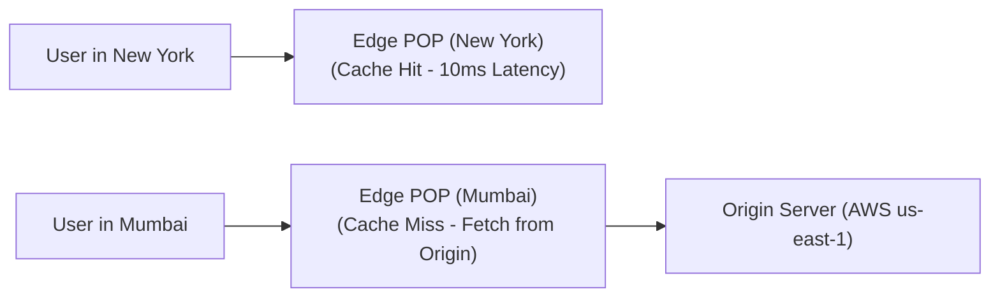

# File 07: CDN and Edge Computing

## Overview
A **Content Delivery Network (CDN)** is a globally distributed network of Edge POP (Point of Presence) servers that caches and serves static assets (images, JS, CSS, video streams) geographically close to end users, reducing latency and origin server load.

---

## 1. CDN Edge Server Caching Architecture



---

## 2. HTTP Cache Headers & CDN Controls

```javascript
// Express Route setting Cache-Control headers for CDN Edge POPs
app.get("/static/banner.png", (req, res) => {
    res.set({
        // Public CDN can cache for 1 year (31536000s), immutable asset
        "Cache-Control": "public, max-age=31536000, immutable",
        "ETag": '"v1.0.4-hash"'
    });
    res.sendFile("/path/to/banner.png");
});

// Dynamic Edge Function Middleware (Cloudflare Workers / Vercel Edge)
export default async function edgeHandler(request) {
    const country = request.headers.get("cf-ipcountry") || "US";
    
    // Personalize content at the Edge in <5ms!
    return new Response(`Welcome user from ${country}!`, {
        headers: { "Content-Type": "text/plain" }
    });
}
```

---

## Key Takeaways
1. CDNs serve static assets from **Edge POPs** geographically nearest to users.
2. Use **`Cache-Control: public, max-age=31536000, immutable`** for fingerprinted static assets.
3. Use **Edge Workers** to run lightweight middleware (A/B testing, auth verification, geo-routing) directly at edge nodes.
