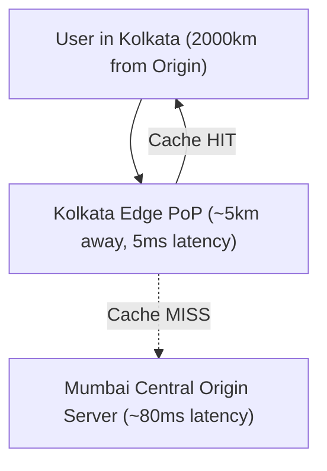
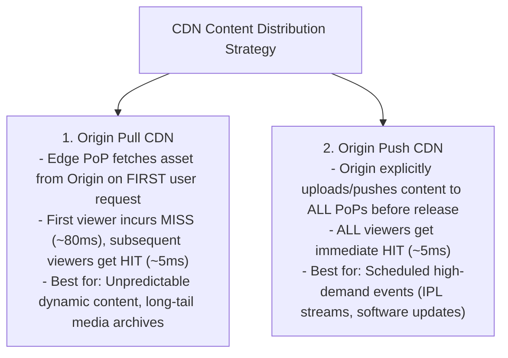
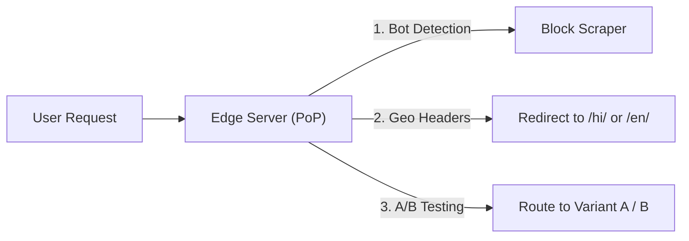

# Module 07: Content Delivery Networks (CDN) and Edge Computing Architecture

## Theoretical Overview & Global Edge Intuition

A **Content Delivery Network (CDN)** is a geographically distributed network of proxy servers and data centers called **Points of Presence (PoPs)**. CDNs caches static and dynamic assets close to end users to minimize network latency (Time to First Byte - TTFB) and reduce load on central origin servers.



### Real-World Case Study: Hotstar IPL Live Stream
During the IPL Cricket Final, Hotstar streams to **59 million concurrent viewers**:
- **Without a CDN**: 59 million stream requests flood the Mumbai origin data center, saturating network interfaces and causing total system blackout.
- **With a CDN**: Over 95% of video segments (`.ts` files) are served directly from regional PoP edge servers in Delhi, Chennai, Kolkata, and Bengaluru, reducing origin traffic to a manageable 5%.

---

## 1. CDN Distance & Latency Physics

Network latency scales directly with physical distance. The **Haversine Formula** calculates Great-Circle distances between geographical coordinates:

$$d = 2R \arcsin\left(\sqrt{\sin^2\left(\frac{\Delta \text{lat}}{2}\right) + \cos(\text{lat}_1)\cos(\text{lat}_2)\sin^2\left(\frac{\Delta \text{lng}}{2}\right)}\right)$$

```javascript
function haversine(lat1, lng1, lat2, lng2) {
  const R = 6371; // Earth radius in km
  const toR = (d) => (d * Math.PI) / 180;
  const dLat = toR(lat2 - lat1), dLng = toR(lng2 - lng1);
  const a = Math.sin(dLat / 2) ** 2 + Math.cos(toR(lat1)) * Math.cos(toR(lat2)) * Math.sin(dLng / 2) ** 2;
  return R * 2 * Math.atan2(Math.sqrt(a), Math.sqrt(1 - a));
}
```

- **Mumbai Origin $\to$ Delhi PoP**: $\approx 1,148\text{ km} \implies 57\text{ ms}$ baseline network latency.
- **Mumbai Origin $\to$ Kolkata PoP**: $\approx 1,652\text{ km} \implies 82\text{ ms}$ baseline network latency.
- **Serving from Local PoP**: $\approx 5\text{ km} \implies \mathbf{< 5\text{ ms}}$ latency (**94% faster**).

---

## 2. Origin Pull vs Origin Push CDN Models



---

## 3. PoP Simulation Engine (`PoP` & `OriginServer`)

```javascript
class PoP {
  constructor(name) {
    this.name = name;
    this.cache = new Map();
    this.hits = 0;
    this.misses = 0;
  }

  get(key) {
    if (this.cache.has(key)) { this.hits++; return "HIT"; }
    this.misses++;
    return "MISS";
  }

  set(key, data) { this.cache.set(key, data); }

  ratio() {
    const total = this.hits + this.misses;
    return total ? ((this.hits / total) * 100).toFixed(1) + "%" : "0%";
  }
}
```

---

## 4. Cache-Control Header Directives Matrix

| Resource Type | Cache-Control Header | Edge & Client Behavior |
| :--- | :--- | :--- |
| **Live Scores / APIs** | `no-cache, no-store` | **Never cache**; always fetch fresh payload from origin. |
| **Video Segments (`.ts`)**| `public, max-age=86400` | Cacheable by both browser and CDN PoPs for 24 hours. |
| **User Profile JSON** | `private, max-age=300` | Cacheable **only by browser client**; CDN PoPs must skip caching PII. |
| **Static Images / Logos**| `public, max-age=604800` | Cacheable by browser and CDN PoPs for 7 days. |

---

## 5. CDN Cache Invalidation Strategies

Invalidating cached edge content across thousands of global PoPs can be slow and expensive.

```javascript
class CDN {
  constructor() { this.pops = new Map(); }

  // Purges specific path across all global edge PoPs
  invalidatePath(path) {
    for (const [, pop] of this.pops) {
      if (pop.cache.has(path)) pop.cache.delete(path);
    }
  }
}
```

> [!TIP]
> **Versioned URLs (Cache Bypassing)**: Instead of triggering manual CDN purges, use content hashing or URL versioning (`/v2/styles.css` instead of `/styles.css`). This forces edge PoPs to pull the new version instantly with zero cache invalidation delay.

---

## 6. Edge Computing Architecture (Cloudflare Workers / AWS Lambda@Edge)

**Edge Computing** executes lightweight serverless functions directly on CDN PoP servers before requests reach backend origin data centers.



### Core Edge Computing Use Cases
1. **Geo-Location & Language Routing**: Inspects user country headers at the edge and rewrites request paths (e.g., routing Indian users to `/hi/ipl`).
2. **Edge Security & Bot Defense**: Inspects `User-Agent` and IP reputation at the edge, dropping malicious scrapers before they hit backend servers.
3. **Zero-Latency A/B Testing**: Assigns user session cookies and splits traffic at the edge without client-side UI flicker.

---

## 7. Geo-Routing and Anycast BGP Routing

**Anycast IP Routing** assigns the **exact same IP address** to hundreds of CDN PoP servers worldwide. Internet routers use BGP (Border Gateway Protocol) to automatically route user packets to the **topologically nearest healthy PoP node**.

---

## 8. Essential CDN Performance Metrics

| Metric | Target Goal | Engineering Significance |
| :--- | :--- | :--- |
| **Cache Hit Ratio (CHR)**| **$> 90\%$** | Percent of requests served by edge PoPs without hitting origin. |
| **Time to First Byte (TTFB)**| **$< 50\text{ ms}$** | Duration from client request initiation to first byte received. |
| **P99 Latency** | **$< 100\text{ ms}$** | 99th percentile latency across worst-case mobile networks. |
| **Origin Bandwidth Saved**| **$> 85\%$** | Total network traffic volume offloaded from backend origin servers. |

---

## Key Takeaways

1. **Edge Offloading**: CDNs reduce origin bandwidth requirements by over 90% by caching content at geographically distributed PoPs.
2. **Push for Hot Events; Pull for Archives**: Use Origin Push for scheduled high-volume events (live streams); use Origin Pull for general on-demand content.
3. **Use Versioned URLs**: Avoid slow global CDN purges by appending version hashes to static assets.
4. **Leverage Edge Computing**: Run lightweight authentication, A/B testing, and bot filtering at edge PoPs to eliminate backend round trips.
