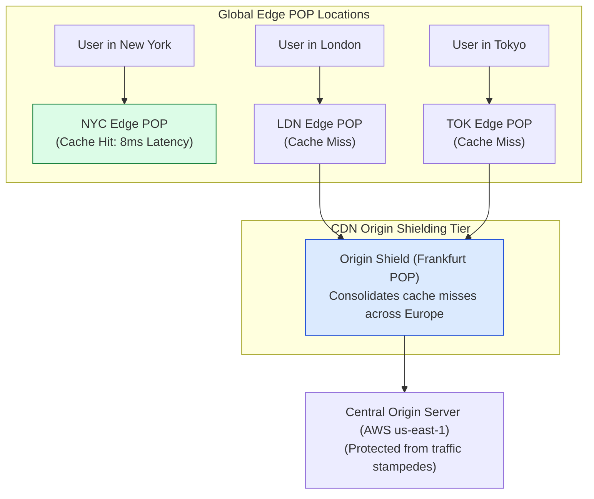
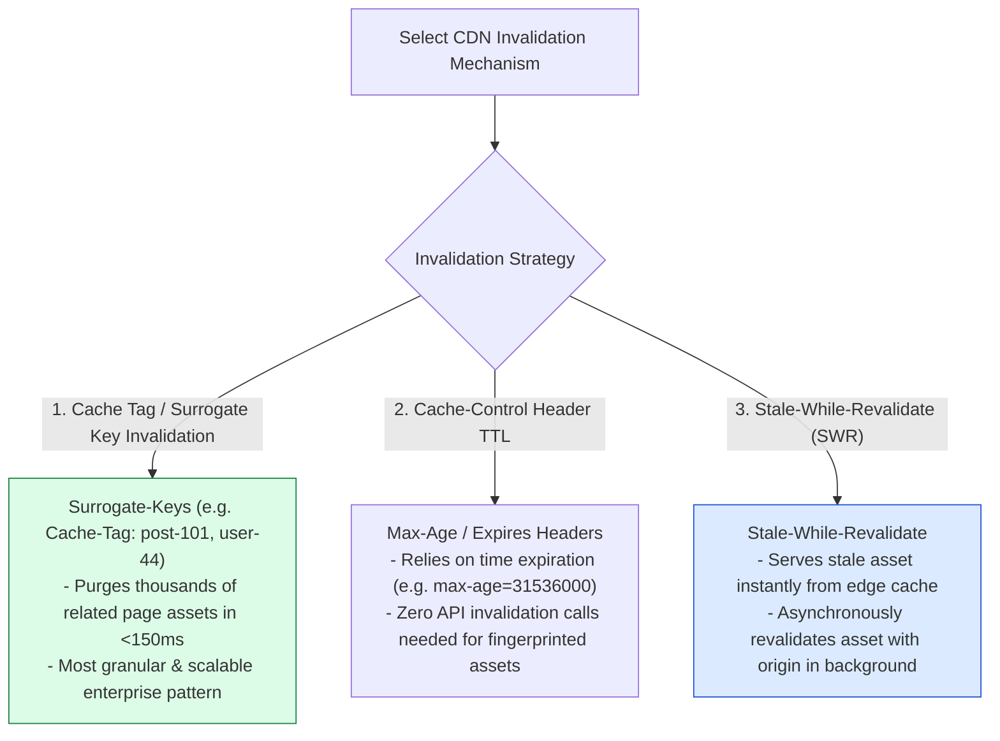
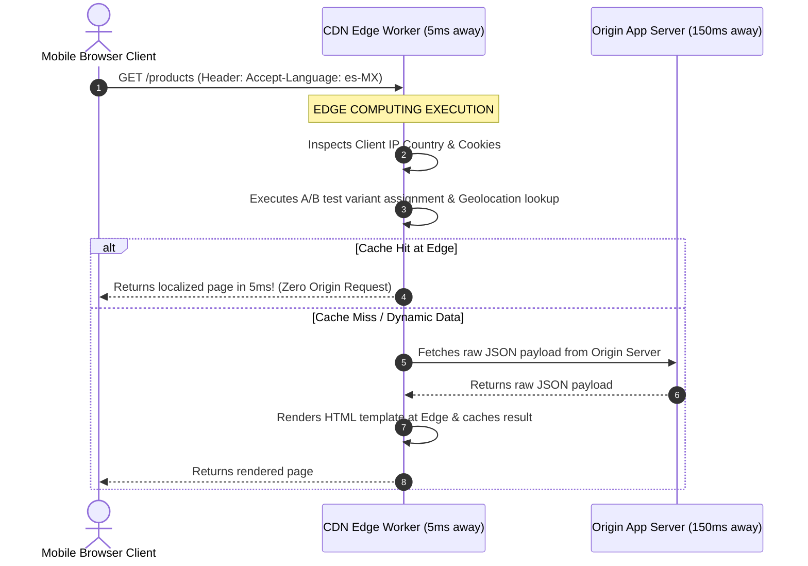

# Module 07: Content Delivery Networks (CDN), Edge Computing, and Cache Invalidation Strategies

## Overview

A **Content Delivery Network (CDN)** is a geographically distributed network of **Edge POPs (Points of Presence)** engineered to cache and serve static media assets (images, JavaScript, CSS, video streams) in close proximity to end users.

Modern CDNs go beyond static caching, introducing **Anycast Routing**, **Dynamic Edge Computing (Cloudflare Workers, Fastly Compute@Edge, Vercel Edge)**, **Surrogate-Key / Cache-Tag Invalidation**, and **`stale-while-revalidate` HTTP Control**.

Understanding **CDN Origin Shielding**, **Cache Invalidation Topologies**, and **Edge Middleware Execution** is essential for low-latency web architecture.

---

## 1. CDN Edge POP & Origin Shield Architecture



---

## 2. CDN Invalidation & Tagging Strategies Comparison



### Comprehensive HTTP Cache Header Reference Matrix

| Header Name | Header Value Example | CDN & Browser Behavior |
| :--- | :--- | :--- |
| **`Cache-Control`** | `"public, max-age=31536000, immutable"` | Caches asset for 1 year; browser skips revalidation on reload. |
| **`Cache-Control`** | `"public, max-age=0, must-revalidate"` | Forces browser/CDN to revalidate with `ETag` on every request. |
| **`Cache-Control`** | `"s-maxage=86400, max-age=3600"` | Instructs **CDN Edge** to cache for 24h, but **Browser** for only 1h. |
| **`Surrogate-Key`** | `"user-101 product-404 blog-post"` | Tags response with key IDs for bulk programmatic purge calls. |

---

## 3. Edge Computing vs. Origin Server Execution



---

## 4. Practical Implementation Showcase: Edge Worker & Surrogate Key Controller

```javascript
// Express.js Origin Controller setting Surrogate-Keys (Cache Tags)
function handleProductDetail(req, res) {
  const productId = req.params.id;

  // Set Surrogate Key header for Fastly / Cloudflare / CloudFront
  res.set({
    "Content-Type": "application/json",
    // Browser caches 5 mins, CDN caches 24 hours
    "Cache-Control": "public, max-age=300, s-maxage=86400, stale-while-revalidate=60",
    "Surrogate-Key": `product-${productId} catalog-electronics tenant-acme`
  });

  res.send(JSON.stringify({
    id: productId,
    title: "Enterprise Edge Gateway Router",
    price: 499.99
  }));
}

// Dynamic Edge Worker Function (Cloudflare Workers / Vercel Edge Runtime)
export default {
  async fetch(request, env, ctx) {
    const url = new URL(request.url);
    const country = request.headers.get("cf-ipcountry") || "US";
    const userAgent = request.headers.get("user-agent") || "";

    // 1. Edge Geo-Routing / Bot Defense
    if (userAgent.includes("BadBot")) {
      return new Response("Forbidden", { status: 403 });
    }

    // 2. Fetch asset from Origin with Edge Caching
    const response = await fetch(request);

    // 3. Inject Edge Diagnostics Header
    const newHeaders = new Headers(response.headers);
    newHeaders.set("X-Edge-Served-By", "Edge-POP-NYC-01");
    newHeaders.set("X-Client-Country", country);

    return new Response(response.body, {
      status: response.status,
      headers: newHeaders
    });
  }
};
```

---

## Key Production Takeaways

1. **Use Fingerprinted Asset Names for Long-Term Caching**: Use build tool hashes (`app.a8f91b.js`) with `Cache-Control: public, max-age=31536000, immutable` to allow 1-year CDN/browser caching with zero revalidation overhead.
2. **Implement Surrogate-Keys (Cache Tags) for Dynamic Content**: Tag API responses with entity keys (`Surrogate-Key: user-101`) to trigger precise programmatic purge calls when database entities are modified.
3. **Use `s-maxage` to Separate CDN and Browser Expiration**: Use `s-maxage` to allow CDNs to cache content for longer durations while keeping browser `max-age` shorter for faster client updates.
4. **Leverage Edge Workers for Lightweight Middleware**: Execute A/B testing, JWT authentication checks, and geo-location routing directly at CDN Edge POPs to eliminate 100ms+ network round-trips to origin servers.

