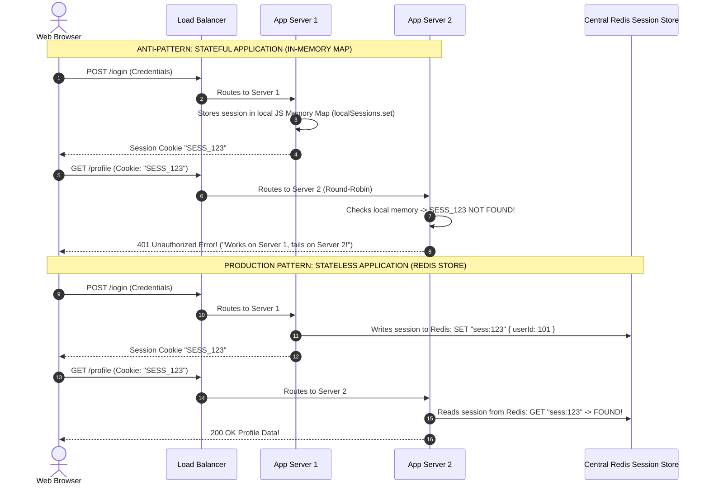
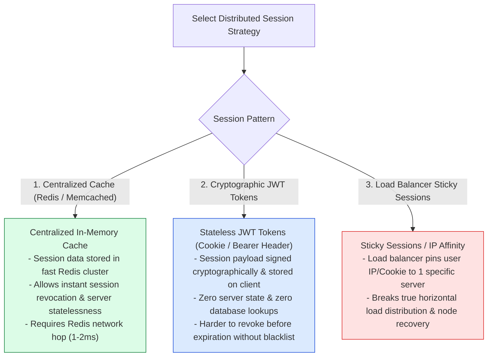

# Module 08: Horizontal vs. Vertical Scaling, Stateless Application Architecture, and Distributed Session Storage

## Overview

Scalability defines an application's capability to handle increasing concurrency and transaction volume without degrading response times or system availability. Systems scale using two fundamental strategies: **Vertical Scaling (Scale-Up)**, which upgrades CPU/RAM on a single server, and **Horizontal Scaling (Scale-Out)**, which distributes load across multiple application nodes behind a load balancer.

Achieving elastic horizontal scalability requires designing **Stateless Application Tiers**, where any server node can process any incoming client request by offloading ephemeral state to centralized distributed caches (Redis) or utilizing cryptographic tokens (JWTs).

---

## 1. Scale-Up (Vertical) vs. Scale-Out (Horizontal) Architectural Paradigms

```mermaid
flowchart TD
    subgraph Vertical Scaling (Scale-Up)
        SingleServer["Single Server Instance<br/>(Upgraded from 4 Core / 16GB to 64 Core / 256GB RAM)<br/>- Single Point of Failure (SPOF)<br/>- Hard Hardware Ceiling & Exponential Cost<br/>- Requires System Downtime to Upgrade"]
    end

    subgraph Horizontal Scaling (Scale-Out)
        LB[Load Balancer] --> Node1["Server Node 1 (Stateless)"]
        LB --> Node2["Server Node 2 (Stateless)"]
        LB --> Node3["Server Node 3 (Stateless)"]
        
        Node1 & Node2 & Node3 --> RedisSession[(Distributed Redis Session Store)]

        note1["- Linear Elastic Cost & Infinite Scaling<br/>- High Availability & Zero-Downtime Rolling Deploys<br/>- Requires Stateless Application Code"]
    end

    style SingleServer fill:#fee2e2,stroke:#dc2626
    style Node1 fill:#dcfce7,stroke:#15803d
    style Node2 fill:#dcfce7,stroke:#15803d
    style Node3 fill:#dcfce7,stroke:#15803d
```

### Comprehensive Scalability Matrix

| Property | Vertical Scaling (Scale-Up) | Horizontal Scaling (Scale-Out) |
| :--- | :--- | :--- |
| **Scaling Mechanism** | Upgrade CPU, RAM, NVMe on 1 server | Provision additional stateless server instances |
| **Max Capacity Limit** | Hard hardware ceiling (e.g. 128 cores / 4TB RAM) | **Virtually Infinite** (Elastically scaled behind LB) |
| **Deployment Overhead** | Requires server downtime / reboot | **Zero-Downtime** rolling deployments |
| **Fault Tolerance** | Low (Server hardware crash takes down entire app) | **High** (Redundant active-active nodes across AZs) |
| **State Management** | Can support in-memory stateful sessions | Requires **Strictly Stateless Application Architecture** |
| **Cost Trajectory** | Non-linear exponential hardware cost at top tier | Linear cost curve using commodity cloud instances |

---

## 2. Stateful vs. Stateless Architecture Topologies



---

## 3. Session Management Strategies Comparison



---

## 4. Practical Implementation Showcase: Distributed Stateless Session Engine

```javascript
const crypto = require("node:crypto");

// Mock In-Memory Distributed Redis Store
const redisCluster = new Map();

class StatelessAuthService {
  constructor(redisStore) {
    this.redis = redisStore;
  }

  // Generate cryptographic session ID and persist to distributed store
  async createSession(userId, userRole) {
    const sessionId = crypto.randomBytes(32).toString("hex");
    const sessionPayload = {
      userId,
      role: userRole,
      createdAt: new Date().toISOString()
    };

    // Store in distributed Redis with 24-hour TTL (86,400 seconds)
    await this.redis.set(`session:${sessionId}`, JSON.stringify(sessionPayload), 86400);
    return sessionId;
  }

  // Validate session ID from any server instance in cluster
  async validateSession(sessionId) {
    if (!sessionId) return null;
    const rawData = await this.redis.get(`session:${sessionId}`);
    if (!rawData) return null;

    return JSON.parse(rawData);
  }

  // Revoke session globally across all app servers
  async destroySession(sessionId) {
    await this.redis.delete(`session:${sessionId}`);
  }
}

// Execution Simulation
async function runStatelessDemo() {
  const authService = new StatelessAuthService({
    get: async (key) => redisCluster.get(key),
    set: async (key, val) => redisCluster.set(key, val),
    delete: async (key) => redisCluster.delete(key)
  });

  console.log("=== STATELESS DISTRIBUTED SESSION TEST ===");
  
  // App Server 1 creates session
  const sessionId = await authService.createSession("user_101", "ADMIN");
  console.log(`✓ [SERVER 1] Created Session ID: ${sessionId.substring(0, 16)}...`);

  // App Server 2 validates same session seamlessly
  const sessionData = await authService.validateSession(sessionId);
  console.log(`✓ [SERVER 2] Validated Session for User: ${sessionData.userId} (${sessionData.role})`);

  // Global Revocation
  await authService.destroySession(sessionId);
  const revokedCheck = await authService.validateSession(sessionId);
  console.log(`✓ [SERVER 3] Revoked Check Result: ${revokedCheck === null ? "AUTHORIZED_REVOKED" : "ACTIVE"}`);
}

runStatelessDemo();
```

---

## Key Production Takeaways

1. **Never Store User Sessions in Application RAM**: Avoid `localMap.set(sessionId)` patterns. Any application server node should be disposable and replaceable without causing user logouts.
2. **Offload Session State to Distributed Redis**: Use Redis clusters with eviction TTLs or signed stateless JWTs to decouple state from node compute.
3. **Avoid Load Balancer Sticky Sessions**: Sticky sessions bind client IPs to specific server nodes, frustrating auto-scaling policies and causing traffic hotspots when single server nodes become overloaded.
4. **Design for Zero-Downtime Rolling Deploys**: Ensure your stateless application deployment pipeline can terminate old nodes and launch new container instances without dropping active client connections.

