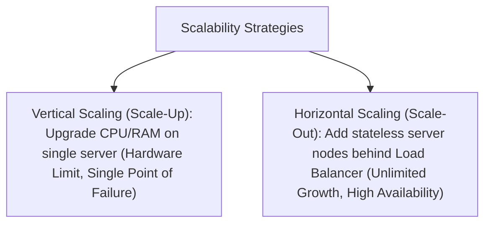

# File 08: Horizontal vs Vertical Scaling and Stateless Architecture

## Overview
Scalability is an application's ability to handle growing workloads. **Vertical Scaling (Scale-Up)** upgrades hardware specs on a single server, while **Horizontal Scaling (Scale-Out)** adds more stateless server nodes behind a load balancer.

---

## 1. Vertical Scaling vs Horizontal Scaling



### Scalability Comparison Matrix

| Property | Vertical Scaling (Scale-Up) | Horizontal Scaling (Scale-Out) |
| :--- | :--- | :--- |
| **Method** | Upgrade CPU, RAM, SSD on 1 machine | Add more commodity server instances |
| **Downtime** | Requires server restart | Zero-downtime rolling deploys |
| **Limit** | Hard hardware ceiling | Virtually infinite |
| **Fault Tolerance** | Low (Single Point of Failure) | High (Redundant active nodes) |
| **Architecture Requirement** | Works with stateful apps | Requires **Stateless Architecture** |

---

## 2. Converting Stateful Session Code to Stateless Distributed Storage

```javascript
// BAD: Stateful Architecture (Stores user session in local server memory)
const localSessions = new Map(); // Fails when load balancer routes next request to Server 2!

app.post("/login", (req, res) => {
    localSessions.set("session_123", { userId: 101 });
});

// GOOD: Stateless Architecture (Offloads session state to distributed Redis)
class StatelessAuthService {
    constructor(redisClient) {
        this.redis = redisClient;
    }

    async createSession(sessionId, userId) {
        // Any server node behind the load balancer can read this session!
        await this.redis.set(`session:${sessionId}`, JSON.stringify({ userId }), "EX", 86400);
    }
}
```

---

## Key Takeaways
1. Prefer **Horizontal Scaling** for production cloud services.
2. Horizontal scaling requires **Stateless Application Servers** (session state offloaded to Redis/DB).
3. Eliminates **Single Points of Failure (SPOF)** by deploying redundant server instances across availability zones.
