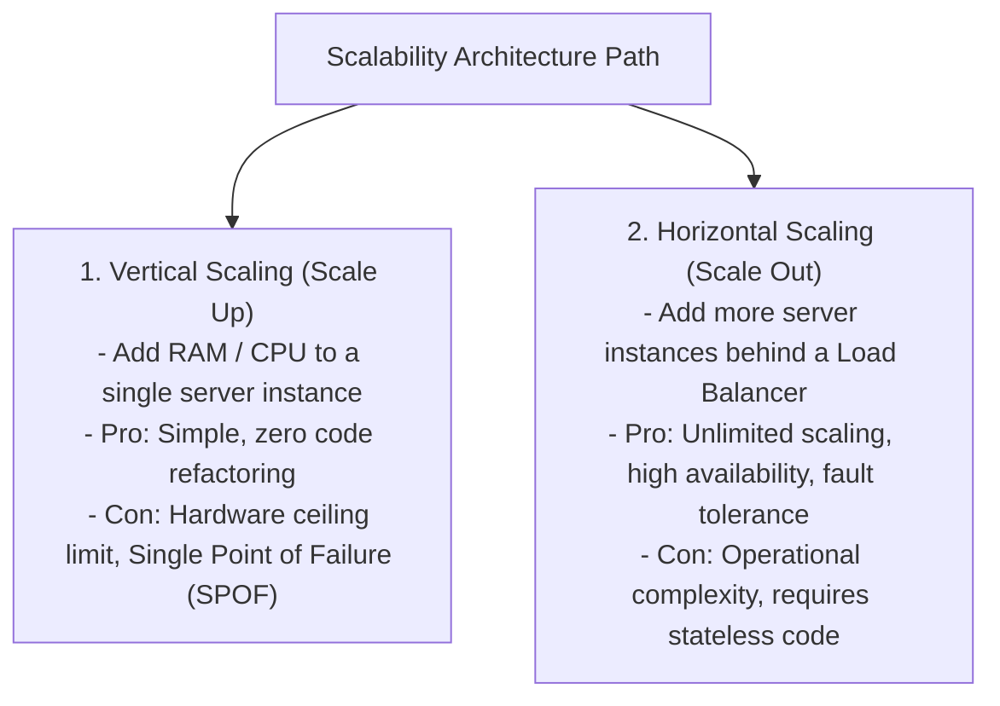
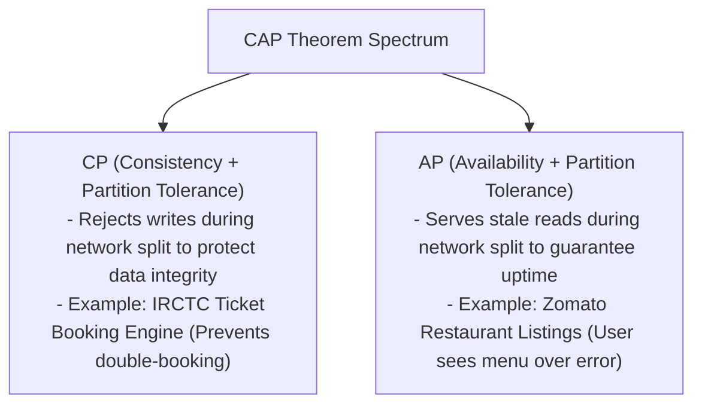

# Module 08: Horizontal vs. Vertical Scaling, Stateless Services, & Auto-Scaling

## Theoretical Overview & Core Trade-offs

System scalability measures an infrastructure's capacity to handle increased workload demand without compromising performance SLAs. Systems scale using two distinct paradigms: **Vertical Scaling (Scale Up)** and **Horizontal Scaling (Scale Out)**.



### Real-World Case Study: Indian Railways Ticket Counters
- **Vertical Scaling**: Replacing a ticket clerk's computer with a faster 64-core machine.
- **Horizontal Scaling**: Opening 10 counters on normal days, auto-expanding to 50 counters during 10:00 AM Tatkal rush, and 200 counters during Diwali holidays.

---

## 1. Scale Up vs. Scale Out Metric Comparison Matrix

| Feature | Vertical Scaling (Scale Up) | Horizontal Scaling (Scale Out) |
| :--- | :--- | :--- |
| **Hardware Limit** | Hard ceiling (e.g., max 128 CPUs, 2TB RAM per box). | Virtually **unlimited** capacity by adding nodes. |
| **Fault Tolerance** | Low (**Single Point of Failure** if box crashes). | High (If 1 instance dies, remaining nodes serve traffic). |
| **Code Impact** | Zero (Monolithic application code unchanged). | Requires **stateless services** and shared external data stores. |
| **Cost Curve** | Exponential (Enterprise high-spec hardware is pricey). | Linear (Uses commodity cloud VM instances). |
| **Maintenance Downtime**| Requires server restart to upgrade CPU/RAM. | **Zero downtime** rolling deployment upgrades. |

---

## 2. Code Implementations & System Mechanics

### 1. Vertical Server Simulation (`VerticalServer`)
```javascript
class VerticalServer {
  constructor(cpu, ram, name = "Server") {
    this.name = name; this.cpu = cpu; this.ram = ram;
    this.rps = cpu * 100;
  }

  process(incomingRps) {
    const handled = Math.min(incomingRps, this.rps);
    const dropped = incomingRps - handled;
    return { handled, dropped };
  }

  scaleUp(newCpu, newRam) {
    if (newCpu > 128) newCpu = 128; // Hardware Ceiling Limit
    this.cpu = newCpu; this.ram = newRam;
    this.rps = newCpu * 100;
  }
}
```

### 2. Horizontal Cluster Auto-Expansion (`HorizontalCluster`)
```javascript
class HorizontalCluster {
  constructor(cpu, ram) {
    this.cpu = cpu; this.ram = ram;
    this.instances = [];
    this.addInstance();
  }

  addInstance() {
    this.instances.push(new VerticalServer(this.cpu, this.ram));
  }

  capacity() {
    return this.instances.reduce((sum, inst) => sum + inst.rps, 0);
  }
}
```

---

## 3. Stateless vs. Stateful Architecture

To scale horizontally, application nodes must be **Stateless**—storing no client session data in local server RAM. Session data must be externalized to a shared distributed store (e.g., Redis Session Store).

```mermaid
flowchart LR
    subgraph Stateful Architecture (Fails Horizontal Scaling)
        C1["Client"] -->|Login (Session saved on Server A)| SrvA["Server Node A (RAM Session)"]
        C1 -.->|Next Call routed to Server B| SrvB["Server Node B -> 401 Unauthorized!"]
    end

    subgraph Stateless Architecture (Scales Horizontally)
        C2["Client"] -->|Any Request (JWT / Auth Token in Header)| AnyServer["Any App Server Node (1..N)"]
        AnyServer -->|Read Session Data| SharedRedis[("Shared Redis Session Store")]
    end
```

```javascript
class SharedStore {
  constructor() { this.data = new Map(); }
  set(k, v) { this.data.set(k, v); }
  get(k) { return this.data.get(k); }
}

class StatelessCounter {
  constructor(id, store) { this.id = id; this.store = store; }
  handle(uid, action) {
    if (action === "login") {
      this.store.set(uid, { cart: [] });
      return `Session created via Counter-${this.id}`;
    }
    const session = this.store.get(uid);
    if (!session) return "No session found!";
    if (action === "book") return `Booked via Counter-${this.id} (Shared Store)`;
  }
}
```

---

## 4. Shared-Nothing Architecture (SN)

In a **Shared-Nothing Architecture**, independent nodes own non-overlapping data partitions. There is zero disk or memory contention, allowing linear horizontal throughput expansion.

```javascript
class SNCluster {
  constructor(n) {
    this.nodes = Array.from({ length: n }, (_, i) => ({ id: i + 1, data: new Map() }));
  }

  hash(key) {
    let h = 0;
    for (let i = 0; i < key.length; i++) h = ((h << 5) - h + key.charCodeAt(i)) & 0x7fffffff;
    return h % this.nodes.length;
  }

  write(key, val) {
    const node = this.nodes[this.hash(key)];
    node.data.set(key, val);
    return node.id;
  }
}
```

---

## 5. Metric-Driven Auto-Scaling Engine (`AutoScaler`)

Auto-scaling dynamically adjusts running cloud instances based on real-time CPU utilization or request depth metrics.

```javascript
class AutoScaler {
  constructor(min, max, capPerInst, scaleUpThreshold, scaleDownThreshold) {
    this.min = min; this.max = max; this.cap = capPerInst;
    this.scaleUp = scaleUpThreshold; // e.g. 70% CPU
    this.scaleDown = scaleDownThreshold; // e.g. 30% CPU
    this.curr = min;
  }

  evaluate(loadRps) {
    const cpuPct = ((loadRps / (this.curr * this.cap)) * 100).toFixed(1);
    let action = "steady";
    if (cpuPct > this.scaleUp && this.curr < this.max) {
      const needed = Math.min(Math.ceil(loadRps / (this.cap * (this.scaleUp / 100))), this.max);
      action = `+${needed - this.curr} nodes`;
      this.curr = needed;
    }
    return { cpu: cpuPct + "%", instances: this.curr, action };
  }
}
```

- **Static Fleet**: 20 instances active 24/7 $\implies \mathbf{\approx ₹2,40,000/\text{day}}$.
- **Auto-Scaling Fleet**: Scales down at night (2 instances) and spikes during Tatkal (20 instances) $\implies \mathbf{\approx ₹60,000/\text{day}}$ (**75% cost savings**).

---

## 6. Introduction to CAP Theorem Constraints

The **CAP Theorem** dictates that a distributed system can guarantee at most 2 out of 3 properties simultaneously during a network partition:



---

## 7. Scaling Decision Framework

```javascript
function decideScalingPath(params) {
  let verticalScore = 0, horizontalScore = 0;
  if (params.rps < 1000) verticalScore += 2; else horizontalScore += 2;
  if (params.growth === "low") verticalScore++; else horizontalScore += 2;
  if (params.team < 5) verticalScore += 2; else horizontalScore++;
  return verticalScore > horizontalScore ? "VERTICAL" : "HORIZONTAL";
}
```

---

## Key Takeaways

1. **Start Vertical, Scale Horizontal Later**: Start with a simple vertical server box; pivot to horizontal scaling beyond $\approx 10,000\text{ RPS}$.
2. **Mandatory Statelessness**: Move all session data and static state to external stores (Redis / S3) to enable horizontal scaling.
3. **Shared-Nothing Eliminates Contention**: Partition data across independent nodes to achieve linear throughput growth.
4. **Auto-Scaling Saves Operational Costs**: Configure metric-driven scale-up and scale-down rules to match real traffic curves.
