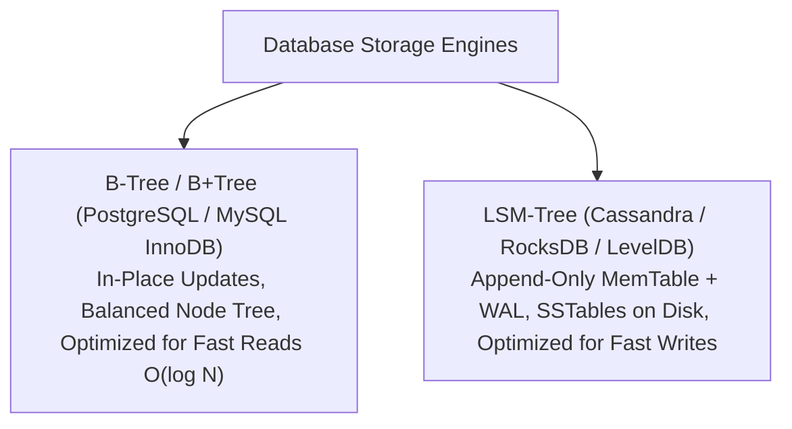

# File 09: Database Fundamentals and Indexing Architecture

## Overview
Databases store and retrieve persistent application data. Understanding database indexing structures (**B-Trees** vs **LSM-Trees**) explains read vs write performance characteristics.

---

## 1. B-Tree Index vs LSM-Tree Storage Architecture



### B-Tree vs LSM-Tree Comparison

| Feature | B-Tree (Postgres, MySQL) | LSM-Tree (Cassandra, RocksDB) |
| :--- | :--- | :--- |
| **Write Operation** | In-place random disk writes | **Append-only sequential disk writes** |
| **Read Operation** | $O(\log n)$ fast random reads | Slower (Checks MemTable $\rightarrow$ SSTables via Bloom Filters) |
| **Primary Advantage** | High-speed read performance | High-throughput write performance |
| **Hardware Fit** | SSDs / HDDs | SSDs / High-volume write streams |

---

## 2. SQL B-Tree Index Query Optimization Concept

```sql
-- Creating Compound B-Tree Index on (user_id, created_at)
CREATE INDEX idx_user_orders ON orders (user_id, created_at DESC);

-- EXPLAIN ANALYZE shows B-Tree Index Scan instead of Full Table Sequential Scan!
EXPLAIN ANALYZE 
SELECT * FROM orders 
WHERE user_id = 101 
ORDER BY created_at DESC 
LIMIT 10;
```

---

## Key Takeaways
1. **B-Trees** power traditional relational databases (PostgreSQL, MySQL), optimizing for **fast random reads**.
2. **LSM-Trees** power write-heavy NoSQL stores (Cassandra, RocksDB), optimizing for **high-throughput sequential writes**.
3. Use **Compound Indexes** following the Leftmost Prefix rule.
4. Avoid over-indexing tables because every index slows down `INSERT`, `UPDATE`, and `DELETE` queries.
