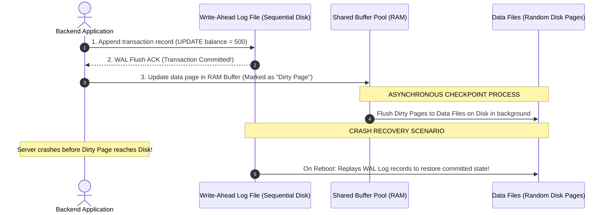

# Module 09: Database Engine Architecture, B-Tree vs. LSM-Tree Storage, and Index Optimization

## Overview

Databases form the persistent core of enterprise applications. Understanding storage engines—specifically **B+Trees (Read-Optimized)** versus **Log-Structured Merge-Trees / LSM-Trees (Write-Optimized)**—explains system throughput limits and disk I/O bottlenecks.

Optimizing database access requires mastering **Write-Ahead Logging (WAL)**, **Clustered vs. Secondary Indexes**, **Compound Index Leftmost Prefix Rules**, and **Query Execution Plan Analysis (`EXPLAIN ANALYZE`)**.

---

## 1. Storage Engine Architecture: B+Tree vs. LSM-Tree

```mermaid
flowchart TD
    subgraph 1. B+Tree Storage Engine (PostgreSQL / MySQL InnoDB)
        BTreeNav["Root & Internal Branch Nodes<br/>O(log N) Navigation"] --> LeafNode["Leaf Nodes Linked List<br/>In-Place Page Updates on Disk"]
        LeafNode -.->|Random I/O Writes| DiskPages[(Database Disk Data Pages)]
    end

    subgraph 2. LSM-Tree Storage Engine (Cassandra / RocksDB)
        MemTable["1. RAM MemTable + WAL Log<br/>(Sequential Write)"] -->|2. Flush when full| SSTable["2. Immutable SSTables on Disk<br/>(Sorted String Tables)"]
        SSTable --> Compaction["3. Background Compaction<br/>(Merges SSTables & Purges Deleted Tombstones)"]
    end

    style LeafNode fill:#dbeafe,stroke:#1d4ed8
    style MemTable fill:#dcfce7,stroke:#15803d
```

### Comprehensive B+Tree vs. LSM-Tree Storage Engine Matrix

| Feature / Metric | B+Tree (PostgreSQL, MySQL InnoDB) | LSM-Tree (Cassandra, RocksDB, LevelDB) |
| :--- | :--- | :--- |
| **Primary Design Goal** | **Read-Optimized** ($O(\log N)$ Point & Range Reads)| **Write-Optimized** (Sequential Ingest) |
| **Disk Write Pattern** | In-place random disk page writes | **Append-only sequential disk writes** |
| **Write Amplification** | High (Writes full 16KB disk pages for minor edits) | Low initial write amp; higher during background compaction |
| **Read Pathway** | Fast single-page lookup via leaf nodes | Checks MemTable $\rightarrow$ SSTables via Bloom Filters |
| **Hardware Affinity** | NVMe SSDs with low random read latencies | High-throughput write streams & HDDs/SSDs |
| **Space Efficiency** | Fragmented pages require `VACUUM` / `OPTIMIZE` | High compression ratios on SSTable segments |

---

## 2. Write-Ahead Logging (WAL) & Crash Recovery Sequence

To guarantee durability (ACID Durability), databases execute **Write-Ahead Logging (WAL)** before committing changes to data pages on disk:



---

## 3. Clustered vs. Secondary Compound Indexes

```mermaid
flowchart TD
    subgraph Primary Clustered Index (InnoDB)
        PKLeaf["Primary Key Leaf Nodes<br/>CONTAINS FULL ROW DATA<br/>(id: 101, name: 'Alice', email: 'a@test.com')"]
    end

    subgraph Secondary Non-Clustered Index (email_idx)
        SecLeaf["Secondary Index Leaf Nodes<br/>CONTAINS ONLY SEARCH KEY + PRIMARY KEY<br/>(email: 'a@test.com' -> id: 101)"]
    end

    SecLeaf -->|Index Lookup + Double I/O Hop| PKLeaf

    style PKLeaf fill:#dcfce7,stroke:#15803d
    style SecLeaf fill:#fef3c7,stroke:#b45309
```

---

## 4. SQL Index Optimization Showcase & `EXPLAIN ANALYZE`

```sql
-- 1. Compound Index Definition (Leftmost Prefix Rule)
-- Index ordered by: user_id FIRST, then status, then created_at
CREATE INDEX idx_orders_user_status_date ON orders (user_id, status, created_at DESC);

-- ✅ USES INDEX (Matches Leftmost Prefix: user_id)
SELECT * FROM orders 
WHERE user_id = 101 AND status = 'COMPLETED' 
ORDER BY created_at DESC 
LIMIT 10;

-- ✅ USES INDEX (Matches Leftmost Prefix: user_id alone)
SELECT * FROM orders WHERE user_id = 101;

-- ❌ CANNOT USE INDEX OPTIMALLY (Skips Leftmost Prefix 'user_id'!)
-- Causes expensive Full Table Sequential Scan!
SELECT * FROM orders WHERE status = 'COMPLETED';
```

---

## 5. Practical Implementation Showcase: Index & WAL Simulator

```javascript
// Simulated B+Tree Index Lookup & Leftmost Prefix Evaluator
class DatabaseIndexOptimizer {
  constructor() {
    this.indexes = new Map();
  }

  createCompoundIndex(tableName, indexName, columns) {
    this.indexes.set(`${tableName}:${indexName}`, {
      columns,
      leftmostPrefix: columns[0]
    });
    console.log(`✓ [INDEX CREATED] ${tableName} -> (${columns.join(", ")})`);
  }

  analyzeQuery(tableName, queryWhereColumns) {
    console.log(`\n--- ANALYZING QUERY: SELECT FROM ${tableName} WHERE (${queryWhereColumns.join(", ")}) ---`);
    
    for (const [key, index] of this.indexes.entries()) {
      if (!key.startsWith(tableName)) continue;

      // Check Leftmost Prefix Match
      if (queryWhereColumns.includes(index.leftmostPrefix)) {
        console.log(`  ✓ [INDEX SCAN MATCHED] Using index '${key}'`);
        console.log(`    Execution Cost: O(log N) Index B+Tree Lookup`);
        return;
      }
    }

    console.log(`  ⚠ [FULL TABLE SCAN WARNING] No matching index found for leftmost column.`);
    console.log(`    Execution Cost: O(N) Sequential Disk Scan!`);
  }
}

// Execution Simulation
const optimizer = new DatabaseIndexOptimizer();
optimizer.createCompoundIndex("orders", "idx_user_status", ["user_id", "status", "created_at"]);

optimizer.analyzeQuery("orders", ["user_id", "status"]); // Index Scan
optimizer.analyzeQuery("orders", ["status"]);            // Full Table Scan Warning!
```

---

## Key Production Takeaways

1. **Choose B+Trees for Read-Heavy OLTP, LSM-Trees for Write-Heavy Log Streams**: Use PostgreSQL/MySQL for traditional transactional systems requiring fast point/range reads; use Cassandra/RocksDB for high-ingest logging and time-series telemetry.
2. **Obey the Leftmost Prefix Rule for Compound Indexes**: When indexing `(A, B, C)`, queries filtering by `(A)`, `(A, B)`, or `(A, B, C)` use the index efficiently, but queries filtering solely by `(B)` or `(C)` will trigger full table scans.
3. **Covering Indexes Eliminate Table Double-Hops**: Include required `SELECT` columns in secondary indexes (`INCLUDE (email)` or compound index) to fulfill queries entirely inside the index leaf node without fetching primary key data pages.
4. **Avoid Over-Indexing Tables**: Every added index incurs write amplification, requiring the database to update multiple B+Tree disk pages synchronously on every `INSERT`, `UPDATE`, and `DELETE`.

