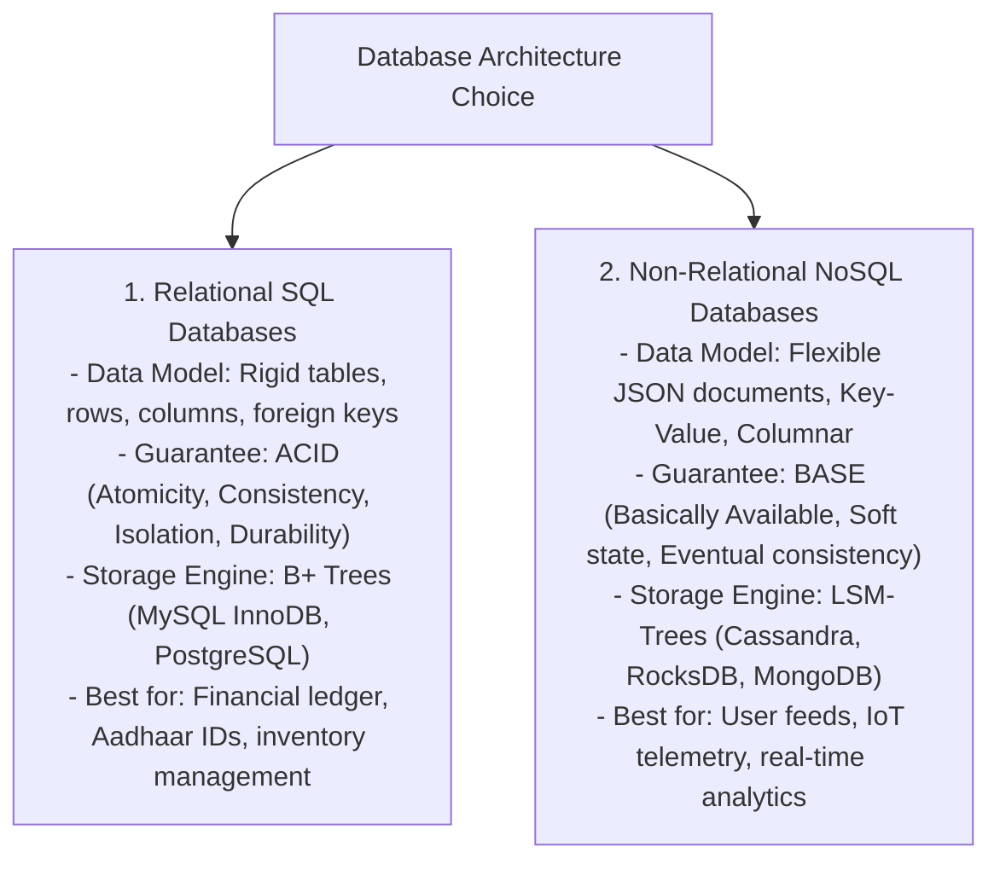
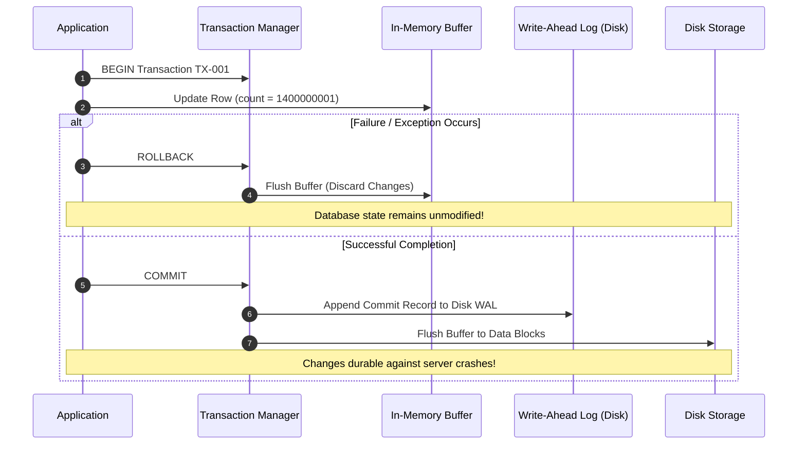
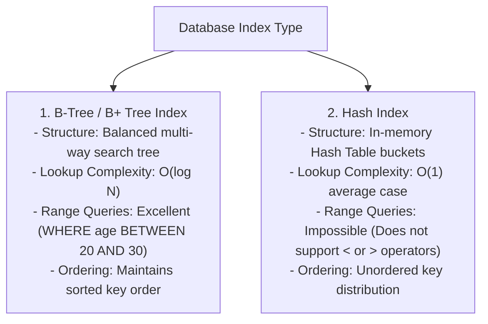

# Module 09: Database Fundamentals, Indexing Mechanics, & ACID vs BASE Models

## Theoretical Overview & Core Storage Engines

Databases store, query, and manage structured or semi-structured data while guaranteeing specific transactional and durability guarantees.



### Real-World Case Study: The Aadhaar National Database (UIDAI)
Aadhaar manages demographic and biometric records for **1.4 billion residents**:
- **ACID Guarantees**: Ensures zero duplicate Aadhaar number assignments during concurrent registration transactions.
- **Indexing Efficiency**: Querying an unindexed table of 1.4 billion rows takes **minutes** ($O(N)$ full table scan). B-Tree indexing on `pincode` or `aadhaar_no` locates target records in **$\approx 30$ disk comparisons** ($O(\log N)$).

---

## 1. SQL Schema vs. NoSQL Document Stores

### 1. In-Memory SQL Table Engine (`SQLTable`)
Enforces schema constraints, primary keys, non-null properties, and unique indexes:

```javascript
class SQLTable {
  constructor(name, columns) {
    this.name = name;
    this.columns = columns;
    this.rows = [];
    this.indexes = new Map();
  }

  insert(row) {
    for (const col of this.columns) {
      if (col.notNull && row[col.name] == null) throw new Error(`NOT NULL: ${col.name}`);
      if (col.unique && this.rows.find((r) => r[col.name] === row[col.name])) {
        throw new Error(`UNIQUE constraint violation: ${col.name}`);
      }
    }
    this.rows.push({ ...row });
    return row;
  }
}
```

### 2. Flexible NoSQL Document Store (`DocStore`)
Supports nested JSON documents and dynamic dot-notation property queries:

```javascript
class DocStore {
  constructor() { this.docs = new Map(); }

  insert(doc) {
    const id = doc._id || `doc_${Date.now()}`;
    this.docs.set(id, { _id: id, ...doc });
    return this.docs.get(id);
  }

  // Evaluates nested queries like 'address.city'
  find(query = {}) {
    return [...this.docs.values()].filter((doc) => {
      for (const [key, val] of Object.entries(query)) {
        const parts = key.split(".");
        let cur = doc;
        for (const p of parts) { if (cur == null) return false; cur = cur[p]; }
        if (cur !== val) return false;
      }
      return true;
    });
  }
}
```

---

## 2. Transactional Guarantees: ACID vs. BASE

| Principle | Meaning | System Mechanism | Engineering Trade-off |
| :--- | :--- | :--- | :--- |
| **Atomicity (A)** | "All-or-Nothing" execution. | Managed via **WAL (Write-Ahead Logging)** & rollback buffers. | Aborts entire transaction on any failure step. |
| **Consistency (C)**| Database transitions only between valid states. | Foreign keys, unique constraints, check conditions. | Rejects transactions that break constraints. |
| **Isolation (I)** | Concurrent transactions execute without mutual interference. | Lock managers (2PL) and MVCC snapshot isolations. | Higher isolation levels reduce throughput concurrency. |
| **Durability (D)** | Committed changes survive power outages/crashes. | Non-volatile disk flush of WAL log entries. | Disk write latency penalty on commit. |
| **BASE Model** | Basically Available, Soft State, Eventual Consistency. | Asynchronous replica background synchronization. | Trades immediate consistency for high availability and low write latency. |



---

## 3. Database Normalization Spectrum

1. **First Normal Form (1NF)**: All column values must be atomic (no comma-separated list values inside a single cell).
2. **Second Normal Form (2NF)**: Meets 1NF, and all non-key attributes are fully dependent on the primary key (removes partial dependencies).
3. **Third Normal Form (3NF)**: Meets 2NF, and no non-key attribute depends on another non-key attribute (removes transitive dependencies like `pincode -> state`).

---

## 4. Indexing Engines: B-Tree vs. Hash Indexes



```javascript
// B-Tree Search Execution
class SimpleBTree {
  // B-Tree node split and search recursion
  search(key) {
    let comparisons = 0;
    // Navigates tree levels in O(log N) comparisons
    return { found: true, comparisons };
  }
}
```

- **Unindexed Table Scan**: Scanning 1,400,000,000 Aadhaar records $= 1,400,000,000$ row comparisons (**$O(N)$**).
- **B-Tree Index Search**: Locates target record in **$\approx 30$ node comparisons** (**$O(\log N)$**).

---

## 5. Query Optimization & Execution Plans

Database Query Planners evaluate SQL queries and generate optimal execution paths.

```javascript
// Query Execution Plan Inspection
const query = "SELECT * FROM aadhaar WHERE pincode = '110001'";
// If index exists on pincode -> Plan: INDEX SCAN (Reads ~100 rows)
// If index missing on pincode -> Plan: FULL TABLE SCAN (Reads 1.4 Billion rows!)
```

### Top Query Optimization Rules
1. **Index Filter Columns**: Create indexes on columns used in `WHERE`, `JOIN`, `ORDER BY`, and `GROUP BY` clauses.
2. **Avoid `SELECT *`**: Fetch only explicitly required columns to utilize **Covering Indexes** and minimize disk IO.
3. **Use `EXPLAIN ANALYZE`**: Inspect query execution plans to spot unintended Full Table Scans.

---

## Key Takeaways

1. **SQL vs NoSQL Choice**: Use SQL for structured data requiring strict ACID guarantees; use NoSQL for schema-free, horizontally scaled document stores.
2. **ACID vs BASE**: ACID prioritizes strict data consistency; BASE prioritizes system availability and write speed.
3. **B-Tree is the Default Index**: Choose B-Trees for general databases due to $O(\log N)$ lookups and fast range scans.
4. **Optimize Queries via Indexing**: Always inspect execution plans to avoid performance-killing Full Table Scans.
