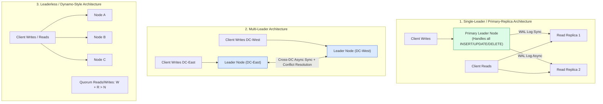
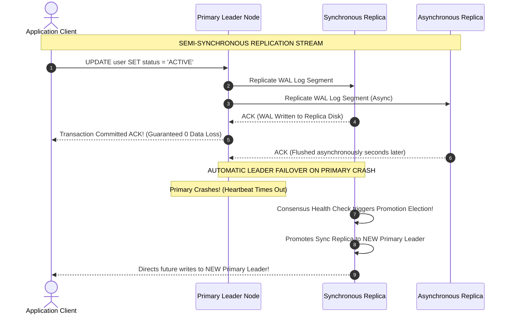
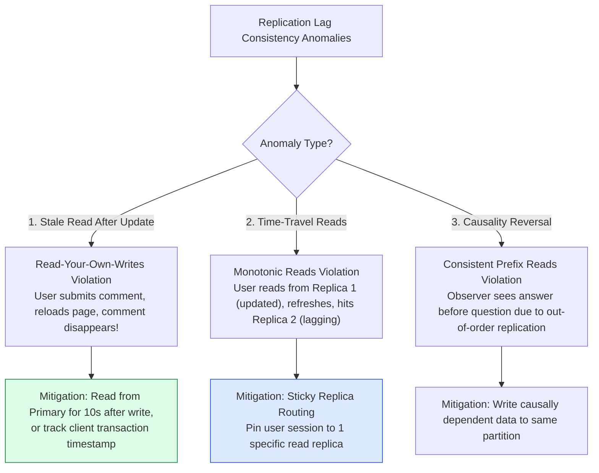

# Module 10: Database Replication Architecture, Failover Mechanics, and Consistency Anomalies

## Overview

**Database Replication** maintains copies of data across multiple physically separate database nodes connected by a network. Replication provides **High Availability** (surviving node hardware crashes), **Fault Tolerance**, **Disaster Recovery**, and **Read Throughput Scaling**.

Understanding **Replication Topologies (Single-Leader, Multi-Leader, Leaderless Dynamo-Style)**, **Synchronous vs. Semi-Synchronous vs. Asynchronous Replication**, **Replication Lag Anomalies (Read-Your-Own-Writes, Monotonic Reads)**, and **Automatic Leader Failover & Split-Brain Prevention** is essential.

---

## 1. Replication Topology Architectural Taxonomy



### Replication Topology Comparison Matrix

| Replication Topology | Write Endpoint | Read Endpoint | Primary Advantage | Main Architectural Challenge |
| :--- | :--- | :--- | :--- | :--- |
| **Single-Leader** | Single Primary Node | All Read Replicas | Simple, zero write conflicts | Primary node is a write bottleneck & SPOF |
| **Multi-Leader** | Any Regional Leader Node | Any Regional Replica | Cross-datacenter write speed | Complex **Write Conflict Resolution** (LWW, CRDTs) |
| **Leaderless (Dynamo)**| Any $W$ nodes in cluster | Any $R$ nodes in cluster | High availability & zero leader failover | Requires **Quorum Math** ($W + R > N$) & Anti-Entropy |

---

## 2. Replication Synchronization Modes & Failover Sequence



---

## 3. Replication Lag Consistency Anomalies & Mitigations

When using asynchronous read replicas, network propagation delays introduce **Replication Lag**, leading to consistency anomalies:



---

## 4. Practical Implementation Showcase: Primary-Replica Engine with Lag Simulation

```javascript
class PrimaryReplicaDatabaseEngine {
  constructor() {
    this.primary = new Map();
    this.replicas = [
      { id: 1, store: new Map(), lagMs: 10 },  // Replica 1 (Fast: 10ms lag)
      { id: 2, store: new Map(), lagMs: 500 }  // Replica 2 (Lagging: 500ms lag)
    ];
  }

  // Primary Write Handler
  async write(key, value) {
    console.log(`⚡ [PRIMARY WRITE] Executing UPDATE ${key} = "${value}"`);
    this.primary.set(key, value);

    // Asynchronous Replication Log Stream
    this.replicas.forEach((replica) => {
      setTimeout(() => {
        replica.store.set(key, value);
        console.log(`  ✓ [REPLICA ${replica.id} REPLICATED] Key '${key}' updated after ${replica.lagMs}ms`);
      }, replica.lagMs);
    });
  }

  // Read Handler with Read-Your-Own-Writes Guard
  async read(key, userLastWriteTimestamp = 0) {
    const timeSinceLastWrite = Date.now() - userLastWriteTimestamp;

    // READ-YOUR-OWN-WRITES GUARD: If written within last 2 seconds, force read from Primary!
    if (timeSinceLastWrite < 2000) {
      console.log(`🛡 [READ-YOUR-OWN-WRITES GUARD] Reading '${key}' directly from PRIMARY (Bypassing Replicas)`);
      return this.primary.get(key);
    }

    // Otherwise, load balance read across replicas
    const replica = this.replicas[Math.floor(Math.random() * this.replicas.length)];
    console.log(`📖 [REPLICA READ] Reading '${key}' from Replica #${replica.id}`);
    return replica.store.get(key);
  }
}

// Execution Simulation
async function runReplicationDemo() {
  const db = new PrimaryReplicaDatabaseEngine();
  
  const writeTime = Date.now();
  await db.write("profile:101", "Priya Sharma");

  // Immediate Read (Triggers Read-Your-Own-Writes Guard -> Reads Primary)
  const valImmediate = await db.read("profile:101", writeTime);
  console.log(`Result Immediate: "${valImmediate}"`);

  // Wait 600ms for replicas to sync
  await new Promise((r) => setTimeout(r, 600));

  // Eventual Read (Reads from Replica safely)
  const valLater = await db.read("profile:101", writeTime - 3000);
  console.log(`Result Later    : "${valLater}"`);
}

runReplicationDemo();
```

---

## Key Production Takeaways

1. **Use Semi-Synchronous Replication for Zero Data Loss**: Configure at least 1 synchronous replica alongside asynchronous read replicas to ensure committed transactions survive primary node hardware failures.
2. **Implement Read-Your-Own-Writes Guarantees**: Route read queries directly to the Primary database node for 5-10 seconds following a client write operation to prevent users from seeing stale state.
3. **Prevent Split-Brain with Quorum Consensus**: Configure failover orchestrators (e.g. Patroni, Orchestrator, Raft consensus) to require strict majority node agreement before promoting a new leader, avoiding multiple nodes accepting writes simultaneously.
4. **Monitor Replication Lag Metrics**: Set up real-time Prometheus/Datadog alerts on Postgres `pg_stat_replication` byte lag or MySQL `Seconds_Behind_Master` to automatically drop lagging replicas from read pools.

