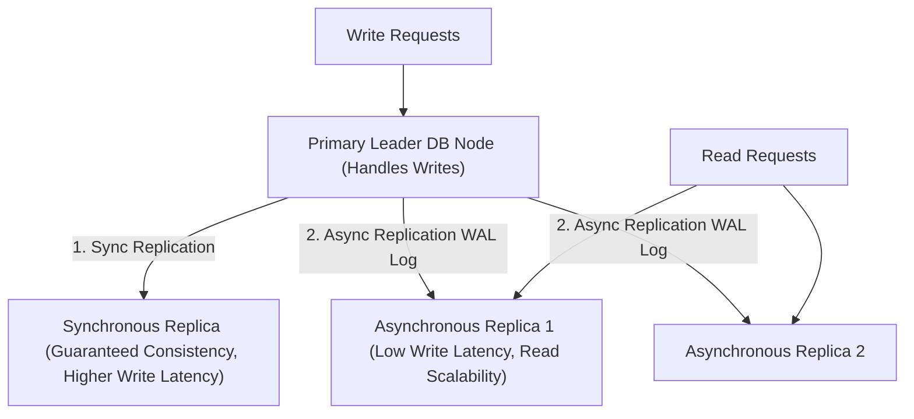

# File 10: Database Replication Architecture

## Overview
**Database Replication** copies data across multiple database nodes to provide high availability, fault tolerance, and read scalability. Replication setups use **Single-Leader (Primary-Replica)**, **Multi-Leader**, or **Leaderless** architectures.

---

## 1. Single-Leader Replication Architecture



---

## 2. Simulated Primary-Replica Replication Concept

```javascript
class PrimaryReplicaDB {
    constructor() {
        this.primary = new Map();
        this.replicas = [new Map(), new Map()];
    }

    write(key, value) {
        console.log(`[PRIMARY WRITE] Writing ${key} = ${value}`);
        this.primary.set(key, value);

        // Asynchronous Replication Stream to Replicas
        setTimeout(() => {
            this.replicas.forEach((replica, i) => {
                replica.set(key, value);
                console.log(`[REPLICA ${i + 1} REPLICATED] ${key} updated`);
            });
        }, 50);
    }

    read(key) {
        // Load balances read queries across read replicas
        const replica = this.replicas[Math.floor(Math.random() * this.replicas.length)];
        return replica.get(key) || null;
    }
}

const db = new PrimaryReplicaDB();
db.write("user:101", "Priya");
```

---

## Key Takeaways
1. **Single-Leader**: All writes go to one Primary node; reads scale across multiple Replicas.
2. **Synchronous Replication**: Guarantees zero data loss, but increases write latency and fails if replica goes down.
3. **Asynchronous Replication**: Low write latency, but introduces **Replication Lag** (stale reads).
