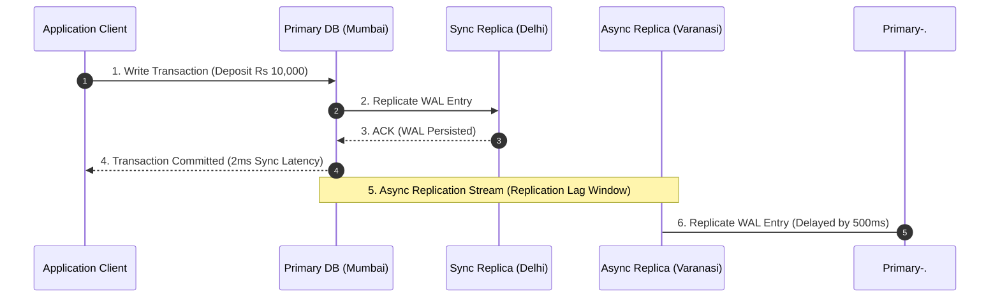

# Module 10: Database Replication Architecture, Failover, & Consistency Models

## Theoretical Overview & Architecture Intuition

**Database Replication** is the process of copying data across multiple physical database servers (nodes) to achieve fault tolerance, high availability, and read scalability.

```mermaid
flowchart TD
    ClientWrite["Write Request (UPDATE balance)"] --> Primary["Primary Database Node (Mumbai HQ)"]
    Primary -->|1. Append WAL Log| LocalWAL[("Primary WAL Disk")]
    
    Primary -->|2a. Synchronous Sync| SyncReplica["Sync Replica (Delhi)"]
    Primary -.->|2b. Asynchronous Replication (Replication Lag)| AsyncReplica["Async Replica (Varanasi)"]
    
    ClientRead["Read Requests (SELECT)"] --> Router["Replica Load Balancer"]
    Router --> SyncReplica
    Router --> AsyncReplica
```

### Real-World Case Study: SBI Core Banking System
State Bank of India (SBI) processes over **100 million transactions daily** across 22,000 branches:
- **Primary Node (Mumbai HQ)**: Accepts all account balance mutations and ledger updates.
- **Read Replicas (Regional Offices)**: Serve branch balance inquiries locally. A deposit in Varanasi updates the local branch instantly, while the Mumbai Primary syncs via WAL logs within seconds.

---

## 1. Replication Topologies Matrix

| Topology Mode | Write Path | Read Path | Fault Tolerance | Primary Bottleneck / Risk |
| :--- | :--- | :--- | :--- | :--- |
| **Single-Leader (Primary-Replica)**| All writes directed to **1 Primary**. | Distributed across **$N$ Read Replicas**. | High (Promote replica if Primary fails). | Primary write throughput limit. |
| **Multi-Master (Active-Active)** | Writes accepted at **Any Master Node**. | Local read execution at nearest master. | Ultra-High (Zero downtime per region). | **Write Conflicts** (Requires LWW or CRDTs). |
| **Leaderless (Dynamo-Style)** | Writes sent to $W$ quorum nodes. | Reads sent to $R$ quorum nodes. | Maximum (No single primary exists). | Complex client conflict resolution. |

---

## 2. Synchronous vs. Asynchronous Replication



| Parameter | Synchronous Replication | Asynchronous Replication |
| :--- | :--- | :--- |
| **Write Latency** | High (Writes wait for $N$ replica ACKs). | **Low ($\approx 1\text{ ms}$)** (ACK returns on Primary commit). |
| **Data Loss Risk** | **Zero Data Loss** (RPO = 0). | Possible data loss during Primary crash (RPO > 0). |
| **Replica Availability**| Blocked if a synchronous replica goes offline. | Writes succeed even if all replicas are down. |

---

## 3. Replication Lag & Consistent Read Guarantee Patterns

When using asynchronous replication, **Replication Lag** can cause stale reads (e.g., a user deposits money, refreshes the page, and sees their old balance).

### Read-Your-Writes Consistency Engine (`ReplicaRouter`)
Tracks recent writers by User ID. If a user wrote within 5 seconds, route their reads directly to the **Primary**; otherwise, route to **Read Replicas**:

```javascript
class ReplicaRouter {
  constructor(primary, replicas) {
    this.primary = primary;
    this.replicas = replicas;
    this.recentWriters = new Map();
    this.rr = 0;
  }

  write(key, val, userId) {
    this.primary.write(key, val);
    this.recentWriters.set(userId, Date.now()); // Record write timestamp
  }

  read(key, userId) {
    const lastWrite = this.recentWriters.get(userId);
    // Guarantee Read-Your-Writes consistency if written recently
    if (lastWrite && Date.now() - lastWrite < 5000) {
      return this.primary.read(key);
    }
    // Otherwise, route to healthy read replicas in round-robin order
    const healthy = this.replicas.filter((r) => r.healthy);
    const replica = healthy[this.rr++ % healthy.length];
    return replica.read(key);
  }
}
```

---

## 4. Automatic Failover Engine (`FailoverMgr`)

When the primary database fails, a monitoring process detects the outage and automatically promotes the replica with the **highest WAL log position** (`walPos`).

```javascript
class FailoverMgr {
  constructor(cluster) {
    this.cluster = cluster;
    this.missedHeartbeats = 0;
    this.threshold = 3;
  }

  heartbeat() {
    if (this.cluster.primary.healthy) {
      this.missedHeartbeats = 0;
      return "HEALTHY";
    }
    this.missedHeartbeats++;
    if (this.missedHeartbeats >= this.threshold) {
      return this.executeFailover();
    }
    return "DEGRADED";
  }

  executeFailover() {
    // Select healthy replica with the most up-to-date WAL position
    const bestReplica = this.cluster.replicas
      .filter((r) => r.healthy)
      .sort((a, b) => b.walPos - a.walPos)[0];

    if (!bestReplica) return "CRITICAL_FAILOVER_ERROR";

    // Promote best replica to Primary
    bestReplica.role = "primary";
    this.cluster.primary = bestReplica;
    this.cluster.replicas = this.cluster.replicas.filter((r) => r !== bestReplica);
    return "FAILOVER_COMPLETED";
  }
}
```

---

## 5. Multi-Master Conflict Resolution (Last-Write-Wins)

When multiple master nodes accept writes for the same key simultaneously, conflicts arise. **Last-Write-Wins (LWW)** resolves conflicts by selecting the payload with the highest physical or logical timestamp.

```javascript
class MultiMaster {
  constructor(name) {
    this.name = name;
    this.data = new Map();
    this.versions = new Map();
  }

  receiveWrite(key, val, timestamp, originNode) {
    const local = this.versions.get(key);
    // LWW Rule: Compare incoming timestamp vs local timestamp
    if (!local || timestamp > local.ts || (timestamp === local.ts && originNode > local.origin)) {
      this.data.set(key, val);
      this.versions.set(key, { ts: timestamp, origin: originNode });
      return "ACCEPTED_LWW";
    }
    return "REJECTED_STALE";
  }
}
```

---

## 6. Split-Brain Prevention & Quorum Fencing

**Split-Brain** occurs when a network partition separates a cluster, causing two isolated groups to both promote a local primary and accept conflicting writes.

```mermaid
flowchart LR
    subgraph Group 1 (Majority Quorum - 3/5 Nodes)
        P1["New Primary (Mumbai)"]
        N2["Node 2 (Delhi)"]
        N3["Node 3 (Chennai)"]
    end

    subgraph Group 2 (Minority Partition - 2/5 Nodes)
        OldP["Old Primary (FENCED)"]
        N5["Node 5 (Kolkata)"]
    end

    Partition["Network Partition Line"] -.-> Group1
    Partition -.-> Group2
```

### Prevention Rules
1. **Majority Quorum**: Requiring a strict majority ($Q = \lfloor N/2 \rfloor + 1$) for leader election. Group 2 (2/5 nodes) cannot form a quorum and refuses writes.
2. **Fencing Tokens**: Incremental tokens (`fenceToken`) passed to storage layers; writes with old tokens are rejected.

---

## Key Takeaways

1. **Primary Handles Writes**: Single-leader architectures concentrate writes on one primary node while scaling reads across replicas.
2. **Sync vs Async Trade-off**: Synchronous replication guarantees zero data loss at the cost of higher write latency; Asynchronous replication optimizes latency at the risk of a failover data loss window.
3. **Read-Your-Writes Consistency**: Route users who recently modified data back to the primary database to bypass replication lag stale reads.
4. **Prevent Split-Brain with Quorums**: Enforce majority node quorums and fencing tokens during failover elections.
