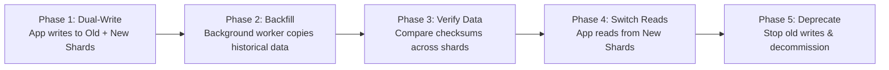
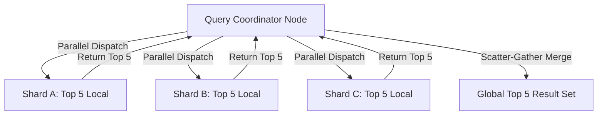

# Module 11: Database Sharding Architecture, Shard Key Design, & Re-Sharding

## Theoretical Overview & Capacity Limits

**Database Sharding** is a horizontal partitioning strategy that divides a single logical database across multiple physical database servers (Shards). Each shard holds a non-overlapping subset of the overall data.

```mermaid
flowchart TD
    ClientQuery["Client Query (GET product_id: 'PROD-004521')"] --> Router["Shard Router / Coordinator"]
    
    Router -->|Hash Routing (PROD-004521)| ShardA[("Shard Node A (Products 1 - 25M)")]
    Router -.-> ShardB[("Shard Node B (Products 25M - 50M)")]
    Router -.-> ShardC[("Shard Node C (Products 50M - 75M)")]
    Router -.-> ShardD[("Shard Node D (Products 75M - 100M)")]
```

### Real-World Case Study: Flipkart Product Catalog
Flipkart hosts over **150 million products** with peak Diwali traffic reaching **300,000 QPS**:
- **Single DB Limits**: Maximum 2,000 GB storage and 50,000 QPS capacity.
- **Sharded Architecture**: Spreads 8 TB storage and 300k QPS across **at least 6 independent database shards** to maintain sub-10ms query execution SLAs.

---

## 1. Sharding Strategies Matrix

| Strategy | Routing Mechanics | Primary Advantage | Major Engineering Drawback |
| :--- | :--- | :--- | :--- |
| **Range-Based** | Routes by value ranges (`ID 1 - 1M` $\to$ Shard A). | **Fast Range Queries** (`WHERE id BETWEEN X AND Y`). | **Write Hotspots** on the newest range shard. |
| **Hash-Based (Modulus)**| Routes by `hash(Key) % N`. | **Uniform Data Distribution**. | **Massive Remapping ($\approx 80\%$)** when adding a node. |
| **Consistent Hashing** | Maps keys & virtual nodes to a $360^\circ$ ring. | **Minimal Key Remapping ($\approx 1/N$)**. | Requires virtual node tuning for uniform balance. |
| **Directory-Based** | Lookup table maps keys to target shard IDs. | Highly flexible dynamic shard movement. | Centralized directory becomes SPOF bottleneck. |

---

## 2. Shard Key Selection & Hot Spot Vulnerability

Choosing a **Shard Key** is the single most critical decision in database architecture. Poorly chosen keys cause uneven data distribution and system outages.

```javascript
// BAD Shard Key: Categorical Sharding (Causes severe hotspot skew!)
const byCat = { Electronics: 400, Fashion: 200, Home: 200, Books: 200 };
// Electronics receives 4x traffic, overloading Shard 1 while Shard 4 sits idle!

// GOOD Shard Key: High-Cardinality Hash (Uniformly distributes load)
function simpleHash(key) {
  let h = 0;
  for (let i = 0; i < key.length; i++) h = (h * 31 + key.charCodeAt(i)) & 0x7fffffff;
  return h;
}

const shardAssignment = simpleHash("PROD-004521") % 4; // Uniform Shard 0..3 assignment
```

---

## 3. Consistent Hashing with Virtual Nodes Engine (`ConsistentHashRing`)

Adding a 5th shard using naive modulo sharding (`hash % 4` $\to$ `hash % 5`) forces **up to 80% of data to migrate across network nodes**. 

**Consistent Hashing with Virtual Nodes** maps 50+ virtual tokens per physical server onto a $360^\circ$ ring, reducing node migration overhead down to **$\approx 20\%$**.

```javascript
class ConsistentHashRing {
  constructor(vnPerServer = 50) {
    this.ring = new Map();
    this.sorted = [];
    this.vn = vnPerServer;
    this.servers = new Set();
  }

  _hash(str) {
    let h = 0;
    for (let i = 0; i < str.length; i++) h = ((h << 5) - h + str.charCodeAt(i)) & 0x7fffffff;
    return h % 360;
  }

  addServer(name) {
    this.servers.add(name);
    // Add virtual nodes to ensure uniform ring distribution
    for (let i = 0; i < this.vn; i++) {
      this.ring.set(this._hash(`${name}#VN${i}`), name);
    }
    this.sorted = Array.from(this.ring.keys()).sort((a, b) => a - b);
  }

  getServer(key) {
    const h = this._hash(key);
    for (const pos of this.sorted) {
      if (pos >= h) return this.ring.get(pos);
    }
    return this.ring.get(this.sorted[0]);
  }
}
```

---

## 4. Re-Sharding & Migration Strategies

When database volume outgrows current cluster limits, data must be re-sharded without system downtime.



1. **Shard Doubling (Power of 2)**: Expand cluster size by doubling nodes ($4 \to 8 \to 16$). Each existing shard splits exactly in half, simplifying data movement.
2. **Virtual Shards**: Pre-allocate 256 logical virtual shards mapped to 4 physical hardware servers. To add a new server, simply reassign 52 virtual shards to the new box.
3. **Shadow Writes (5-Phase Live Migration)**: Zero-downtime migration via dual-writing, background backfilling, verification, read-switch, and old write termination.

---

## 5. Cross-Shard Query Patterns



### Handling Cross-Shard Operations
1. **Scatter-Gather Parallel Execution**: For queries without a shard key (`SELECT * FROM products WHERE price > 5000`), the query coordinator dispatches requests to **all shards in parallel**, merging the local top results.
2. **Cross-Shard JOIN Avoidance**: Joining tables sharded by different keys causes expensive network scans.
   - **Solution A: Co-location**: Shard related child tables using the parent's shard key (e.g., shard both `orders` and `order_items` by `customer_id`).
   - **Solution B: Denormalization**: Duplicate required attributes directly inside the target payload.

---

## Key Takeaways

1. **Shard Key Selection is Permanent**: Choose high-cardinality, uniformly distributed shard keys (`user_id`, `product_id`) to avoid traffic hotspots.
2. **Consistent Hashing Minimizes Re-sharding Overhead**: Using virtual nodes on a hash ring restricts key migration to $1/N$ when expanding nodes.
3. **Co-locate Related Data**: Shard child entities by the parent entity's shard key to avoid cross-shard JOINs.
4. **Scatter-Gather for Global Aggregations**: Query all shards concurrently when executing queries that lack shard key filters.
