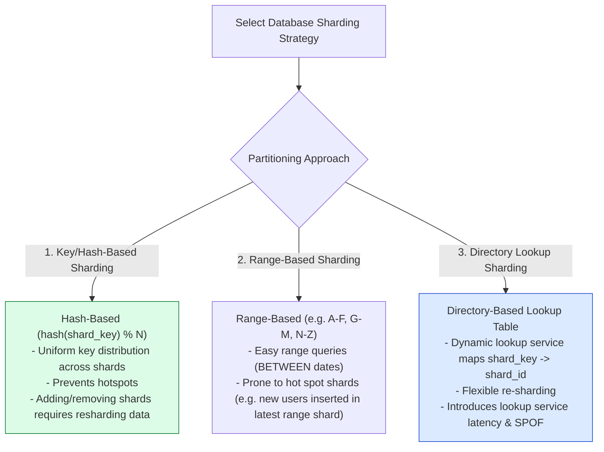
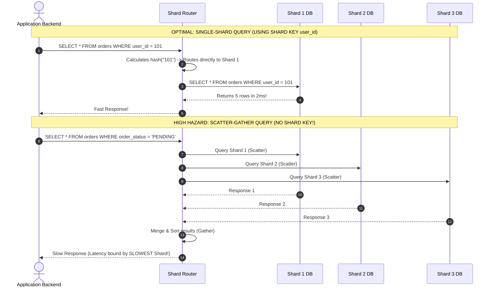

# Module 11: Database Sharding Architecture, Horizontal Partitioning, and Shard Key Selection

## Overview

**Database Sharding** partitions large datasets horizontally across multiple independent database nodes (**Shards**). Unlike vertical scaling or read-replica scaling (which only scales reads), sharding scales both **storage capacity** and **write throughput** far beyond the physical boundaries of a single database server.

Mastering **Sharding Strategies (Range-Based, Hash-Based, Directory-Based)**, **Shard Key Selection Rules**, **Scatter-Gather Query Hazards**, **Cross-Shard JOIN Avoidance**, and **Live Resharding Techniques** is critical for high-scale databases.

---

## 1. Horizontal Sharding Architecture & Shard Router

```mermaid
flowchart TD
    ClientApp[Client Application] --> ShardRouter[Shard Router Layer / Middleware]
    
    ShardRouter -->|hash(user_id) % 3 == 0| ShardA["Shard Node A (Physical DB 1)<br/>Contains Users 1-100k"]
    ShardRouter -->|hash(user_id) % 3 == 1| ShardB["Shard Node B (Physical DB 2)<br/>Contains Users 100k-200k"]
    ShardRouter -->|hash(user_id) % 3 == 2| ShardC["Shard Node C (Physical DB 3)<br/>Contains Users 200k-300k"]

    style ShardRouter fill:#dbeafe,stroke:#1d4ed8
    style ShardA fill:#dcfce7,stroke:#15803d
    style ShardB fill:#dcfce7,stroke:#15803d
    style ShardC fill:#dcfce7,stroke:#15803d
```

---

## 2. Sharding Strategy Taxonomy



### Sharding Strategy Comparison Matrix

| Sharding Pattern | Routing Logic | Primary Advantage | Major Architectural Drawback |
| :--- | :--- | :--- | :--- |
| **Hash-Based** | $\text{Shard} = \text{MurmurHash3}(\text{Key}) \bmod N$ | **Uniform Data Distribution** (Zero hotspots) | Resharding requires full data migration |
| **Range-Based** | $\text{Shard} = f(\text{Key Range})$ | Efficient for Range Queries (`BETWEEN A AND B`) | **Write Hotspots** on newest date ranges |
| **Directory-Based** | $\text{Shard} = \text{LookupTable}(\text{Key})$ | Highly flexible; re-shard individual tenants | Additional network hop for lookup service |

---

## 3. Query Execution: Single-Shard vs. Scatter-Gather Hazards



---

## 4. Practical Implementation Showcase: Shard Router & Range Aggregator

```javascript
const crypto = require("node:crypto");

class DatabaseShardRouter {
  constructor(shardNodes) {
    this.shards = shardNodes; // Physical database shard instances
  }

  // Consistent 32-bit Hash Routing Function
  _getShardIndex(shardKey) {
    const hashHex = crypto.createHash("md5").update(String(shardKey)).digest("hex");
    const hashInt = parseInt(hashHex.substring(0, 8), 16);
    return Math.abs(hashInt) % this.shards.length;
  }

  // Execute Single-Shard Query
  async executeQueryByShardKey(shardKey, queryFn) {
    const shardIndex = this._getShardIndex(shardKey);
    const targetShard = this.shards[shardIndex];
    console.log(`🎯 [SINGLE-SHARD QUERY] Key '${shardKey}' mapped to ${targetShard.name}`);
    return await queryFn(targetShard);
  }

  // Execute Scatter-Gather Cross-Shard Query
  async executeScatterGatherQuery(queryFn) {
    console.log(`⚠️ [SCATTER-GATHER QUERY] Broadcasting query to ALL ${this.shards.length} shards...`);
    const startTime = Date.now();

    // Broadcast in parallel to all shards
    const shardPromises = this.shards.map((shard) => queryFn(shard));
    const resultsArray = await Promise.all(shardPromises);

    // Merge/Gather results from all shards
    const mergedData = resultsArray.flat();
    console.log(`  ✓ Gathered ${mergedData.length} records in ${Date.now() - startTime}ms`);
    return mergedData;
  }
}

// Execution Simulation
const shardsPool = [
  { name: "Shard-Node-01 (db-east-1)", store: new Map([["user_101", { id: "user_101", name: "Alice" }]]) },
  { name: "Shard-Node-02 (db-east-2)", store: new Map([["user_202", { id: "user_202", name: "Bob" }]]) },
  { name: "Shard-Node-03 (db-west-1)", store: new Map([["user_303", { id: "user_303", name: "Charlie" }]]) }
];

const router = new DatabaseShardRouter(shardsPool);

async function runShardingDemo() {
  // 1. Single-Shard Point Lookup
  await router.executeQueryByShardKey("user_101", async (shard) => {
    return shard.store.get("user_101");
  });

  // 2. Scatter-Gather Broadcast Search
  await router.executeScatterGatherQuery(async (shard) => {
    return Array.from(shard.store.values());
  });
}

runShardingDemo();
```

---

## Key Production Takeaways

1. **Choose High-Cardinality Shard Keys**: Always select a shard key with millions of distinct values (e.g. `user_id`, `account_id`) to prevent data hotspots and imbalanced shards. Avoid low-cardinality keys like `gender` or `country`.
2. **Design Applications for Single-Shard Queries**: Ensure $95\%+$ of critical database read/write queries contain the Shard Key in the `WHERE` clause to avoid expensive **Scatter-Gather** multi-shard broadcasts.
3. **Avoid Cross-Shard ACID Transactions**: Cross-shard transactions require Two-Phase Commit (2PC), which introduces massive network locking latency and drastically degrades database throughput.
4. **Co-Locate Related Entities in the Same Shard**: Store a user's profile, orders, and payment records on the exact same shard (using `user_id` as the common shard key) to enable fast single-shard JOINs.

