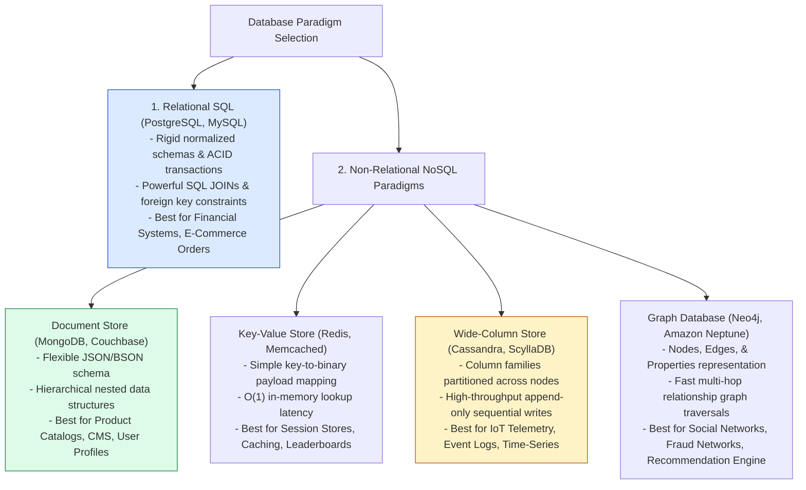
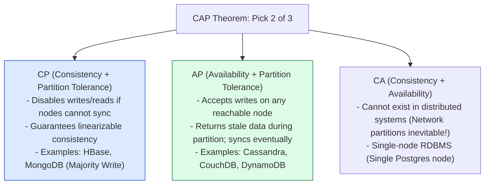

# Module 12: SQL vs. NoSQL Paradigm Deep Dive, CAP Theorem, and Polyglot Persistence

## Overview

Architecting database storage requires choosing between **Relational SQL Databases** (PostgreSQL, MySQL, Oracle) and **Non-Relational NoSQL Databases** (MongoDB, DynamoDB, Cassandra, Neo4j).

Making the correct architectural selection requires evaluating **ACID vs. BASE Consistency**, **Data Modeling (Normalization vs. Denormalization)**, the **CAP Theorem ($C + A + P$)**, the **PACELC Theorem**, and **Polyglot Persistence**.

---

## 1. Database Paradigm Taxonomy & Categories



---

## 2. CAP Theorem & PACELC Theorem Frameworks

The **CAP Theorem** dictates that a distributed data store can simultaneously guarantee at most **two out of three** properties during a network partition:



### The PACELC Theorem (Extension of CAP)

If there is a **Partition ($P$)**, trade off **Availability ($A$)** vs. **Consistency ($C$)**; **Else ($E$)**, trade off **Latency ($L$)** vs. **Consistency ($C$)**:

| Database System | Partition Mode ($P$) | Normal Mode ($E$) | PACELC Classification | Typical Behavior |
| :--- | :--- | :--- | :--- | :--- |
| **PostgreSQL / MySQL** | Choose Consistency ($C$) | Choose Consistency ($C$) | **PC / EC** | Strict ACID transactional consistency always |
| **Cassandra** | Choose Availability ($A$) | Choose Latency ($L$) | **PA / EL** | High write availability, eventual consistency |
| **MongoDB** | Choose Consistency ($C$) | Choose Latency ($L$) | **PC / EL** | Consistent reads with local write buffering |
| **DynamoDB** | Choose Availability ($A$) | Choose Latency ($L$) | **PA / EL** | Tunable consistency (`StronglyConsistentReads`) |

---

## 3. Polyglot Persistence Microservice Architecture

Modern enterprise architectures use **Polyglot Persistence**—matching each microservice with the storage engine best suited for its specific workload:

```mermaid
flowchart TD
    ClientApp[Client Web/Mobile App] --> APIGateway[API Gateway]

    APIGateway --> AuthService[Auth & Session Service]
    APIGateway --> OrderService[Order Processing Service]
    APIGateway --> CatalogService[Product Catalog Service]
    APIGateway --> SocialService[Social Recommendation Service]

    AuthService --> Redis[(Redis Key-Value)<br/>Fast In-Memory Session Tokens]
    OrderService --> Postgres[(PostgreSQL RDBMS)<br/>ACID Financial Transactions & JOINs]
    CatalogService --> Mongo[(MongoDB Document)<br/>Flexible Polymorphic Product Schemas]
    SocialService --> Neo4j[(Neo4j Graph DB)<br/>Multi-hop Friend Connection Traversals]

    style Redis fill:#fef3c7,stroke:#b45309
    style Postgres fill:#dbeafe,stroke:#1d4ed8
    style Mongo fill:#dcfce7,stroke:#15803d
```

---

## 4. Practical Implementation Showcase: Polyglot Query Abstraction Layer

```javascript
// Polyglot Persistence Abstraction Layer
class PolyglotDataStore {
  constructor() {
    this.sessionStore = new Map(); // Key-Value Store (Redis mock)
    this.relationalStore = new Map(); // RDBMS SQL Store (Postgres mock)
    this.documentStore = new Map(); // Document Store (Mongo mock)
  }

  // Key-Value Operation: O(1) Session Check
  async getSession(token) {
    console.log(`[KEY-VALUE READ] Fetching token '${token}'`);
    return this.sessionStore.get(token) || null;
  }

  // Relational SQL Operation: ACID Order Creation
  async createOrder(orderId, userId, amount) {
    console.log(`[RELATIONAL SQL TRANSACTION] Inserting Order #${orderId} with ACID guarantees`);
    const record = { orderId, userId, amount, status: "PAID", createdAt: new Date().toISOString() };
    this.relationalStore.set(orderId, record);
    return record;
  }

  // Document Operation: Flexible Schema Product Insertion
  async saveProduct(productId, productDoc) {
    console.log(`[DOCUMENT STORE WRITE] Inserting Product #${productId} with polymorphic attributes`);
    this.documentStore.set(productId, productDoc);
    return productDoc;
  }
}

// Execution Demonstration
async function runPolyglotDemo() {
  const store = new PolyglotDataStore();

  // 1. Write Key-Value Session
  store.sessionStore.set("token_abc123", { userId: "user_99", expires: Date.now() + 3600000 });
  await store.getSession("token_abc123");

  // 2. Execute Relational Order Write
  await store.createOrder("ORD_505", "user_99", 199.99);

  // 3. Insert Polymorphic Document Record
  await store.saveProduct("PROD_888", {
    name: "Enterprise Gaming Laptop",
    brand: "TechCorp",
    attributes: { ram: "64GB", gpu: "RTX 4090", RGB: true }, // Dynamic nested schema
    tags: ["gaming", "hardware", "laptop"]
  });
}

runPolyglotDemo();
```

---

## Key Production Takeaways

1. **Use Relational SQL for Financial & Transactional Data**: Relational databases (PostgreSQL/MySQL) provide strict ACID guarantees, atomic multi-table updates, and normalized integrity constraints essential for billing and inventory.
2. **Use Document NoSQL for Dynamic & Polymorphic Catalogs**: Document databases (MongoDB/DynamoDB) excel when entity schemas vary widely (e.g. e-commerce product catalogs with dynamic attributes) and require hierarchical JSON representations.
3. **Understand PACELC Trade-Offs for Global Applications**: When configuring distributed databases (Cassandra/DynamoDB), decide explicitly whether your application can tolerate eventual consistency ($PA/EL$) in exchange for single-digit millisecond latency across geographic regions.
4. **Embrace Polyglot Persistence**: Avoid forcing a single database engine to handle all application requirements. Combine Redis for sessions, PostgreSQL for ACID transactions, MongoDB for content documents, and Neo4j for social graphs.
