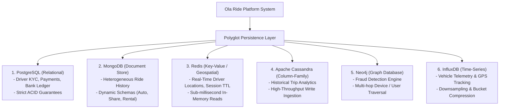
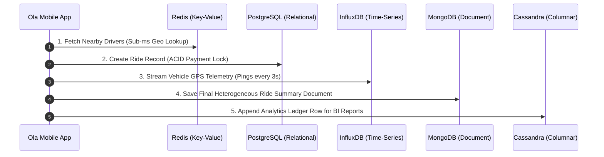
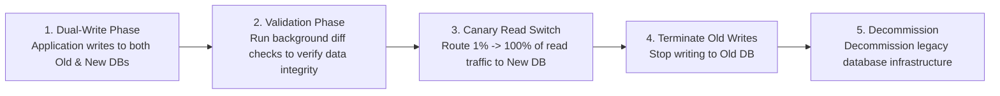

# Module 12: SQL vs. NoSQL Paradigm Deep Dive & Polyglot Persistence

## Theoretical Overview & Polyglot Persistence Paradigm

No single database management system fits every application requirement. Modern microservice platforms adopt **Polyglot Persistence**—matching each distinct domain feature to its optimal database paradigm (Relational, Document, Key-Value, Column-Family, Graph, Time-Series).



---

## 1. Database Paradigm Feature Comparison Matrix

| Database Paradigm | Primary Data Structure | Query Efficiency | Scalability Profile | Core Use Cases |
| :--- | :--- | :--- | :--- | :--- |
| **Relational (SQL)** | Tabular (Rows & Columns). | Complex JOINs, SQL queries. | Vertical (Scale Up); Horizontal via sharding. | Core Banking, KYC, Payment Ledgers. |
| **Document Store** | BSON / Nested JSON. | Index-assisted JSON path query. | Horizontal sharding by document key. | Product Catalogs, Ride Histories, User Profiles. |
| **Key-Value Store** | In-Memory Hash Map. | **$\mathcal{O}(1)$ Primary Key lookup**. | Horizontal partitioning across memory. | Session Caches, Live Driver Geolocation. |
| **Column-Family** | Sparse Multi-dimensional Map. | **Fast Time-Range Scans**. | Linear horizontal write throughput scaling.| High-volume Telemetry, Financial Audit Logs. |
| **Graph Database** | Nodes, Edges, & Properties. | **$\mathcal{O}(1)$ Per-Hop Traversal**. | Sharded Property Graphs. | Fraud Ring Detection, Social Networks. |
| **Time-Series DB** | Time-stamped Append Log. | **Downsampled Aggregations**. | Partitioned by time windows. | IoT Sensors, Vehicle GPS Tracking. |

---

## 2. Core NoSQL Implementations & Code Models

### 1. Document Store Dynamic Schema Engine (`DocumentStore`)
Handles heterogeneous record structures (e.g., distinct fields for Auto vs. Outstation rides):

```javascript
class DocumentStore {
  constructor() { this.collections = {}; }
  createCollection(name) { this.collections[name] = []; }

  insert(coll, doc) {
    const id = `ObjectId_${Date.now()}_${Math.random().toString(36).slice(2, 8)}`;
    this.collections[coll].push({ _id: id, ...doc });
    return id;
  }

  find(coll, query = {}) {
    return this.collections[coll].filter((doc) =>
      Object.entries(query).every(([k, v]) => doc[k] === v)
    );
  }
}
```

### 2. Key-Value Geospatial Store (`KVStore`)
Enables sub-millisecond driver lookup and radius distance evaluation:

```javascript
class KVStore {
  constructor() { this.data = new Map(); this.expiry = new Map(); }

  set(key, val, ttlMs = 0) {
    this.data.set(key, JSON.stringify(val));
    if (ttlMs > 0) this.expiry.set(key, Date.now() + ttlMs);
  }

  geoAdd(key, lng, lat, member) {
    const geo = this.get(key) || {};
    geo[member] = { lng, lat };
    this.set(key, geo);
  }

  geoNearby(key, lng, lat, radiusKm) {
    const geo = this.get(key) || {};
    return Object.entries(geo)
      .map(([m, p]) => ({ member: m, dist: Math.sqrt((p.lng - lng)**2 + (p.lat - lat)**2) * 111 }))
      .filter((e) => e.dist <= radiusKm);
  }
}
```

### 3. Column-Family Analytics Store (`ColumnFamilyStore`)
Organizes data by Partition Key (Data Locality) and Clustering Key (Ordered Time Scans):

```javascript
class ColumnFamilyStore {
  constructor() { this.tables = {}; }
  createTable(name, pk, ck) { this.tables[name] = { pk, ck, partitions: {} }; }

  insert(table, row) {
    const t = this.tables[table];
    if (!t.partitions[row[t.pk]]) t.partitions[row[t.pk]] = {};
    t.partitions[row[t.pk]][row[t.ck]] = { ...row };
  }

  queryPartition(table, pkVal, fromTimestamp, toTimestamp) {
    const t = this.tables[table];
    return Object.values(t.partitions[pkVal] || {})
      .filter((r) => (!fromTimestamp || r[t.ck] >= fromTimestamp) && (!toTimestamp || r[t.ck] <= toTimestamp));
  }
}
```

### 4. Graph Database Fraud Detection Engine (`GraphDB`)
Uncovers malicious account rings sharing identical devices and promotional codes via relationship traversals:

```javascript
class GraphDB {
  constructor() { this.nodes = new Map(); this.edges = []; }
  addNode(id, props) { this.nodes.set(id, props); }
  addEdge(from, to, type) { this.edges.push({ from, to, type }); }
}

// Fraud Ring Detection Execution
// If 3 distinct rider accounts share 1 physical device ID AND redeem promo 'FIRST50'
// -> Flag as Fraud Ring!
```

---

## 3. Polyglot Persistence Architecture: Single Ride Request Lifecycle



---

## 4. Zero-Downtime Database Migration Framework

Migrating production data across paradigm boundaries (e.g., MySQL $\to$ MongoDB) uses the **Strangler Fig Pattern**:



---

## Key Takeaways

1. **Adopt Polyglot Persistence**: Match specific workload patterns to the optimal database paradigm rather than forcing a single database engine across all microservices.
2. **Document Stores for Dynamic Schemas**: Choose Document Stores (MongoDB) when data attributes vary heavily per record.
3. **Key-Value for High-Speed Caching**: Use Key-Value Stores (Redis) for sub-millisecond lookups and transient TTL sessions.
4. **Column-Family for Write Heavy Analytics**: Use Column-Family Stores (Cassandra) for high-throughput time-range reporting scans.
5. **Migrate via Dual-Writing**: Execute live database migrations safely using 5-phase dual-writing and canary read switching.
