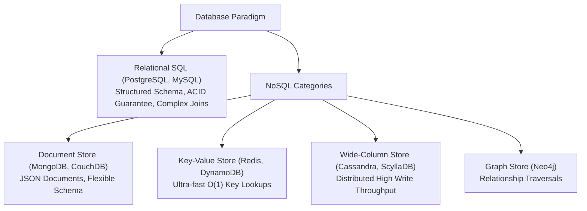

# File 12: SQL vs NoSQL Deep Dive

## Overview
Selecting between **Relational Databases (SQL)** and **Non-Relational Databases (NoSQL)** depends on schema flexibility, transaction requirements (ACID vs BASE), data relationships, and scale targets.

---

## 1. Database Categories Taxonomy

### SQL vs NoSQL Trade-off Matrix

| Property | Relational SQL (Postgres, MySQL) | NoSQL (MongoDB, DynamoDB, Cassandra) |
| :--- | :--- | :--- |
| **Data Schema** | Rigid, Structured Relational Schema | Flexible, Dynamic Schema |
| **ACID Guarantees** | Strong ACID Transactions out of the box | Eventual Consistency (BASE) |
| **Scaling** | Vertical (Primary) / Read Replicas | Horizontal Sharding natively built-in |
| **Joins** | Efficient Multi-Table JOINs | Denormalized data / Application-level joins |

---

## Key Takeaways
1. Choose **SQL** when strict **ACID transactions**, financial data integrity, or complex table JOINs are required.
2. Choose **Document NoSQL (MongoDB)** for rapidly evolving schemas and nested JSON documents.
3. Choose **Wide-Column (Cassandra)** for high-volume append-only write streams (IoT, logs, clickstreams).
4. Choose **Key-Value (Redis)** for high-speed in-memory caching and session management.
