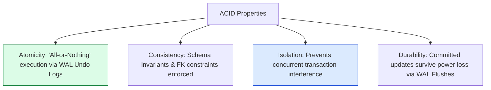
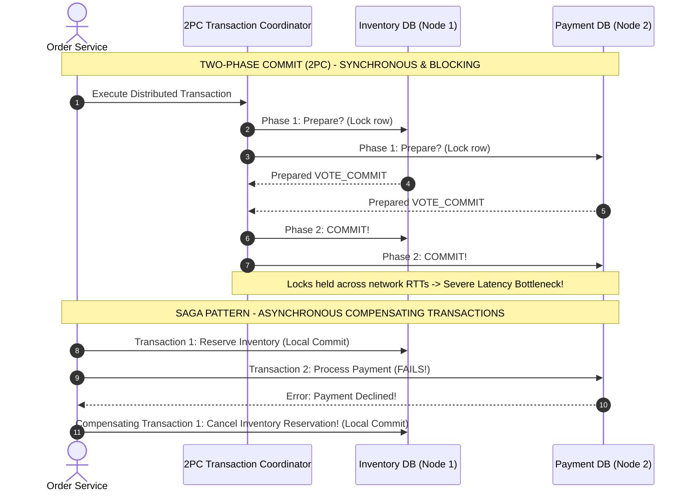

# Module 13: Database Transactions, Isolation Levels, 2PC, and Distributed Saga Patterns

## Overview

A **Database Transaction** is a sequence of read and write operations executed as a single logical unit of work. Transaction processing in relational systems relies on **ACID Guarantees** (Atomicity, Consistency, Isolation, Durability).

However, scaling across distributed microservices requires trading strict single-node ACID guarantees for **SQL Isolation Level Tuning**, **Two-Phase Commit (2PC)** protocols, or **Compensating Saga Patterns (Choreography & Orchestration)**.

---

## 1. ACID Guarantees & SQL Isolation Level Matrix



### SQL Isolation Levels vs. Read Phenomena Matrix

| Isolation Level | Dirty Reads Allowed? | Non-Repeatable Reads Allowed? | Phantom Reads Allowed? | Locking / MVCC Mechanism |
| :--- | :--- | :--- | :--- | :--- |
| **Read Uncommitted** | **Yes (DANGEROUS)** | **Yes** | **Yes** | Zero locks; reads uncommitted WAL changes |
| **Read Committed** (Postgres default) | **No** | **Yes** | **Yes** | Reads snapshot of committed data per query |
| **Repeatable Read** (MySQL default) | **No** | **No** | **Yes** (Prevented in InnoDB MVCC) | Reads snapshot created at start of transaction |
| **Serializable** | **No** | **No** | **No** | Strict Two-Phase Locking (2PL) / SSI |

---

## 2. Distributed Transactions: 2PC vs. Saga Pattern



---

## 3. Saga Pattern Topologies: Choreography vs. Orchestration

```mermaid
flowchart TD
    subgraph 1. Saga Choreography (Event-Driven)
        OrderSvc[Order Service] -->|Emits 'OrderCreated'| Kafka((Event Bus))
        Kafka --> PaymentSvc[Payment Service]
        PaymentSvc -->|Emits 'PaymentFailed'| Kafka
        Kafka --> InventorySvc[Compensating Inventory Service]
    end

    subgraph 2. Saga Orchestration (Centralized)
        Orchestrator[Saga Orchestrator Engine] -->|1. Command Reserve| Svc1[Inventory Svc]
        Orchestrator -->|2. Command Charge| Svc2[Payment Svc (Fails!)]
        Orchestrator -->|3. Compensate Command| Svc1
    end

    style Orchestrator fill:#dbeafe,stroke:#1d4ed8
    style Kafka fill:#dcfce7,stroke:#15803d
```

---

## 4. Practical Implementation Showcase: Saga Orchestrator Engine

```javascript
class SagaOrchestrator {
  constructor() {
    this.steps = [];
  }

  // Register local transaction step and its compensating transaction
  addStep(name, executeFn, compensateFn) {
    this.steps.push({ name, executeFn, compensateFn });
  }

  async execute() {
    const executedSteps = [];
    console.log("=== EXECUTING SAGA ORCHESTRATION TRANSACTION ===");

    for (const step of this.steps) {
      try {
        console.log(`▶ Executing Step: '${step.name}'...`);
        await step.executeFn();
        executedSteps.push(step); // Track successful step for potential rollback
      } catch (err) {
        console.error(`✖ STEP FAILED: '${step.name}' (${err.message})`);
        console.log("↺ INITIATING COMPENSATING ROLLBACK TRANSACTIONS...");
        await this._rollback(executedSteps);
        return false;
      }
    }

    console.log("✔ SAGA TRANSACTION COMPLETED SUCCESSFULLY!");
    return true;
  }

  async _rollback(executedSteps) {
    // Execute compensating functions in REVERSE order
    for (let i = executedSteps.length - 1; i >= 0; i--) {
      const step = executedSteps[i];
      try {
        console.log(`  ↺ Reversing Step: '${step.name}'...`);
        await step.compensateFn();
      } catch (rollbackErr) {
        console.error(`  CRITICAL: Compensation for '${step.name}' failed!`, rollbackErr.message);
      }
    }
  }
}

// Execution Simulation
async function runSagaDemo() {
  const saga = new SagaOrchestrator();

  // Step 1: Inventory
  saga.addStep(
    "Reserve Inventory",
    async () => console.log("   -> Inventory reserved in DB 1"),
    async () => console.log("   -> [COMPENSATE] Inventory released in DB 1")
  );

  // Step 2: Payment (Simulated Failure)
  saga.addStep(
    "Charge Payment",
    async () => { throw new Error("Card Insufficient Funds"); },
    async () => console.log("   -> [COMPENSATE] Refund payment")
  );

  await saga.execute();
}

runSagaDemo();
```

---

## Key Production Takeaways

1. **Default to `Read Committed` or `Repeatable Read`**: Use PostgreSQL's default `Read Committed` or MySQL's `Repeatable Read` for general web workloads. Avoid `Serializable` unless required for financial balances due to heavy lock contention.
2. **Avoid Two-Phase Commit (2PC) Across Microservices**: 2PC requires synchronous row locking across network boundaries, causing thread starvation and cascading system failures if any node lags.
3. **Use the Saga Pattern for Microservice Workloads**: Break multi-service operations into a series of local database transactions, defining explicit **Compensating Transactions** to undo prior steps if a downstream service fails.
4. **Ensure Compensating Transactions are Idempotent**: In a Saga workflow, network retries may execute compensating steps multiple times. Ensure functions like `releaseInventory()` are strictly idempotent.

