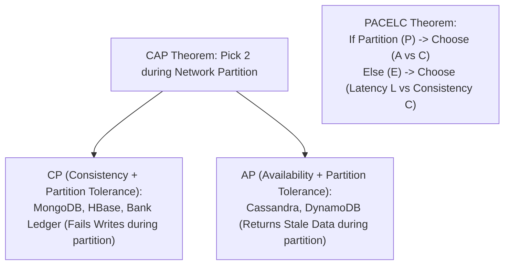

# File 13: Transactions, ACID, CAP Theorem, and PACELC

## Overview
Database reliability rests on transaction models: **ACID** (Atomicity, Consistency, Isolation, Durability) for relational databases, the **CAP Theorem** (Consistency, Availability, Partition Tolerance) for distributed networks, and **PACELC** for latency trade-offs.

---

## 1. CAP Theorem & PACELC Theorem



### ACID Guarantees Breakdown

- **Atomicity**: All operations in a transaction succeed or all fail together ("All-or-Nothing").
- **Consistency**: Data transitions strictly from one valid schema state to another.
- **Isolation**: Concurrent transactions execute without interfering with one another.
- **Durability**: Committed data is saved permanently even if system crashes.

---

## 2. Distributed Saga Transaction Pattern (Choreography)

```javascript
// Saga Pattern Choreography Implementation
class PaymentSaga {
    async executeOrder(orderId, amount) {
        try {
            console.log("Step 1: Reserve Inventory...");
            await this.reserveInventory(orderId);

            console.log("Step 2: Charge Payment...");
            await this.chargePayment(amount); // Fails!

            console.log("Step 3: Ship Order...");
        } catch (error) {
            console.error("[SAGA FAILURE] Executing Compensating Rollback Transactions...");
            await this.rollbackInventoryReservation(orderId); // Undo Step 1!
        }
    }

    async reserveInventory(id) { return true; }
    async chargePayment(amount) { throw new Error("Card Declined"); }
    async rollbackInventoryReservation(id) { console.log(`[ROLLBACK] Inventory unreserved for ${id}`); }
}

const saga = new PaymentSaga();
saga.executeOrder("ORD_9901", 1500);
```

---

## Key Takeaways
1. **ACID** guarantees strict database transaction safety on single nodes.
2. **CAP Theorem**: In a distributed system with a network Partition ($P$), you must choose between Consistency ($C$) or Availability ($A$).
3. **Saga Pattern**: Manages distributed transactions across microservices via sequential compensating transactions.
