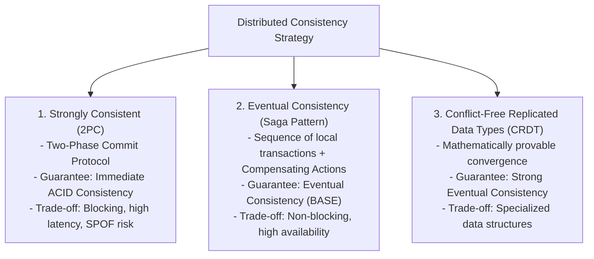
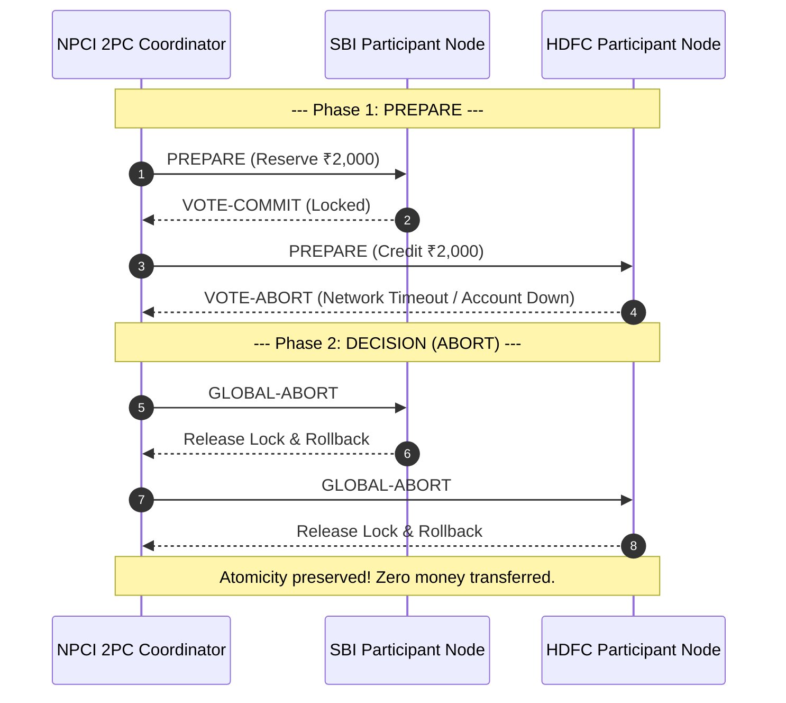

# Module 13: Distributed Transactions, 2PC, Saga Patterns, & CRDTs

## Theoretical Overview & Distributed Consistency Spectrum

A **Distributed Transaction** spans multiple database nodes or microservices over an un-reliable network. Traditional single-node ACID locks do not scale across network partitions, requiring specialized distributed transaction protocols.



### Real-World Case Study: NPCI UPI Payment Saga (SBI $\to$ HDFC)
India's UPI system processes **10+ billion transactions monthly**:
1. **Debit Step**: SBI debits ₹5,000 from sender account.
2. **Network Timeout**: HDFC Core Banking System times out after 30 seconds.
3. **Compensating Action**: NPCI orchestrator initiates a compensating refund transaction to SBI, guaranteeing that money is never lost in transit.

---

## 1. Distributed Consistency Protocols Comparison Matrix

| Protocol / Pattern | Execution Model | Consistency Guarantee | Availability Profile | Major Engineering Drawback |
| :--- | :--- | :--- | :--- | :--- |
| **Two-Phase Commit (2PC)**| Two-phase voting (`PREPARE` $\to$ `COMMIT`). | **Immediate Strong Consistency**. | Low (Blocks if Coordinator crashes). | High network latency ($\ge 2$ RTTs), lock holding contention. |
| **Saga (Orchestration)** | Centralized controller calls steps & compensations. | **Eventual Consistency**. | High (Non-blocking local commits). | Intermediate states visible (Lack of Isolation). |
| **Saga (Choreography)** | Event-driven pub/sub message chain. | **Eventual Consistency**. | Maximum (Fully decoupled). | Hard to trace and debug complex event cascades. |
| **Last-Write-Wins (LWW)**| Timestamps resolve conflicting writes. | Eventual Convergence. | High. | **Silent data loss** during clock drift or concurrent updates. |
| **Vector Clocks** | Causality tracking per node vector. | Causal Consistency. | High. | Requires application layer to resolve concurrent conflicts. |
| **CRDTs** | Commutative / Associative state merging. | **Strong Eventual Consistency**. | Maximum (Zero coordination). | Restricted to specific mathematical data types. |

---

## 2. Two-Phase Commit Protocol (2PC) Engine

2PC uses a central **Coordinator** to execute transactions across multiple **Participants** in two phases:



```javascript
class TwoPCCoordinator {
  constructor(participants) { this.participants = participants; }

  execute(tx) {
    // Phase 1: PREPARE
    let allPrepared = true;
    for (const [name, p] of Object.entries(this.participants)) {
      if (!p.prepare(tx)) allPrepared = false;
    }

    // Phase 2: COMMIT or ABORT
    for (const [name, p] of Object.entries(this.participants)) {
      if (allPrepared) p.commit(tx);
      else p.abort(tx);
    }
    return allPrepared;
  }
}
```

> [!WARNING]
> **2PC Blocking Flaw**: If the coordinator crashes after sending `PREPARE`, all participants remain **blocked indefinitely**, holding expensive database row locks.

---

## 3. Saga Pattern: Orchestration Engine (`SagaOrchestrator`)

Sagas replace blocking global locks with a sequence of local transactions. If any step fails, the orchestrator triggers **Compensating Actions** in reverse order.

```javascript
class SagaOrchestrator {
  constructor(steps) {
    this.steps = steps;
    this.completedSteps = [];
  }

  execute() {
    for (let i = 0; i < this.steps.length; i++) {
      const step = this.steps[i];
      const result = step.action();

      if (!result.success) {
        // Trigger compensating actions in reverse order!
        for (let j = this.completedSteps.length - 1; j >= 0; j--) {
          const compStep = this.completedSteps[j];
          compStep.compensate();
        }
        return { success: false, failedAt: step.name };
      }
      this.completedSteps.push(step);
    }
    return { success: true };
  }
}
```

---

## 4. Conflict Resolution Mechanics: LWW vs. Vector Clocks

### 1. Last-Write-Wins (LWW) Silent Write Drop Danger
LWW selects updates with the highest physical timestamp. However, physical clock drift can cause **silent data loss**:

```javascript
// Conflicting writes with LWW timestamp resolution
mumbaiNode.write("balance:U001", 45000, timestamp=100); // Withdraws ₹5,000
delhiNode.write("balance:U001",  48000, timestamp=110); // Withdraws ₹2,000

// Result: Delhi's write wins (48,000). Mumbai's ₹5,000 withdrawal is SILENTLY LOST!
```

### 2. Vector Clocks for Causal Concurrency (`VectorClock`)
Vector Clocks maintain a vector of logical clocks `[NodeID: Counter]` to detect concurrent non-causal writes:

```javascript
class VectorClock {
  constructor(nodeId, clocks = {}) { this.nodeId = nodeId; this.clocks = { ...clocks }; }

  increment() {
    this.clocks[this.nodeId] = (this.clocks[this.nodeId] || 0) + 1;
    return this;
  }

  isConcurrent(other) {
    let thisLess = false, otherLess = false;
    const all = new Set([...Object.keys(this.clocks), ...Object.keys(other.clocks)]);
    for (const n of all) {
      if ((this.clocks[n] || 0) < (other.clocks[n] || 0)) thisLess = true;
      if ((this.clocks[n] || 0) > (other.clocks[n] || 0)) otherLess = true;
    }
    return thisLess && otherLess; // Concurrent if neither clock dominates!
  }
}
```

---

## 5. Conflict-Free Replicated Data Types (CRDTs)

CRDTs enable decentralized data structures to converge to identical states across all replica nodes **without requiring central coordination or locks**.

### Grow-Only Counter (`GCounter`) Implementation
Each node increments its own position in a vector. Merging takes the element-wise maximum across vectors:

```javascript
class GCounter {
  constructor(nodeId) {
    this.nodeId = nodeId;
    this.counts = {};
  }

  increment(amount = 1) {
    this.counts[this.nodeId] = (this.counts[this.nodeId] || 0) + amount;
  }

  value() {
    return Object.values(this.counts).reduce((sum, v) => sum + v, 0);
  }

  merge(other) {
    for (const [node, val] of Object.entries(other.counts)) {
      this.counts[node] = Math.max(this.counts[node] || 0, val);
    }
  }
}
```

---

## Key Takeaways

1. **2PC Blocks on Failures**: Use Two-Phase Commit sparingly due to blocking locks and coordinator SPOF risks.
2. **Use Sagas for Distributed Microservices**: Implement Sagas with explicit compensating steps to manage long-running distributed workflows.
3. **Avoid LWW for Financial Ledgers**: Last-Write-Wins risks silent data loss during concurrent updates; use CRDTs, append-only logs, or Vector Clocks instead.
4. **CRDTs Provide Deterministic Convergence**: CRDTs guarantee strong eventual consistency across decentralized replicas without locking overhead.
