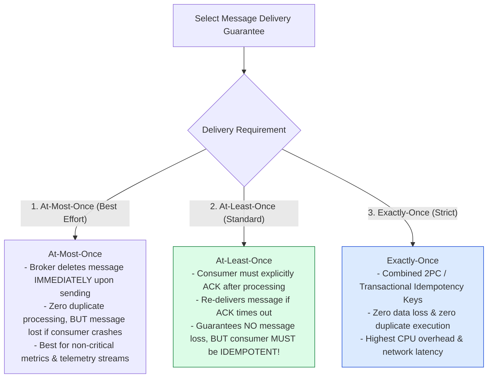
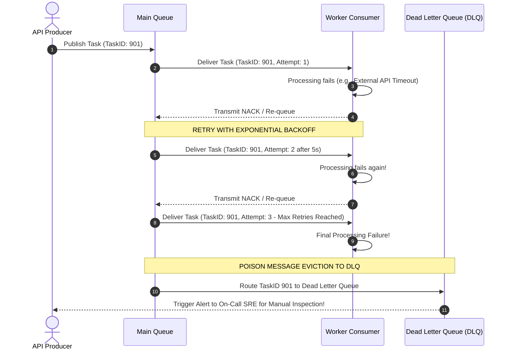

# Module 14: Message Queuing Architecture, Delivery Semantics, and Dead Letter Queue (DLQ) Patterns

## Overview

A **Message Queue (MQ)** (RabbitMQ, Amazon SQS, ActiveMQ) provides asynchronous, point-to-point communication between decoupled system services. Message queues buffer bursty client traffic, flatten load spikes on backend infrastructure, and enable background asynchronous job processing.

Understanding **Producer-Consumer Topology**, **Message Delivery Semantics (At-Most-Once, At-Least-Once, Exactly-Once)**, **Competing Consumer Load Balancing**, **Consumer Acknowledgments (ACK/NACK)**, and **Dead Letter Queue (DLQ) Retry Policies** is essential.

---

## 1. Producer-Consumer Message Queue Architecture

```mermaid
flowchart LR
    subgraph Producers
        WebAPI[Web API Gateway] -->|1. Enqueue Task| Broker[Message Queue Broker]
    end

    subgraph Message Broker Infrastructure
        Broker --> MainQueue[Main Task Queue<br/>(In-Flight Buffer)]
        MainQueue -- "Exceeds Max Retries" --> DLQ[Dead Letter Queue<br/>(DLQ for Unhandled Poison Messages)]
    end

    subgraph Worker Consumer Pool
        MainQueue -->|2. Pull / Push Task| Worker1[Worker Consumer 1]
        MainQueue -->|2. Pull / Push Task| Worker2[Worker Consumer 2]
        MainQueue -->|2. Pull / Push Task| Worker3[Worker Consumer 3]
        
        Worker1 & Worker2 & Worker3 -->|3. Send ACK / NACK| MainQueue
    end

    style MainQueue fill:#dcfce7,stroke:#15803d
    style DLQ fill:#fee2e2,stroke:#dc2626
```

---

## 2. Message Delivery Semantics Comparison



### Message Delivery Guarantees Matrix

| Semantics Model | ACK Timing | Duplicate Risk? | Message Loss Risk? | Required Consumer Logic |
| :--- | :--- | :--- | :--- | :--- |
| **At-Most-Once** | Prior to processing | **Zero** | **High** (If worker crashes mid-task) | Simple non-idempotent handlers |
| **At-Least-Once** | **After successful processing** | **Yes** (During network ACK loss) | **Zero** (Message re-queued on timeout) | **Strictly Idempotent Handlers** |
| **Exactly-Once** | Transactional Commit | **Zero** | **Zero** | Deduplication Key Store + Atomic DB Write |

---

## 3. Worker Consumer Lifecycle & Dead Letter Queue (DLQ) Sequence



---

## 4. Practical Implementation Showcase: Robust Message Queue with DLQ & Exponential Backoff

```javascript
class DistributedMessageQueue {
  constructor(maxRetries = 3) {
    this.queue = [];
    this.deadLetterQueue = [];
    this.maxRetries = maxRetries;
  }

  publish(taskType, payload) {
    const envelope = {
      id: `msg_${Date.now()}_${Math.floor(Math.random() * 1000)}`,
      taskType,
      payload,
      attempts: 0,
      nextAttemptTime: Date.now()
    };

    this.queue.push(envelope);
    console.log(`📥 [ENQUEUE] Published Message ID: ${envelope.id} (${taskType})`);
  }

  async processQueue(workerCallback) {
    const now = Date.now();
    const readyMessages = this.queue.filter((m) => m.nextAttemptTime <= now);

    for (const msg of readyMessages) {
      // Remove from active queue while processing
      this.queue = this.queue.filter((m) => m.id !== msg.id);
      msg.attempts++;

      try {
        console.log(`▶ [PROCESSING] Message ID: ${msg.id} (Attempt ${msg.attempts}/${this.maxRetries})`);
        await workerCallback(msg.payload);
        console.log(`  ✓ [ACK] Message ID: ${msg.id} successfully processed!`);
      } catch (err) {
        console.error(`  ✖ [NACK] Message ID: ${msg.id} failed: ${err.message}`);

        if (msg.attempts < this.maxRetries) {
          // Exponential Backoff Delay Calculation: 2^attempt * 1000ms
          const backoffDelay = Math.pow(2, msg.attempts) * 1000;
          msg.nextAttemptTime = Date.now() + backoffDelay;
          this.queue.push(msg);
          console.log(`  ↺ [RE-QUEUED] Message ID: ${msg.id} scheduled for retry in ${backoffDelay}ms`);
        } else {
          // Route Poison Message to Dead Letter Queue (DLQ)
          this.deadLetterQueue.push({ ...msg, failedAt: new Date().toISOString(), error: err.message });
          console.error(`  ☠ [DLQ EVICTION] Message ID: ${msg.id} exceeded max retries! Moved to DLQ.`);
        }
      }
    }
  }
}

// Execution Demonstration
async function runQueueDemo() {
  const mq = new DistributedMessageQueue(3);

  // Publish Messages
  mq.publish("SEND_EMAIL", { to: "user1@example.com" });
  mq.publish("GENERATE_PDF", { orderId: "ORD_FAIL" }); // Destined to fail

  // Worker Simulation Function
  const workerFn = async (payload) => {
    if (payload.orderId === "ORD_FAIL") {
      throw new Error("PDF Generator Binary Crash");
    }
  };

  // Attempt 1 Processing
  await mq.processQueue(workerFn);

  // Fast forward simulation for retries
  await new Promise((r) => setTimeout(r, 2100));
  await mq.processQueue(workerFn);

  await new Promise((r) => setTimeout(r, 4100));
  await mq.processQueue(workerFn);
}

runQueueDemo();
```

---

## Key Production Takeaways

1. **Design Consumers for At-Least-Once Delivery & Idempotency**: Assume message brokers will occasionally deliver duplicate messages due to network ACK timeouts. Ensure consumers handle duplicate IDs gracefully without corrupting database state.
2. **Always Configure Dead Letter Queues (DLQs)**: Configure a DLQ for poison pill messages (malformed JSON, non-existent foreign keys) to prevent unprocessable tasks from blocking worker loops indefinitely.
3. **Use Exponential Backoff with Jitter for Retries**: When re-queuing failed tasks, increase retry delays exponentially (`Backoff = 2^attempt * Base_Delay + Jitter`) to avoid hammering recovering third-party APIs.
4. **Scale Consumers via Competing Consumer Pattern**: Add or remove worker container instances dynamically based on queue depth metrics (`ApproximateNumberOfMessagesVisible`) to handle high traffic bursts effortlessly.

