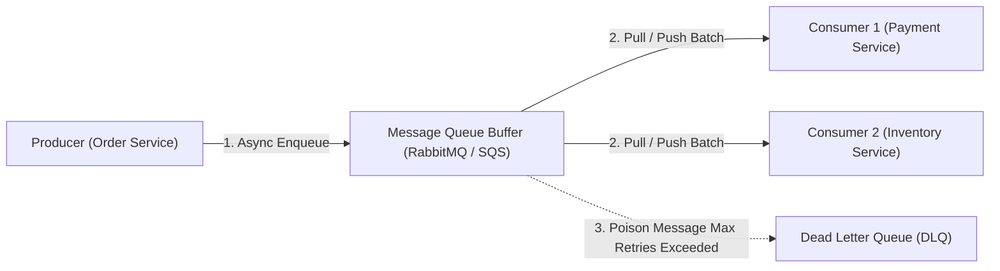
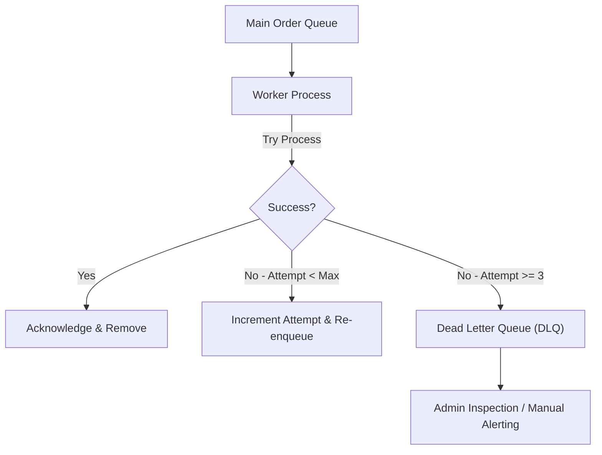
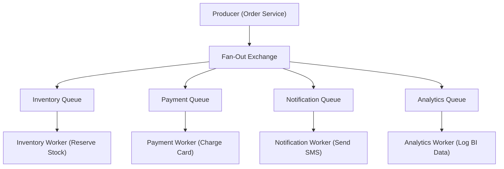

# Module 14: Message Queue Architecture, Delivery Guarantees, & Backpressure

## Theoretical Overview & Asynchronous Decoupling

A **Message Queue (MQ)** is an asynchronous communication buffer that decouples **Producers** (who create messages/events) from **Consumers** (who process messages).



### Real-World Case Study: BigBasket Festival Sale Processing
BigBasket processes over **2,000,000 grocery orders daily**:
- **Without Message Queues**: The Order API synchronously calls Payment, Stock Allocation, SMS, and Analytics APIs. A 5-second delay in SMS gateway blocks the user's checkout screen.
- **With Message Queues**: The Order API enqueues a `OrderPlaced` slip in **$\approx 2\text{ ms}$** and immediately returns `201 Created` to the user, while background worker fleets consume messages asynchronously.

---

## 1. Delivery Guarantees Comparison Matrix

| Guarantee Level | Resend / Retry Policy | Duplicate Risk | Engineering Requirements | Recommended Use Cases |
| :--- | :--- | :--- | :--- | :--- |
| **At-Most-Once** | No retries. Fire and forget. | None (Zero duplicates). | None. | Non-critical logs, real-time telemetry metrics. |
| **At-Least-Once** | Retry until acknowledged (`ACK`). | **High Duplicate Risk**. | Consumer **must be idempotent**. | Financial transactions, order processing. |
| **Exactly-Once** | Guaranteed single processing. | **Zero Duplicates**. | At-least-once + **Deduplication ID Filter**. | Bank ledger balances, billing invoices. |

---

## 2. Core Queue Patterns & Code Models

### 1. Producer-Consumer FIFO Queue (`SimpleQueue`)
```javascript
class SimpleQueue {
  constructor(name, capacity = Infinity) {
    this.name = name;
    this.buffer = [];
    this.capacity = capacity;
    this.totalEnqueued = 0;
  }

  enqueue(message) {
    if (this.buffer.length >= this.capacity) {
      return { success: false, reason: "Queue full — backpressure!" };
    }
    this.buffer.push({ ...message, id: `MSG-${++this.totalEnqueued}` });
    return { success: true, id: `MSG-${this.totalEnqueued}` };
  }

  dequeue() {
    return this.buffer.length === 0 ? null : this.buffer.shift();
  }
}
```

### 2. At-Least-Once Delivery with ACK/NACK (`AtLeastOnceQueue`)
Tracks unacknowledged messages and re-enqueues on explicit failure (`nack`):

```javascript
class AtLeastOnceQueue {
  constructor() { this.buffer = []; this.unacked = new Map(); this.counter = 0; }

  send(msg) {
    const id = `MSG-${++this.counter}`;
    this.buffer.push({ id, payload: msg, attempts: 0 });
    return id;
  }

  receive() {
    const msg = this.buffer.shift();
    if (!msg) return null;
    msg.attempts++;
    this.unacked.set(msg.id, msg);
    return msg;
  }

  ack(id) { this.unacked.delete(id); }
  nack(id) {
    const msg = this.unacked.get(id);
    if (msg) { this.unacked.delete(id); this.buffer.push(msg); } // Re-enqueue for retry
  }
}
```

### 3. Exactly-Once Processing via Idempotent Deduplication
Combines At-Least-Once retry delivery with consumer-side message ID tracking:

```javascript
const processedIds = new Set();

function processIdempotently(message) {
  if (processedIds.has(message.id)) {
    return "DUPLICATE_SKIPPED"; // Idempotent filter
  }
  processedIds.add(message.id);
  executeBusinessLogic(message);
  return "SUCCESSFULLY_PROCESSED";
}
```

---

## 3. Dead Letter Queue (DLQ) Architecture

A **Dead Letter Queue (DLQ)** isolates unparseable or repeatedly failing ("poison") messages to prevent them from blocking the primary processing pipeline.



```javascript
class MessageQueueWithDLQ {
  constructor(name, maxRetries = 3) {
    this.mainQueue = [];
    this.dlq = [];
    this.maxRetries = maxRetries;
  }

  processAll(handler) {
    while (this.mainQueue.length > 0) {
      const msg = this.mainQueue.shift();
      msg.attempts++;
      try {
        handler(msg);
      } catch (err) {
        if (msg.attempts >= this.maxRetries) {
          this.dlq.push({ ...msg, error: err.message }); // Transfer to DLQ
        } else {
          this.mainQueue.push(msg); // Re-enqueue for retry
        }
      }
    }
  }
}
```

---

## 4. Backpressure Management & Watermarking

During traffic bursts (e.g., Diwali flash sales), producers can enqueue messages faster than consumers can process them. **Backpressure** regulates producer rates using High and Low Watermarks.

```javascript
class BackpressureQueue {
  constructor(capacity, hwRatio = 0.8, lwRatio = 0.3) {
    this.buffer = [];
    this.capacity = capacity;
    this.highWater = Math.floor(capacity * hwRatio); // e.g. 80 items
    this.lowWater = Math.floor(capacity * lwRatio);  // e.g. 30 items
    this.accepting = true;
  }

  enqueue(msg) {
    if (this.buffer.length >= this.capacity) return "DROPPED";
    if (this.buffer.length >= this.highWater) this.accepting = false; // Pause producers
    if (!this.accepting) return "REJECTED_429";

    this.buffer.push(msg);
    return "ACCEPTED";
  }

  dequeue(count = 1) {
    for (let i = 0; i < count && this.buffer.length > 0; i++) this.buffer.shift();
    if (this.buffer.length <= this.lowWater) this.accepting = true; // Resume producers
  }
}
```

---

## 5. Message Fan-Out Pattern

The **Fan-Out Pattern** broadcasts a single published event across multiple independent consumer queues, isolating downstream service failures.



```javascript
class FanOutQueue {
  constructor() { this.subscribers = {}; }

  addQueue(name) { this.subscribers[name] = []; }

  publish(msg) {
    let count = 0;
    for (const [name, queue] of Object.entries(this.subscribers)) {
      queue.push({ ...msg }); // Duplicate message to all registered queues
      count++;
    }
    return count;
  }
}
```

---

## Key Takeaways

1. **Decouple Systems via Queues**: Use message queues to buffer high-volume traffic spikes and prevent downstream timeouts.
2. **At-Least-Once Requires Idempotency**: Always pair At-Least-Once queue delivery with consumer deduplication keys to achieve Exactly-Once execution guarantees.
3. **Isolate Poison Messages in DLQs**: Move failing messages to a Dead Letter Queue after max retry thresholds to prevent queue blockage.
4. **Use Fan-Out for Event Broadcasting**: Publish events to multiple subscriber queues to isolate service failures (e.g., analytics outage won't break payment processing).
