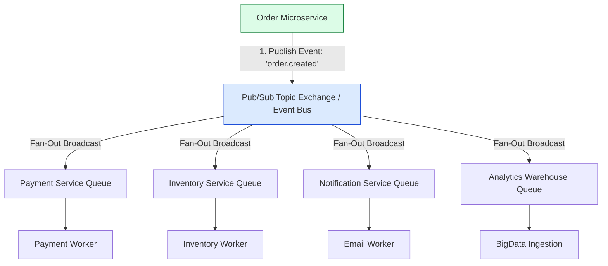
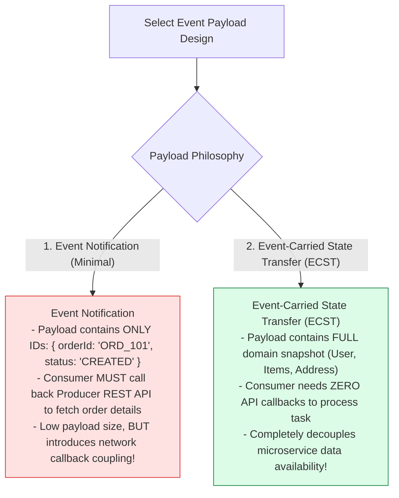
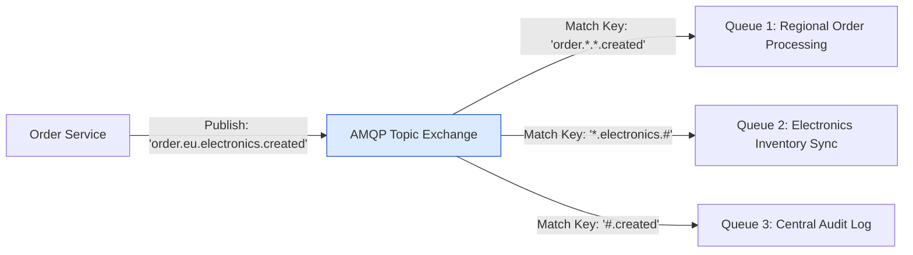

# Module 15: Publish-Subscribe (Pub/Sub) Architecture, Fan-Out Patterns, and Event-Driven Microservices

## Overview

In **Publish-Subscribe (Pub/Sub)** and **Event-Driven Architectures (EDA)**, system microservices communicate asynchronously by publishing **Events** when business domain state changes occur.

Unlike point-to-point message queues (where each message is consumed by exactly one worker), Pub/Sub systems employ **Fan-Out Messaging Topologies**, allowing single event notifications (`order.created`) to be broadcast simultaneously to multiple independent subscriber microservices without tight coupling.

Understanding **Topic Routing Keys**, **Event-Carried State Transfer (ECST)**, and **Broker Trade-Offs (RabbitMQ vs. Apache Kafka vs. AWS SNS/SQS)** is essential.

---

## 1. Pub/Sub Fan-Out Architecture Topology



---

## 2. Event Payload Design: Event Notification vs. Event-Carried State Transfer (ECST)



### Pub/Sub Broker Infrastructure Comparison Matrix

| Feature / Metric | RabbitMQ (Topic Exchange) | Apache Kafka (Partitioned Log) | AWS SNS / SQS |
| :--- | :--- | :--- | :--- |
| **Architecture Model** | Smart Broker / Dumb Consumer | Dumb Broker / Smart Consumer (Log) | Cloud Serverless Fan-Out |
| **Message Persistence** | Deleted immediately after consumer ACK | Retained on disk log for $N$ days | Ephemeral 14-day retention |
| **Replayability** | No (Messages gone post-ACK) | **Yes** (Re-seek offset $O(1)$) | No |
| **Ordering Guarantees** | Per-queue FIFO | **Strictly per partition key** | Best-effort (or SQS FIFO) |
| **Primary Use Case** | Complex AMQP topic routing | High-throughput event streaming logs | Cloud native microservice fan-out |

---

## 3. Dynamic Topic Routing Key Matching



---

## 4. Practical Implementation Showcase: Distributed Pub/Sub Event Bus Engine

```javascript
class DistributedEventBus {
  constructor() {
    this.topics = new Map(); // TopicName -> Map<SubscriberName, HandlerFn>
  }

  // Subscribe service to target topic
  subscribe(topicPattern, subscriberName, handlerFn) {
    if (!this.topics.has(topicPattern)) {
      this.topics.set(topicPattern, new Map());
    }
    this.topics.get(topicPattern).set(subscriberName, handlerFn);
    console.log(`📌 [SUBSCRIBED] '${subscriberName}' registered for topic pattern '${topicPattern}'`);
  }

  // Publish Event with Event-Carried State Transfer (ECST) Payload
  publish(topic, payload) {
    const eventEnvelope = {
      eventId: `evt_${Date.now()}_${Math.floor(Math.random() * 1000)}`,
      topic,
      timestamp: new Date().toISOString(),
      data: payload
    };

    console.log(`\n📢 [EVENT PUBLISHED] Topic: '${topic}' | Event ID: ${eventEnvelope.eventId}`);

    // Deliver to matching topic subscribers asynchronously
    this.topics.forEach((subscribers, pattern) => {
      if (this._matchTopicPattern(pattern, topic)) {
        subscribers.forEach((handler, subName) => {
          setTimeout(() => {
            console.log(`  ⚡ [DELIVERING -> ${subName}] Processing event...`);
            handler(eventEnvelope);
          }, 0);
        });
      }
    });
  }

  // Basic wildcard pattern matcher (e.g., 'order.*' matches 'order.created')
  _matchTopicPattern(pattern, topic) {
    if (pattern === topic || pattern === "#") return true;
    const regex = new RegExp("^" + pattern.replace(/\./g, "\\.").replace(/\*/g, "[^.]+") + "$");
    return regex.test(topic);
  }
}

// Execution Demonstration
const bus = new DistributedEventBus();

// Register Microservice Subscribers
bus.subscribe("order.created", "PaymentService", async (evt) => {
  console.log(`  ✓ [PAYMENT SERVICE] Processing payment for Order #${evt.data.orderId} ($${evt.data.amount})`);
});

bus.subscribe("order.*", "AuditLogService", async (evt) => {
  console.log(`  ✓ [AUDIT LOG SERVICE] Logging lifecycle event: ${evt.topic} for Order #${evt.data.orderId}`);
});

// Publish Domain Event
bus.publish("order.created", {
  orderId: "ORD_9918",
  customer: { id: "user_44", email: "alice@example.com" },
  amount: 299.99,
  items: [{ sku: "LAPTOP_01", qty: 1 }]
});
```

---

## Key Production Takeaways

1. **Prefer Event-Carried State Transfer (ECST) for Total Decoupling**: Embed essential domain entity snapshots inside event payloads so consumer microservices can execute business logic without calling back to the producer's REST API.
2. **Use Apache Kafka for Replayable Event Logs**: Select Kafka over traditional message queues when consumers require the ability to replay historical event streams (e.g. rebuilding read caches or training ML models).
3. **Keep Event Handlers Strictly Idempotent**: In Pub/Sub networks, network retries or consumer group rebalances can cause duplicate event delivery. Ensure subscribers track processed `eventId` values.
4. **Publish Events Only After DB Commit**: Use the **Transactional Outbox Pattern** to ensure database updates and event publishing occur atomically, preventing phantom events if a database write rolls back.

