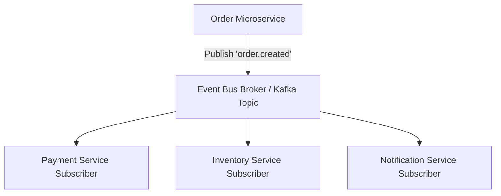

# File 15: Publish-Subscribe and Event-Driven Systems

## Overview
In **Pub/Sub** and **Event-Driven Architectures**, services communicate by publishing **Events** when state changes occur. Subscribers consume event topics asynchronously without direct service coupling.

---

## 1. Pub/Sub Broker Event Stream Architecture



---

## 2. Event-Driven Broker Implementation

```javascript
class DistributedEventBus {
    constructor() {
        this.topics = new Map();
    }

    subscribe(topic, subscriberName, handler) {
        if (!this.topics.has(topic)) this.topics.set(topic, new Map());
        this.topics.get(topic).set(subscriberName, handler);
    }

    publish(topic, payload) {
        const subscribers = this.topics.get(topic);
        if (!subscribers) return;

        console.log(`[EVENT PUBLISHED] Topic '${topic}' with payload:`, payload);
        subscribers.forEach((handler, subName) => {
            // Execute subscriber reaction asynchronously
            setTimeout(() => {
                handler(payload);
            }, 0);
        });
    }
}

const bus = new DistributedEventBus();

// Service Subscriptions
bus.subscribe("order.created", "InventoryService", order => {
    console.log(`[INVENTORY SERVICE] Reserving stock for item ${order.itemId}`);
});

bus.subscribe("order.created", "NotificationService", order => {
    console.log(`[NOTIFICATION SERVICE] Sending email for order ${order.id}`);
});

bus.publish("order.created", { id: "ORD_1001", itemId: "PROD_55", amount: 1200 });
```

---

## Key Takeaways
1. Enables **complete architectural decoupling** between microservice boundaries.
2. New subscriber features can be added without modifying existing producer code.
3. Event log stores act as an immutable audit trail of domain state changes.
