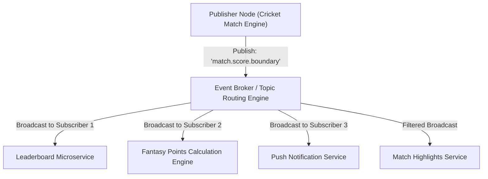

# Module 15: Publish-Subscribe (Pub/Sub) Architecture & Event-Driven Systems

## Theoretical Overview & Decoupled Event Streaming

**Publish-Subscribe (Pub/Sub)** is an asynchronous event broadcasting paradigm where **Publishers** emit event messages without knowledge of who the **Subscribers** are. Subscriptions are managed dynamically via a central **Event Bus** or **Message Broker** using topic routing.



### Real-World Case Study: Dream11 IPL Live Scores
During an IPL cricket match, Dream11 serves over **150 million active users**:
- **Without Pub/Sub**: The Match Engine synchronously updates leaderboards, calculates fantasy scores, and sends push notifications—causing cascading timeouts whenever any secondary service slows down.
- **With Pub/Sub**: When MS Dhoni hits a six, the Match Engine publishes a single `BALL_BOWLED` event (`runs: 6`). Independent consumer microservices subscribe to the event stream, updating leaderboards and fantasy points concurrently.

---

## 1. Messaging Patterns Comparison Matrix

| Feature | Point-to-Point Queue | Traditional Pub/Sub | Kafka Hybrid Model (Consumer Groups) |
| :--- | :--- | :--- | :--- |
| **Delivery Model** | **1 Consumer** gets each message (Competing Consumers). | **ALL Subscribers** get every message (Broadcast). | Every **Consumer Group** gets every message; workers inside a group split partitions. |
| **Message Lifetime**| Deleted immediately upon worker `ACK`. | Expired based on broker TTL or retention memory. | Retained on disk log according to retention policy (e.g., 7 days). |
| **Message Replay** | Impossible (Consumed messages are purged). | Impossible (Transient in-memory streams). | **Supported** (Rewind consumer log offset pointer). |
| **Ordering** | Strict FIFO per Queue. | Unordered transient broadcast. | **Guaranteed within a Partition** (`key` hash). |

---

## 2. Core Pub/Sub Implementations & Code Models

### 1. Topic-Based Routing (`PubSub`)
Routes messages based on exact string topic channels (`match.score`, `match.wicket`):

```javascript
class PubSub {
  constructor() {
    this.subscribers = {};
    this.messageLog = [];
  }

  subscribe(topic, name, callback) {
    if (!this.subscribers[topic]) this.subscribers[topic] = [];
    this.subscribers[topic].push({ name, callback });
  }

  publish(topic, message) {
    const subs = this.subscribers[topic] || [];
    const deliveries = [];
    subs.forEach((sub) => {
      try {
        sub.callback(message);
        deliveries.push({ subscriber: sub.name, status: "delivered" });
      } catch (err) {
        deliveries.push({ subscriber: sub.name, status: "failed" });
      }
    });
    return deliveries;
  }
}
```

### 2. Wildcard Topic Subscriptions (`WildcardPubSub`)
Supports wildcard topic matching:
- `*` (Single-Level Wildcard): Matches exactly one token level (e.g., `match.score.*` matches `match.score.boundary` but NOT `match.score.boundary.six`).
- `#` (Multi-Level Wildcard): Matches zero or more hierarchical tokens (e.g., `match.#` matches any event starting with `match`).

```javascript
class WildcardPubSub {
  constructor() { this.subscribers = []; }

  subscribe(pattern, name, callback) {
    // Converts MQTT/AMQP wildcards (* and #) to regular expressions
    const regex = new RegExp(
      "^" + pattern.replace(/\./g, "\\.").replace(/\*/g, "[^.]+").replace(/#/g, ".*") + "$"
    );
    this.subscribers.push({ pattern, regex, name, callback });
  }

  publish(topic, message) {
    const matched = [];
    this.subscribers.forEach((sub) => {
      if (sub.regex.test(topic)) {
        sub.callback({ topic, ...message });
        matched.push(sub.name);
      }
    });
    return matched;
  }
}
```

---

## 3. Central Event Bus Pattern with Middleware (`EventBus`)

An **Event Bus** acts as the central messaging nervous system across microservices, providing execution logging, middleware interceptors, and replay capability.

```mermaid
flowchart LR
    Producer["Producer Microservice"] -->|emit('BALL_BOWLED')| EventBus["Event Bus Core"]
    
    subgraph Middleware Pipeline
        EventBus --> MW1["1. Auth & Schema Validation"]
        MW1 --> MW2["2. Metric Logging Interceptor"]
        MW2 --> MW3["3. Filter Test Events"]
    end
    
    MW3 --> Handlers["Invoke Registered Event Handlers"]
```

```javascript
class EventBus {
  constructor() {
    this.handlers = {};
    this.middleware = [];
    this.eventLog = [];
  }

  use(fn) { this.middleware.push(fn); }
  on(type, handler) {
    if (!this.handlers[type]) this.handlers[type] = [];
    this.handlers[type].push(handler);
  }

  emit(eventType, payload) {
    const event = { type: eventType, payload, id: `EVT-${Math.random().toString(36).slice(2, 8)}` };
    
    // Execute Middleware Interceptors
    for (const mw of this.middleware) {
      if (!mw(event)) return { delivered: 0, filtered: true };
    }

    this.eventLog.push(event); // Replay Log
    let delivered = 0;
    (this.handlers[eventType] || []).forEach((h) => {
      try { h(event); delivered++; } catch (e) {}
    });
    return { delivered, id: event.id };
  }
}
```

---

## 4. Partitioned Topics & Consumer Groups (`PartitionedTopic`)

To scale subscribers horizontally while preserving event order, topics are divided into **Partitions**.

- **Partition Hash Invariant**: Events with the same partition key (e.g., `match_id = "CSK-MI"`) are consistently routed to the **same partition**, preserving strict sequence ordering.
- **Consumer Group Load Balancing**: Partitions within a topic are distributed evenly across active instances in a Consumer Group.

```mermaid
flowchart TD
    subgraph Topic: 'match-events' (6 Partitions)
        P0["Partition 0 (CSK-MI)"]
        P1["Partition 1 (RCB-KKR)"]
        P2["Partition 2 (DC-SRH)"]
        P3["Partition 3 (PBKS-RR)"]
        P4["Partition 4 (GT-LSG)"]
        P5["Partition 5 (MI-KKR)"]
    end

    subgraph Consumer Group: 'fantasy-points-engine' (3 Instances)
        C0["Consumer Worker 0<br/>(Processes P0, P3)"]
        C1["Consumer Worker 1<br/>(Processes P1, P4)"]
        C2["Consumer Worker 2<br/>(Processes P2, P5)"]
    end

    P0 --> C0
    P3 --> C0
    P1 --> C1
    P4 --> C1
    P2 --> C2
    P5 --> C2
```

```javascript
class PartitionedTopic {
  constructor(name, numPartitions) {
    this.name = name;
    this.numPartitions = numPartitions;
    this.partitions = {};
    for (let i = 0; i < numPartitions; i++) this.partitions[i] = [];
  }

  publish(key, message) {
    let hash = 0;
    for (let i = 0; i < key.length; i++) hash = (hash * 31 + key.charCodeAt(i)) & 0x7fffffff;
    const p = hash % this.numPartitions; // Partition routing
    this.partitions[p].push({ key, message, partition: p });
    return p;
  }

  registerConsumerGroup(groupName, workerCount) {
    const assignments = {};
    for (let c = 0; c < workerCount; c++) assignments[`${groupName}-${c}`] = [];
    const workers = Object.keys(assignments);
    
    // Assign partitions round-robin to workers
    for (let p = 0; p < this.numPartitions; p++) {
      assignments[workers[p % workers.length]].push(p);
    }
    return assignments;
  }
}
```

---

## 5. Pre-Filtering & Event Transformation

To avoid wasting downstream consumer CPU cycles, the Event Bus can execute client-registered **filtering and transformation predicates** before dispatching payloads.

```javascript
class FilteredSubscription {
  constructor() { this.subscriptions = []; }

  subscribe(name, filterFn, transformFn = null) {
    this.subscriptions.push({ name, filter: filterFn, transform: transformFn, received: [] });
  }

  publish(event) {
    this.subscriptions.forEach((sub) => {
      if (sub.filter(event)) {
        sub.received.push(sub.transform ? sub.transform(event) : event);
      }
    });
  }
}
```

---

## Key Takeaways

1. **Decouple Publishers from Subscribers**: Use Pub/Sub to allow independent microservices to subscribe to events without modifying publisher logic.
2. **Wildcards Simplify Topic Subscriptions**: Use `*` for single-level matching and `#` for multi-level matching.
3. **Partition Keys Guarantee Order**: Events with identical partition keys land on the same partition, guaranteeing ordered processing.
4. **Consumer Groups Enable Horizontal Scale**: Scale consumer microservices horizontally by distributing partition assignments across group workers.
