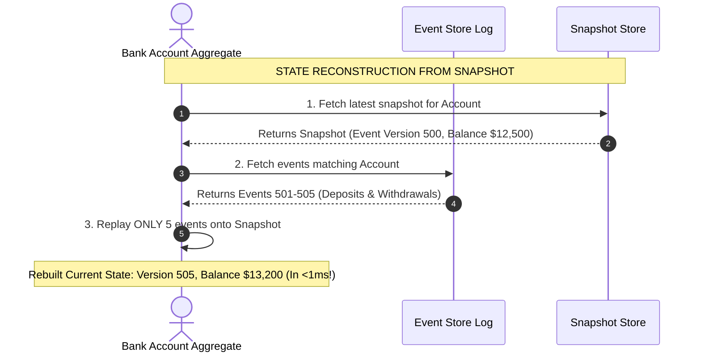

# Module 16: Event Sourcing, CQRS Architecture, and Read Projection Engines

## Overview

Traditional application architectures update database state in-place using CRUD (`UPDATE users SET status = 'ACTIVE'`). In contrast, **Event Sourcing** persists every application state change as an immutable sequence of historical domain events (`UserRegistered`, `UserEmailVerified`, `SubscriptionUpgraded`).

Combining Event Sourcing with **CQRS (Command Query Responsibility Segregation)** splits Write operations (**Commands**) from Read operations (**Queries**), allowing Write models (Append-Only Event Log) and Read models (Denormalized Materialized Views) to scale independently.

Understanding **Event Store Replaying**, **Snapshotting Mechanics**, and **Asynchronous Read Projections** is essential.

---

## 1. CQRS & Event Sourcing System Topology

```mermaid
flowchart TD
    subgraph Command / Write Side (Write Model)
        ClientCommand[Client Write Action] -->|1. Transmit Command| CmdAPI[Command API Handler]
        CmdAPI -->|2. Validate Domain Rules| Aggregate[Domain Aggregate Root]
        Aggregate -->|3. Append Immutable Event| EventStore[(Append-Only Event Store Log)]
    end

    subgraph Event Projection Engine
        EventStore -->|4. Stream Event Log| Projector[Async Read Model Projector]
        Projector -->|5. Update Materialized Views| ReadDB[(Read-Optimized Database / Elastic)]
    end

    subgraph Query / Read Side (Read Model)
        ClientQuery[Client Read Query] -->|6. Fast Read Query| QueryAPI[Query API Handler]
        QueryAPI --> ReadDB
    end

    style EventStore fill:#dcfce7,stroke:#15803d
    style ReadDB fill:#dbeafe,stroke:#1d4ed8
```

---

## 2. Event Replaying & Snapshotting Mechanics

Rebuilding state for aggregates with thousands of historical events by replaying from event zero becomes CPU-intensive. **Snapshotting** periodically captures an aggregate's current state (e.g. every 100 events), allowing state reconstruction to start from the latest snapshot:



---

## 3. Command Side vs. Query Side Comparison

| Architectural Dimension | Command Side (Write Model) | Query Side (Read Model) |
| :--- | :--- | :--- |
| **Primary Goal** | Protect domain invariants & append events | Deliver ultra-fast, pre-computed query responses |
| **Data Storage Engine** | Append-Only Log (EventStoreDB, Kafka, Postgres WAL) | Document/Search/Cache (Elasticsearch, Redis, Postgres) |
| **Schema Normalization**| Normalized Event Schema | **Denormalized Flat Materialized Views** |
| **Data Modification** | `INSERT` Only (Immutable Append) | Asynchronous Bulk Invalidation / Updates |
| **Scaling Pattern** | Scales with write transaction volume | Scales independently with read query volume |

---

## 4. Practical Implementation Showcase: Event Sourced Bank Account with CQRS Projections

```javascript
// 1. Immutable Event Definitions
class AccountAggregate {
  constructor(id) {
    this.id = id;
    this.balance = 0;
    this.version = 0;
  }

  // Replay event onto aggregate state
  apply(event) {
    switch (event.type) {
      case "ACCOUNT_CREATED":
        this.balance = event.data.initialDeposit;
        break;
      case "FUNDS_DEPOSITED":
        this.balance += event.data.amount;
        break;
      case "FUNDS_WITHDRAWN":
        if (this.balance < event.data.amount) {
          throw new Error("Insufficient funds!");
        }
        this.balance -= event.data.amount;
        break;
    }
    this.version = event.version;
  }
}

// 2. CQRS Event Store & Read Projection Manager
class CQRSStore {
  constructor() {
    this.eventStoreLog = []; // Append-only log
    this.readModelView = new Map(); // Denormalized Read DB
  }

  // Command Write Side
  async appendEvent(aggregateId, eventType, data) {
    const nextVersion = this.eventStoreLog.filter((e) => e.aggregateId === aggregateId).length + 1;
    
    const event = {
      eventId: `evt_${Date.now()}_${nextVersion}`,
      aggregateId,
      type: eventType,
      version: nextVersion,
      data,
      timestamp: new Date().toISOString()
    };

    this.eventStoreLog.push(event);
    console.log(`⚡ [EVENT APPENDED] ${event.type} (Ver ${event.version}) for ID ${aggregateId}`);

    // Trigger Async Read Model Projection Update
    await this._updateReadProjection(event);
  }

  // Query Read Side (Denormalized Materialized Projection)
  async _updateReadProjection(event) {
    let readRecord = this.readModelView.get(event.aggregateId) || { id: event.aggregateId, balance: 0, lastUpdated: "" };

    if (event.type === "ACCOUNT_CREATED") readRecord.balance = event.data.initialDeposit;
    else if (event.type === "FUNDS_DEPOSITED") readRecord.balance += event.data.amount;
    else if (event.type === "FUNDS_WITHDRAWN") readRecord.balance -= event.data.amount;

    readRecord.lastUpdated = event.timestamp;
    this.readModelView.set(event.aggregateId, readRecord);
    console.log(`  ✓ [READ PROJECTION UPDATED] ID ${event.aggregateId} -> Balance: $${readRecord.balance}`);
  }

  // Query Handler (Instant O(1) Read)
  getAccountReadModel(aggregateId) {
    return this.readModelView.get(aggregateId) || null;
  }
}

// Execution Demonstration
async function runCQRSDemo() {
  const cqrs = new CQRSStore();

  // Execute Commands
  await cqrs.appendEvent("ACC_9910", "ACCOUNT_CREATED", { initialDeposit: 1000 });
  await cqrs.appendEvent("ACC_9910", "FUNDS_DEPOSITED", { amount: 500 });
  await cqrs.appendEvent("ACC_9910", "FUNDS_WITHDRAWN", { amount: 200 });

  // Execute Query against Denormalized Read View
  const readView = cqrs.getAccountReadModel("ACC_9910");
  console.log("\n=== READ MODEL RESULT ===");
  console.log(`Account ID   : ${readView.id}`);
  console.log(`Current Bal  : $${readView.balance}`);
  console.log(`Last Updated : ${readView.lastUpdated}`);
}

runCQRSDemo();
```

---

## Key Production Takeaways

1. **Use Event Sourcing when Auditing & Time-Travel Debugging are Essential**: Event Sourcing preserves complete, un-mutable historical record of all domain changes, making it ideal for financial ledgers, healthcare records, and legal compliance.
2. **Implement Snapshotting to Avoid Long Replay Times**: Store aggregate state snapshots every 100-500 events to prevent cold state restoration from stalling application threads on old aggregates.
3. **Handle Eventual Consistency on the Read Side**: In CQRS, the read model updates asynchronously after the event store write. Ensure client UIs accommodate temporary 100-300ms projection lag using optimistic UI updates.
4. **Treat Event Log Schemas as Immutable**: Never alter past event schemas. Implement forward-compatible event versioning or event upcasting (`UserRegistered_v1` to `UserRegistered_v2`) to maintain backwards compatibility.

