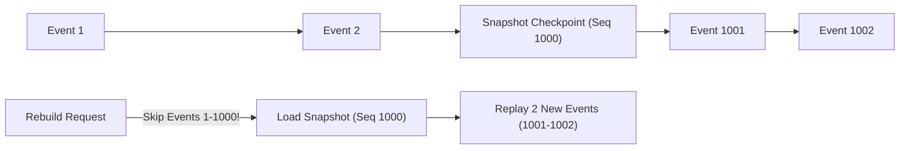

# Module 16: Event Sourcing, CQRS Pattern, & Event Store Architecture

## Theoretical Overview & State Rebuild Philosophy

Traditional CRUD applications update database records in-place (`UPDATE bookings SET status = 'CANCELLED'`), destroying historical context.

**Event Sourcing** models state transitions as an **append-only sequence of immutable events** stored inside an **Event Store**. Current state is never stored directly—it is calculated dynamically by **replaying** events through a **Projection**.

```mermaid
flowchart TD
    subgraph Write Path (Commands & Event Store)
        Cmd["Command: Initiate Booking PNR-4512"] --> CmdHandler["Command Handler"]
        CmdHandler -->|Append Event| ES[("Append-Only Event Store Log")]
        ES --> Evt1["1. BookingInitiated"]
        ES --> Evt2["2. SeatAllocated"]
        ES --> Evt3["3. PaymentProcessed"]
        ES --> Evt4["4. BookingConfirmed"]
    end

    subgraph Read Path (Projections & Read Models)
        ES -.->|Publish Stream| Proj["Projection Processor"]
        Proj --> ReadModel[("Optimized Read DB / Materialized View")]
        ClientQuery["Query: GET /api/pnr/4512"] --> ReadModel
    end
```

### Real-World Case Study: IRCTC Booking Ledger
Every transaction step on IRCTC—searching trains, holding seats, processing UPI payments, issuing PNR confirmations, and submitting cancellation refunds—is appended as an immutable event.
- **Auditability**: Complete audit trails resolve customer disputes.
- **Time Travel**: Engineers can reconstruct exact system state at 10:01:05 AM during Tatkal surges.

---

## 1. CRUD vs. Event Sourcing vs. CQRS Comparison

| Dimension | Traditional CRUD | Event Sourcing | CQRS (Command Query Responsibility Segregation) |
| :--- | :--- | :--- | :--- |
| **Data Mutation** | In-place update (`UPDATE / DELETE`). | **Append-Only** (`INSERT` immutable events). | Separates Command writes from Query reads. |
| **Historical Data** | Lost upon overwrite. | **Fully preserved** indefinitely. | Maintained via immutable event streams. |
| **Read/Write Scaling**| Tight coupling (Same DB schema). | Read side requires replaying events. | **Independent Scaling** (Optimum Write DB + Read DB). |
| **Auditability** | Requires manual trigger tables. | Built-in by architecture design. | Built-in via event store logs. |

---

## 2. Event Store & State Replay Engine

```javascript
class EventStore {
  constructor() {
    this.events = [];
    this.subscribers = [];
    this.seq = 0;
  }

  append(streamId, eventType, data) {
    const event = {
      seq: ++this.seq,
      streamId,
      eventType,
      data,
      metadata: { timestamp: Date.now(), version: 1 },
    };
    this.events.push(event);
    this.subscribers.forEach((fn) => fn(event));
    return event;
  }

  getStream(streamId) { return this.events.filter((e) => e.streamId === streamId); }
}

class BookingProjection {
  constructor() { this.state = {}; }

  apply(event) {
    const pnr = event.streamId;
    if (!this.state[pnr]) this.state[pnr] = { pnr, status: "UNKNOWN", history: [] };
    const b = this.state[pnr];

    switch (event.eventType) {
      case "BookingInitiated": Object.assign(b, event.data); b.status = "INITIATED"; break;
      case "SeatAllocated": b.coach = event.data.coach; b.seat = event.data.seat; b.status = "SEAT_ALLOCATED"; break;
      case "PaymentProcessed": b.amountPaid = event.data.amount; b.status = "PAYMENT_DONE"; break;
      case "BookingConfirmed": b.status = "CONFIRMED"; break;
      case "BookingCancelled": b.status = "CANCELLED"; b.refundAmount = event.data.refundAmount; break;
    }
    b.history.push({ event: event.eventType, timestamp: event.metadata.timestamp });
    return b;
  }

  replayAll(events) {
    this.state = {};
    events.forEach((e) => this.apply(e));
    return this.state;
  }
}
```

---

## 3. Performance Checkpoints via Snapshots

Replaying millions of historical events to compute current state becomes a bottleneck. **Snapshots** periodically checkpoint current state so replays start from the latest snapshot rather than sequence 0.



```javascript
class SnapshotStore {
  constructor(eventStore) {
    this.eventStore = eventStore;
    this.snapshots = {};
  }

  takeSnapshot(streamId) {
    const events = this.eventStore.getStream(streamId);
    const proj = new BookingProjection();
    events.forEach((e) => proj.apply(e));
    this.snapshots[streamId] = {
      state: JSON.parse(JSON.stringify(proj.getState(streamId))),
      lastSeq: events[events.length - 1].seq,
    };
  }

  rebuildFromSnapshot(streamId) {
    const snapshot = this.snapshots[streamId];
    const proj = new BookingProjection();
    if (snapshot) {
      proj.state[streamId] = JSON.parse(JSON.stringify(snapshot.state));
      // Replay only un-checkpointed events!
      const newEvents = this.eventStore.getStream(streamId).filter((e) => e.seq > snapshot.lastSeq);
      newEvents.forEach((e) => proj.apply(e));
    }
    return proj.getState(streamId);
  }
}
```

---

## 4. CQRS Architecture: Separating Command and Query Pipelines

CQRS splits application logic into two independent sides:
- **Command Side**: Validates domain business logic and appends events.
- **Query Side**: Subscribes to events to update optimized read databases (e.g., Elasticsearch, Redis).

```javascript
// Command Handler (Write Model)
class BookingCommandHandler {
  constructor(eventStore) { this.es = eventStore; }
  initiateBooking(pnr, passenger, train, classType) {
    return this.es.append(pnr, "BookingInitiated", { passenger, train, class: classType });
  }
  confirmBooking(pnr) {
    return this.es.append(pnr, "BookingConfirmed", { status: "CNF" });
  }
}

// Query Handler (Read Projections)
class BookingQueryHandler {
  constructor() { this.occupancy = {}; this.revenue = {}; }

  handleEvent(event) {
    if (event.eventType === "BookingConfirmed") {
      const train = event.data.train || "default";
      this.occupancy[train] = (this.occupancy[train] || 0) + 1;
    } else if (event.eventType === "PaymentProcessed") {
      const train = event.data.train || "default";
      this.revenue[train] = (this.revenue[train] || 0) + event.data.amount;
    }
  }
}
```

---

## 5. Event Schema Versioning & Upgraders

As system features evolve, event payload schemas change. **Upgraders** convert legacy events on-the-fly without breaking historical event replays:

```javascript
class EventUpgrader {
  constructor() { this.upgraders = {}; }

  register(type, fromVer, toVer, upgradeFn) {
    this.upgraders[`${type}:${fromVer}:${toVer}`] = upgradeFn;
  }

  upgrade(event) {
    let upgraded = { ...event, data: { ...event.data }, metadata: { ...event.metadata } };
    let v = event.metadata.version || 1;
    while (this.upgraders[`${event.eventType}:${v}:${v + 1}`]) {
      upgraded = this.upgraders[`${event.eventType}:${v}:${v + 1}`](upgraded);
      upgraded.metadata.version = ++v;
    }
    return upgraded;
  }
}
```

---

## Key Takeaways

1. **Append-Only Event Store**: Store changes as immutable event logs rather than executing in-place record updates.
2. **Use Projections for State Reconstruction**: Derive application state by applying event streams to projection models.
3. **Accelerate Replay with Snapshots**: Checkpoint state periodically to avoid replaying long event logs from sequence 0.
4. **Separate Read and Write Models with CQRS**: Scale read queries independently from write commands.
