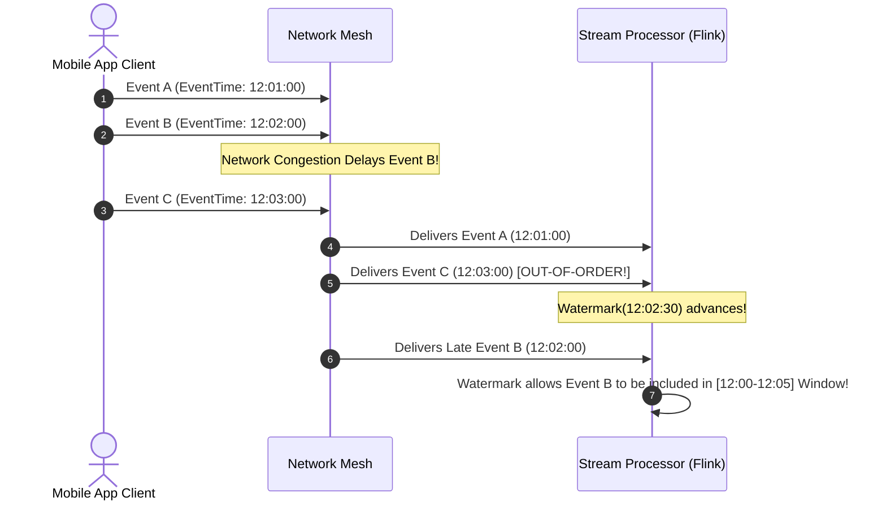

# Module 17: Real-Time Stream Processing Architecture, Windowing Algorithms, and Watermarking

## Overview

In enterprise data engineering, traditional **Batch Processing** (MapReduce, Spark Batch) processes static, bounded datasets on fixed time schedules (e.g. nightly ETL jobs). In contrast, **Stream Processing** (Apache Flink, Kafka Streams, Spark Streaming) processes unbounded event streams continuously in real-time with sub-second latency.

Understanding **Stream Windowing Algorithms (Tumbling, Sliding, Session Windows)**, **Time Domains (Event Time vs. Processing Time)**, and **Watermarking Mechanics** for late-arriving out-of-order data is essential.

---

## 1. Batch vs. Stream Processing Architecture

```mermaid
flowchart TD
    subgraph 1. Traditional Batch Processing Pipeline
        BatchSource[(Historical Log Files)] --> DailyJob[Nightly ETL Batch Job]
        DailyJob --> BatchDB[(Data Warehouse)]
        note1["High Latency (Hours/Days) | Bounded Data Blocks"]
    end

    subgraph 2. Real-Time Stream Processing Pipeline
        EventSource[Live IoT Sensor / App Events] --> StreamEngine[Stream Processor (Flink / Kafka Streams)]
        StreamEngine -->|Continuous Analytics| LiveDash[Real-Time Dashboard & Fraud Alerts]
        note2["Low Latency (Microseconds) | Unbounded Event Streams"]
    end

    style StreamEngine fill:#dcfce7,stroke:#15803d
    style DailyJob fill:#fee2e2,stroke:#dc2626
```

---

## 2. Stream Windowing Algorithms Comparison

```mermaid
flowchart TD
    subgraph 1. Tumbling Window (Fixed-Size, Non-Overlapping)
        T1["[12:00 - 12:05] Window A"] ---> T2["[12:05 - 12:10] Window B"] ---> T3["[12:10 - 12:15] Window C"]
    end

    subgraph 2. Sliding Window (Fixed-Size, Overlapping Step)
        S1["[12:00 - 12:05] Window 1"]
        S2["[12:01 - 12:06] Window 2"]
        S3["[12:02 - 12:07] Window 3"]
        S1 -.->|Slides every 1 min| S2 -.-> S3
    end

    subgraph 3. Session Window (Dynamic Gap-Bounded)
        Ses1["User Activity Session A"] --- Gap["Inactivity Gap (>30 min)"] --- Ses2["User Activity Session B"]
    end

    style S1 fill:#dbeafe,stroke:#1d4ed8
    style S2 fill:#dbeafe,stroke:#1d4ed8
    style T1 fill:#dcfce7,stroke:#15803d
```

### Windowing Strategy Comparison Matrix

| Window Type | Boundary Definition | Overlap Behavior | Ideal System Scenario |
| :--- | :--- | :--- | :--- |
| **Tumbling Window** | Fixed duration (e.g. 5 minutes) | **Non-Overlapping** (Keys belong to 1 window) | Hourly revenue reports, distinct 5-min server error counts |
| **Sliding Window** | Fixed duration + slide interval | **Overlapping** (e.g. 5-min window sliding every 10 sec) | Moving averages, sliding rate limiters, 5-min rolling CPU load |
| **Session Window** | Dynamic duration based on activity | **Gap-Bounded** (Closes when inactivity $> \Delta t$) | User web session tracking, e-commerce checkout funnel behavior |

---

## 3. Time Semantics & Watermarking for Late-Arriving Events

Events sent over cellular/mobile networks frequently arrive out-of-order. Stream processors rely on **Event Time Watermarks** (progress metrics indicating no events with event-time $< W$ will arrive) to evaluate window calculations accurately:



---

## 4. Practical Implementation Showcase: Real-Time Sliding Window Metric Aggregator

```javascript
class SlidingWindowStreamProcessor {
  constructor(windowSizeMs = 10000, slideStepMs = 2000) {
    this.windowSizeMs = windowSizeMs;
    this.slideStepMs = slideStepMs;
    this.eventBuffer = [];
  }

  // Ingest stream event
  ingest(event) {
    const eventRecord = {
      timestamp: event.timestamp || Date.now(),
      value: event.value,
      metricName: event.metricName
    };
    this.eventBuffer.push(eventRecord);
    console.log(`📥 [STREAM INGEST] ${eventRecord.metricName} = ${eventRecord.value} at ${new Date(eventRecord.timestamp).toISOString().substring(11, 19)}`);
  }

  // Calculate sliding window metrics
  calculateRollingMetrics(metricName) {
    const now = Date.now();
    const windowCutoff = now - this.windowSizeMs;

    // Prune events older than window size
    this.eventBuffer = this.eventBuffer.filter((e) => e.timestamp >= windowCutoff);

    const matchingEvents = this.eventBuffer.filter((e) => e.metricName === metricName);
    if (matchingEvents.length === 0) return { count: 0, sum: 0, avg: 0 };

    const sum = matchingEvents.reduce((acc, curr) => acc + curr.value, 0);
    const avg = sum / matchingEvents.length;

    console.log(`\n======================================================`);
    console.log(`   SLIDING WINDOW METRICS (${this.windowSizeMs / 1000}s Window)`);
    console.log(`======================================================`);
    console.log(`Metric Name        : ${metricName}`);
    console.log(`Window Event Count : ${matchingEvents.length}`);
    console.log(`Window Sum Total   : ${sum}`);
    console.log(`Window Moving Avg  : ${avg.toFixed(2)}`);
    console.log(`======================================================\n`);

    return { count: matchingEvents.length, sum, avg };
  }
}

// Execution Demonstration
async function runStreamDemo() {
  const processor = new SlidingWindowStreamProcessor(5000, 1000);

  // Ingest stream events over time
  processor.ingest({ metricName: "http_request_duration_ms", value: 120 });
  processor.ingest({ metricName: "http_request_duration_ms", value: 250 });

  await new Promise((r) => setTimeout(r, 1000));
  processor.ingest({ metricName: "http_request_duration_ms", value: 80 });

  // Evaluate sliding window
  processor.calculateRollingMetrics("http_request_duration_ms");
}

runStreamDemo();
```

---

## Key Production Takeaways

1. **Use Event Time (Not Processing Time) for Windowing**: Always compute stream analytics based on the timestamp when the event occurred on the client device (**Event Time**) rather than when it reached your server (**Processing Time**).
2. **Configure Watermark Allowed Lateness**: Define an allowed lateness threshold (e.g. 5 seconds) to accommodate network latency glitches before closing window computations.
3. **Use Tumbling Windows for Distinct Totals, Sliding Windows for Rolling Metrics**: Select Tumbling Windows for fixed 5-minute sales buckets; select Sliding Windows for rolling 5-minute moving average CPU thresholds.
4. **Leverage RocksDB State Backends in Apache Flink**: For large stateful stream aggregations (millions of concurrent user sessions), configure Flink to persist state out-of-core using embedded RocksDB storage to avoid JVM heap limits.

