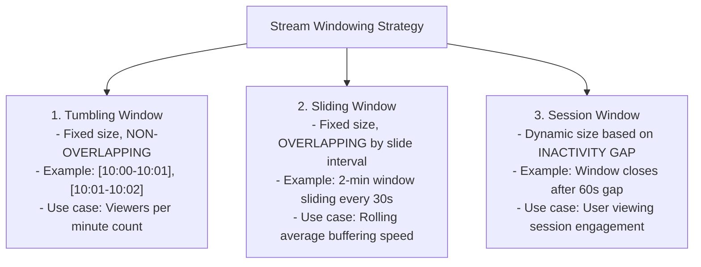
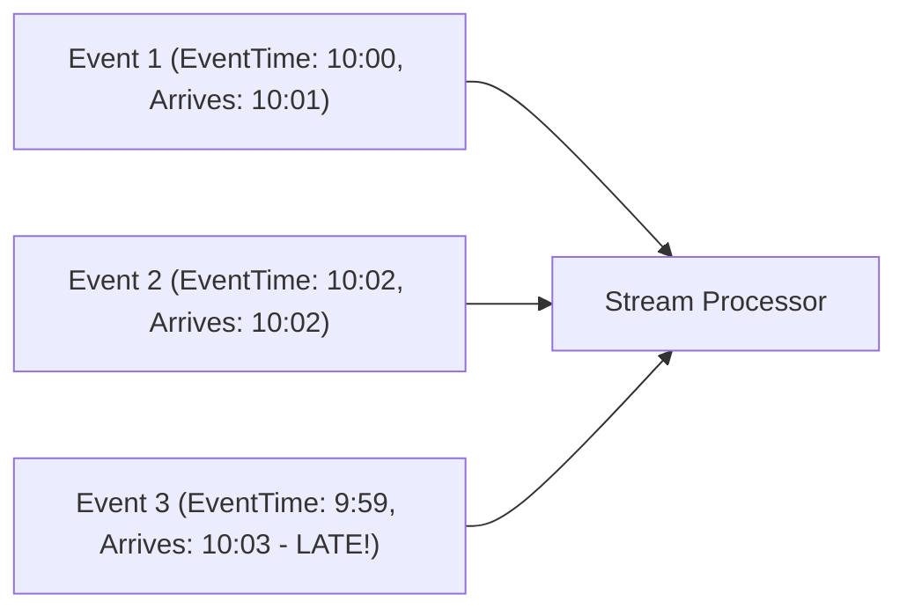

# Module 17: Stream Processing Architecture, Windowing Strategies, & Watermarks

## Theoretical Overview & Real-Time Analytics Paradigm

Traditional **Batch Processing** (e.g., Apache Hadoop, Spark) processes bounded historical datasets in periodic chunks (e.g., nightly ETL jobs).

**Stream Processing** (e.g., Apache Flink, Kafka Streams, Storm) continuously ingests and computes unbounded data streams in **real-time** as events occur.

```mermaid
flowchart LR
    subgraph Batch Processing (High Latency)
        BatchData["Bounded Historical Logs"] --> BatchJob["Nightly ETL Batch Job"]
        BatchJob --> BatchOutput["Daily Report (24h Delay)"]
    end

    subgraph Stream Processing (Low Latency)
        StreamEvents["Unbounded Event Stream"] --> StreamEngine["Real-Time Stream Processor (Flink / Kafka Streams)"]
        StreamEngine --> LiveOutput["Live Dashboard / Alert (< 100ms)"]
    end
```

### Real-World Case Study: Hotstar Live Viewer Telemetry
During an IPL match with **25+ million concurrent viewers**, Hotstar computes live metrics:
- **Tumbling Window**: Counts unique active viewers every 60 seconds.
- **Sliding Window**: Computes 2-minute rolling average bitrate to monitor CDN health.
- **Session Window**: Groups user viewing activity into distinct sessions separated by 60 seconds of inactivity.

---

## 1. Batch vs. Stream Processing Matrix

| Feature | Batch Processing | Stream Processing |
| :--- | :--- | :--- |
| **Data Scope** | Bounded, complete finite datasets. | Unbounded continuous infinite streams. |
| **Latency** | High (Minutes to Hours). | **Ultra-Low (Milliseconds to Seconds)**. |
| **Time Semantics** | Processing time (When batch job runs). | **Event time** (When action occurred on user device). |
| **State Management** | State persisted across job steps. | In-memory managed state (RocksDB checkpoints). |
| **Primary Frameworks**| Apache Hadoop, Apache Spark Batch. | Apache Flink, Kafka Streams, Apache Beam. |

---

## 2. Windowing Strategies in Stream Processing

Because data streams are infinite, stream processors chunk data into finite time slices called **Windows** to execute aggregations.



### 1. Tumbling Window (`TumblingWindow`)
Non-overlapping fixed-duration time intervals:

```javascript
class TumblingWindow {
  constructor(sizeMs) {
    this.sizeMs = sizeMs;
    this.windows = {};
  }

  getKey(timestamp) {
    return Math.floor(timestamp / this.sizeMs) * this.sizeMs;
  }

  add(event) {
    const k = this.getKey(event.timestamp);
    if (!this.windows[k]) {
      this.windows[k] = { start: k, end: k + this.sizeMs, events: [], count: 0 };
    }
    this.windows[k].events.push(event);
    this.windows[k].count++;
  }
}
```

### 2. Sliding Window (`SlidingWindow`)
Overlapping time intervals providing smooth rolling trends:

```javascript
class SlidingWindow {
  constructor(sizeMs, slideMs) {
    this.sizeMs = sizeMs;
    this.slideMs = slideMs;
    this.events = [];
  }

  add(event) { this.events.push(event); }

  compute(startTime, endTime) {
    const windows = [];
    for (let s = startTime; s + this.sizeMs <= endTime + this.slideMs; s += this.slideMs) {
      const wEnd = s + this.sizeMs;
      const evts = this.events.filter((e) => e.timestamp >= s && e.timestamp < wEnd);
      if (evts.length > 0) windows.push({ start: s, end: wEnd, count: evts.length });
    }
    return windows;
  }
}
```

### 3. Session Window (`SessionWindow`)
Gap-based dynamic windows that close after a threshold period of inactivity:

```javascript
class SessionWindow {
  constructor(gapMs) {
    this.gapMs = gapMs;
    this.sessions = {};
  }

  add(event) {
    const uid = event.userId;
    if (!this.sessions[uid]) this.sessions[uid] = [];
    const userSessions = this.sessions[uid];
    const lastSession = userSessions[userSessions.length - 1];

    if (lastSession && event.timestamp - lastSession.lastActivity <= this.gapMs) {
      lastSession.events.push(event);
      lastSession.lastActivity = event.timestamp;
      lastSession.end = event.timestamp;
    } else {
      userSessions.push({
        start: event.timestamp,
        end: event.timestamp,
        lastActivity: event.timestamp,
        events: [event],
      });
    }
  }
}
```

---

## 3. Time Semantics & Watermark Architecture

In stream processing, event ordering is unpredictable due to mobile network delays.



### Time Definitions
1. **Event Time**: The timestamp when the event actually occurred on the client device (e.g., user clicked "play").
2. **Ingestion Time**: The timestamp when the event was ingested into the messaging broker (e.g., Kafka).
3. **Processing Time**: The wall-clock timestamp of the machine executing the stream transformation.

### Watermark Tracking (`WatermarkTracker`)
A **Watermark** is a temporal metric asserting that no further events with `EventTime < Watermark` are expected.

$$\text{Watermark} = \max(\text{EventTime}) - \text{MaxLatenessAllowed}$$

```javascript
class WatermarkTracker {
  constructor(maxLatenessMs) {
    this.maxLateness = maxLatenessMs;
    this.maxEventTime = 0;
    this.watermark = 0;
  }

  process(event) {
    if (event.eventTime > this.maxEventTime) {
      this.maxEventTime = event.eventTime;
    }
    this.watermark = this.maxEventTime - this.maxLateness;
    const isLate = event.eventTime < this.watermark;
    return { watermark: this.watermark, isLate };
  }
}
```

### Strategies for Late Data
1. **Drop Late Data**: Silently discard events arriving after the watermark closes the window.
2. **Side Outputs**: Route late events to a secondary stream for manual inspection or audit logging.
3. **Window Retraction & Re-computation**: Re-open the window and emit an updated materialized aggregation result.

---

## 4. Stream Processing Pipeline Architecture

Stream processing applications link operators into a Directed Acyclic Graph (DAG) pipeline:

$$\text{Source} \longrightarrow \text{Filter} \longrightarrow \text{Map} \longrightarrow \text{Window} \longrightarrow \text{Aggregate} \longrightarrow \text{Sink}$$

```javascript
class StreamPipeline {
  constructor(name) {
    this.name = name;
    this.stages = [];
  }

  addStage(name, fn) {
    this.stages.push({ name, fn });
    return this;
  }

  process(events) {
    let current = [...events];
    for (const s of this.stages) {
      current = s.fn(current);
    }
    return current;
  }
}
```

---

## Key Takeaways

1. **Process Data in Motion**: Stream processing computes low-latency metrics on unbounded data streams as events arrive.
2. **Match Window Types to Domain Needs**: Use Tumbling Windows for fixed metrics (viewers per min); Sliding Windows for smooth rolling trends; Session Windows for user engagement tracking.
3. **Rely on Event Time & Watermarks**: Use Event Time over Processing Time to handle network latencies and out-of-order event arrivals accurately.
4. **Define Late Data Behavior**: Explicitly choose whether late events are dropped, routed to side outputs, or used to recompute window results.
